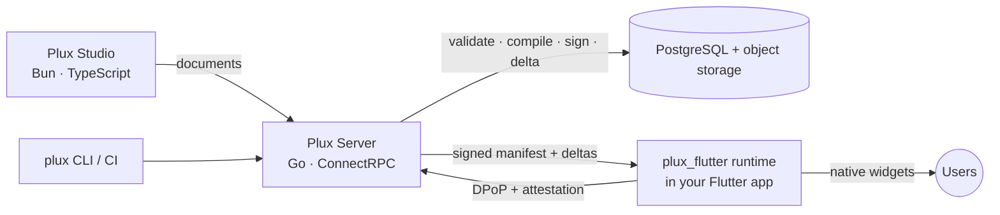

<p align="center">
  
</p>

<p align="center">
  <strong>Build Flutter apps visually and update them live:</strong> zero-parse FlatBuffers plugins, delta sync, DPoP-secured and fully self-hosted.
</p>

<p align="center">
  <a href="https://github.com/nightCode42/plux3/actions/workflows/ci.yml"></a>
  <a href="https://scorecard.dev/viewer/?uri=github.com/nightCode42/plux3"></a>
  <a href="REUSE.toml"></a>
  <a href="docs/adr/0022-open-core-licensing.md"></a>
</p>

---

Plux is a server-driven UI and plugin platform for Flutter. Teams design screens and flows in **Plux Studio**; the **Plux Server** compiles them into signed **FlatBuffers** bundles and computes binary deltas against every older version; the **`plux_flutter`** runtime syncs all plugins at app start, verifies them, and renders them as native widgets — with no app-store release for changes that are "just UI". Logic that declarative actions cannot express runs as **Plux Functions**: Go compiled to WebAssembly, on the server or on the device.

> **Status: Phase 2 — Backend core.** The Plux Server (API, publishing, signed releases, section deltas and signed manifests), the `plux` CLI against it, and a one-command Docker Compose stack are in place on top of the Phase 1 schema, compiler and bundle format ([server](docs/reference/server.md), [CLI](docs/reference/cli.md), [Compose stack](deploy/compose/README.md)). Product capabilities arrive phase by phase; see the [roadmap](#roadmap).

## Why Plux

| | |
|---|---|
| **Fast by construction** | Bundles are read zero-copy from memory-mapped files and expressions are pre-compiled bytecode. Targets such as a delta of at most 2 KiB for a one-word change are specified (spec §30) and benchmarked: a one-string change is a 635 B delta ([P2 benchmarks](docs/benchmarks/p2-backend.md)). |
| **High-assurance security** | Every device request is bound to a hardware key with DPoP (RFC 9449) and backed by Play Integrity or App Attest; updates follow The Update Framework's model with anti-rollback; functions run sandboxed. Suitable for financial applications. |
| **No-code or incremental** | Generate a complete Flutter project and build everything in Studio — or add the package to an existing app and adopt Plux one screen, or one widget, at a time. |
| **Governed change** | Immutable versions, four-eyes approvals bound to content hashes, staged rollouts, kill switches, and an audit trail that reconstructs exactly what a user saw. |
| **Self-hosted by design** | Every capability runs on your infrastructure, including air-gapped networks. |

## Architecture



The full design — document model, bundle format, sync, security, functions, Studio — is in the [specification](docs/requirements.md).

## Repository

| Path | Contents |
|---|---|
| [`backend/`](backend/) | Go: `plux-server`, the `plux` CLI, compiler |
| [`packages/`](packages/) | Dart: the `plux_flutter` runtime and optional packages |
| [`studio/`](studio/) | Bun and TypeScript: Plux Studio |
| [`tools/`](tools/) | Go: specification lint, requirement traceability, coverage gates |
| [`schema/`](schema/), [`proto/`](proto/) | Contracts shared by every component |
| [`docs/`](docs/) | [Specification](docs/requirements.md), [handbook](docs/engineering/README.md), [ADRs](docs/adr/README.md), [work log](docs/WORKLOG.md) |

## Getting started

Requirements: Go (the toolchain in `backend/go.mod` is fetched automatically), Flutter 3.47, Bun 1.3, Python 3 and GNU Make.

```bash
git clone https://github.com/nightCode42/plux3.git && cd plux3
make setup   # pinned tools and git hooks
make check   # every quality gate CI runs
make help    # all tasks
```

## Engineering

- **Specification-driven.** [`docs/requirements.md`](docs/requirements.md) defines 640 requirements with stable IDs, phases and status. Tests cite the IDs they verify, and CI generates the [traceability report](docs/engineering/testing.md#3-naming-and-traceability) from code — a requirement marked done without a test fails the build.
- **One pipeline definition.** CI, git hooks and developers run the same Makefile targets; a single **CI OK** gate aggregates path-filtered jobs for Go, Dart and Studio.
- **Supply chain.** Actions pinned by SHA, least-privilege workflows checked by actionlint and zizmor, reproducible Go builds verified in CI, CycloneDX SBOMs, dependency review, Dependabot with cooldowns, OpenSSF Scorecard, REUSE-compliant licensing.
- **Decisions are written down.** [Architecture Decision Records](docs/adr/README.md) explain every choice a future reader would question.

## Roadmap

| Milestone | Phases | Delivers |
|---|---|---|
| M1 — Engine | P0–P5 | Schema, compiler, server core, runtime, routing and host integration, actions and state |
| M2 — High-assurance | P6–P9 | Device security, Plux Functions, localisation and accessibility, enterprise operations |
| M3 — Plux 1.0 | P10–P12 | Dev app and live debugging, Studio, AI generation |
| M4 — Growth | P13–P15 | Payments, collaboration, multi-tenant operation |

Current phase and next steps: [docs/WORKLOG.md](docs/WORKLOG.md).

## Contributing and security

Read [CONTRIBUTING.md](CONTRIBUTING.md) and the working agreement in [AGENTS.md](AGENTS.md). Report vulnerabilities privately as described in [SECURITY.md](SECURITY.md).

## Licence

Open core ([ADR-0022](docs/adr/0022-open-core-licensing.md)): the runtime, CLI, compiler, schema, tooling and documentation are **Apache-2.0**; the server and Studio are **AGPL-3.0-only**; the enterprise edition in `ee/` will be commercial. Licences per path are declared in [REUSE.toml](REUSE.toml); texts are in [LICENSES/](LICENSES/).
