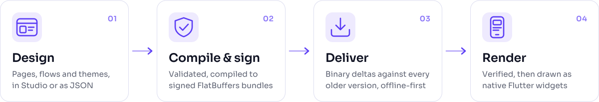
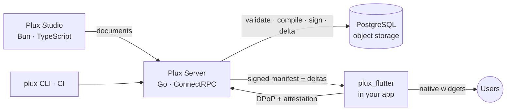

<p align="center">
  <picture>
    <source media="(prefers-color-scheme: dark)" srcset="docs/assets/brand/plux-lockup-dark.svg">
    
  </picture>
</p>

<h3 align="center">The mobile plugin system, built on Flutter.</h3>

<p align="center">
  Design screens and flows once, publish them in seconds, and every installed app updates itself.<br>
  Ship features as signed plugins, with no app-store release and no compromise on speed or security.
</p>

<p align="center">
  <a href="https://github.com/nightCode42/plux3/actions/workflows/ci.yml"></a>
  <a href="https://scorecard.dev/viewer/?uri=github.com/nightCode42/plux3"></a>
  <a href="REUSE.toml"></a>
  <a href="docs/adr/0022-open-core-licensing.md"></a>
  
  
</p>

<p align="center">
  <a href="docs/guides/run-locally.md"><b>Run it locally</b></a> ·
  <a href="docs/guides/host-app.md"><b>Add to your app</b></a> ·
  <a href="docs/requirements.md"><b>Specification</b></a> ·
  <a href="docs/adr/README.md"><b>Design decisions</b></a> ·
  <a href="#roadmap"><b>Roadmap</b></a>
</p>

<br>

<p align="center">
  <picture>
    <source media="(prefers-color-scheme: dark)" srcset="docs/assets/readme/how-it-works-dark.svg">
    
  </picture>
</p>

## What is Plux?

Plux is a **mobile plugin system, built on Flutter**. Your app becomes a host, and every screen, flow and feature can ship as a plugin, versioned and delivered on its own.

1. **Design.** Teams design pages, flows and themes as plugins, in **Plux Studio** or as JSON.
2. **Compile and sign.** The **Plux Server** validates every change, compiles it into signed **FlatBuffers** bundles, and computes a binary delta against every older version.
3. **Deliver and render.** The **`plux_flutter`** runtime inside your app syncs every plugin at start-up. It verifies every signature and hash before parsing anything, and draws the result as real Flutter widgets, online or offline.

Logic that declarative actions can't express runs as **Plux Functions**: Go compiled to WebAssembly, sandboxed on the server or on the device.

It is built for teams that need to move fast **and** prove what they shipped: banks, fintechs, super-apps, and anyone with a regulated release process.

## Why Plux

<table>
  <tr>
    <td width="33%" valign="top">
      <h4>Native speed, by design</h4>
      Bundles are memory-mapped and read zero-copy, and expressions are pre-compiled bytecode.
      A 300-widget page opens in about the same time as the same page hand-written in Flutter
      (<a href="docs/benchmarks/p3-runtime.md">benchmarks</a>).
    </td>
    <td width="33%" valign="top">
      <h4>Updates measured in bytes</h4>
      Changing one translated message ships as a <b>635-byte</b> delta. An app start with
      nothing new costs one request of <b>344 bytes</b> of bodies, whether the app has five
      plugins or fifty (<a href="docs/adr/0037-up-to-date-check-installed-digest.md">ADR-0037</a>).
    </td>
    <td width="33%" valign="top">
      <h4>Trust, verified on the device</h4>
      Every manifest and bundle is signed, and checked for tampering and rollback before
      it is parsed. Hardware-bound requests (DPoP), device attestation and
      The Update Framework's key model complete the chain.
    </td>
  </tr>
  <tr>
    <td valign="top">
      <h4>Adopt it one screen at a time</h4>
      Add the package to an existing app and render one page or one widget. Mix native and
      Plux content on the same screen, or generate a complete no-code Flutter project.
    </td>
    <td valign="top">
      <h4>Change you can govern</h4>
      Immutable versions, four-eyes approvals bound to content hashes, staged rollouts,
      kill switches, and an audit trail that reconstructs exactly what a user saw.
    </td>
    <td valign="top">
      <h4>Yours to host</h4>
      Every capability runs on your infrastructure, including air-gapped networks: one
      Docker Compose command for development, and a Helm chart for production.
    </td>
  </tr>
</table>

> [!NOTE]
> Speed, deltas, on-device verification and pages embedded in native screens work today. Native slots and generated projects arrive in P4, DPoP and attestation in P6, and approvals, rollouts and the Helm chart in P9. See the [roadmap](#roadmap).

## Add it to a Flutter app

```dart
import 'package:plux_flutter/plux_flutter.dart';

Future<void> main() async {
  WidgetsFlutterBinding.ensureInitialized();
  await Plux.initialize(PluxConfig(
    appId: 'acme-mobile',
    endpoint: Uri.parse('https://plux.acme.example'),
  ));
  runApp(const MyApp());
}

// Anywhere in your widget tree: a published page, by route name.
const PluxView('loan-calculator');

// Or full screen, with typed parameters.
await Plux.open(context, 'loan-calculator', params: {'productId': 'personal-12m'});
```

Publish a change from your terminal or CI. The compiler reports every problem with its JSON path:

```bash
plux validate ./my-app
plux publish -C ./my-app --env staging --promote staging   # server, org and app from plux.json
```

The full walkthrough is in [Add Plux to your app](docs/guides/host-app.md) and [Publish a page and see it on a device](docs/guides/first-release.md).

## Architecture



| Component | Path | Built with | Licence |
|---|---|---|---|
| Plux Server, CLI and compiler | [`backend/`](backend/) | Go, ConnectRPC, PostgreSQL | Server: AGPL-3.0 · CLI and compiler: Apache-2.0 |
| Flutter runtime and optional packages | [`packages/`](packages/) | Dart, Flutter, Riverpod | Apache-2.0 |
| Plux Studio | [`studio/`](studio/) | Bun, TypeScript, React | AGPL-3.0 |
| Contracts | [`schema/`](schema/), [`proto/`](proto/) | JSON Schema, FlatBuffers, Protobuf | Apache-2.0 |
| Repository tooling | [`tools/`](tools/) | Go, standard library only | Apache-2.0 |

The whole design is in the [specification](docs/requirements.md): the document model, bundle format, sync, security, functions and Studio.

## Engineered to be provable

- **Specification-driven.** [640 requirements](docs/requirements.md) with stable IDs. Tests name the IDs they verify, and a requirement marked done without a test fails the build ([traceability](docs/engineering/testing.md#3-naming-and-traceability)).
- **Measured, not promised.**
  - Rendering, sync and app-size budgets are benchmarked in CI.
  - A regression of more than 10% fails the build.
  - Every result is committed with its method ([benchmarks](docs/benchmarks/README.md), [size journey](docs/benchmarks/size.md)).
- **Tested on real platforms.**
  - End-to-end flows run on Android emulators (API 26 and 35) and the iOS simulator, against a server built from source.
  - Compiler output is byte-identical across runs and operating systems.
- **Supply chain.**
  - Actions are pinned by SHA, and workflows are least-privilege.
  - Go builds are reproducible.
  - CI produces CycloneDX SBOMs and runs dependency review.
  - The repository runs OpenSSF Scorecard and is REUSE-compliant.
- **Decisions are written down.** [Architecture Decision Records](docs/adr/README.md) explain every choice a future reader would question.

## Roadmap

Plux is built in phases, each finished only when every requirement in it is verified.

| Phase | Theme | Status |
|---|---|---|
| P0–P1 | Foundations · document schema and deterministic compiler | ✅ Done |
| P2 | Server: publishing, signed releases, deltas, CLI, Compose stack | ✅ Done |
| P3 | Flutter runtime: verified sync, rendering, theming, telemetry, starter app | ✅ Done |
| P4 | Routing, mixed native and Plux screens, deep links, `plux create` | 🔜 Next ([plan](docs/plans/p4.md)) |
| P5 | Action engine, state, data sources, local database, animation | Planned |
| P6–P9 | Device security (DPoP, attestation), Plux Functions, localisation and accessibility, enterprise operations | Planned |
| P10–P12 | Dev app and live debugging, Plux Studio, AI generation · **Plux 1.0** | Planned |
| P13–P15 | Payments, collaboration, multi-tenant operation | Planned |

Current focus and hand-off notes: [work log](docs/WORKLOG.md).

## Get started

You need Go (the toolchain in `backend/go.mod` is fetched automatically), Flutter 3.47, Bun 1.3, Python 3, GNU Make 4 and Docker.

```bash
git clone https://github.com/nightCode42/plux3.git && cd plux3
make setup   # pinned tools and git hooks
make dev     # server stack + starter app with hot reload, on your emulator or phone
make check   # every quality gate CI runs
```

[Run it locally](docs/guides/run-locally.md) covers the rest: the stack on its own, the CLI, tests, end-to-end runs, benchmarks and size.

## Contributing and security

Contributions are welcome. Start with [CONTRIBUTING.md](CONTRIBUTING.md) and the working agreement in [AGENTS.md](AGENTS.md). Please report vulnerabilities privately, as described in [SECURITY.md](SECURITY.md).

## Licence

Plux is open core ([ADR-0022](docs/adr/0022-open-core-licensing.md)):

- **Apache-2.0:** the runtime, CLI, compiler, schema, tooling and documentation.
- **AGPL-3.0-only:** the server and Studio.
- **Commercial:** the enterprise edition in `ee/`, when it arrives.

Each path's licence is declared in [REUSE.toml](REUSE.toml), and the licence texts are in [LICENSES/](LICENSES/).
