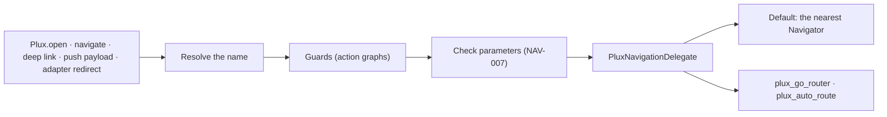

# 0040. Navigation: plain `Navigator` by default, router adapters as packages

- **Status:** Accepted (maintainer, 2026-10-02, at R1's review)
- **Date:** 2026-10-01
- **Requirements:** `NAV-001`–`NAV-012`, `HST-010`, `HST-011`, `HST-031`, `SCH-040`, `BND-008`

## Context and problem

P4 makes routes addressable across the whole app (spec §5.1):

- plugin to plugin and plugin to native (`NAV-001`, `NAV-002`);
- native to plugin by route name only (`NAV-003`), inline (`NAV-004`) or as a screen;
- every stack operation (`NAV-005`);
- runtime parameter checks (`NAV-007`), deep links and push payloads (`NAV-008`), guards
  (`NAV-009`), transitions (`NAV-010`), a not-found page (`NAV-011`), and `screen_view`
  for every navigation (`NAV-012`).

Host apps navigate in three ways:

- with the plain `Navigator` API;
- with a declarative `Navigator` 2.0 pages list;
- with a router package, most often `go_router` or `auto_route`.

`NAV-006` requires `Navigator` 2.0 integration and a `go_router` adapter, and requires
apps that use plain `Navigator` to work. An `auto_route` adapter is a `SHOULD`.

In P3, `Plux.open` pushes one page on the host's navigator. The route names already
exist: each plugin bundle's `Meta.pages` maps its pages to their app-wide route names,
and the runtime indexes them lazily (`ActiveRelease.page`).

## Decision drivers

- **The core carries no router.** A dependency in `plux_flutter` would weigh on every app
  (`RT-061`'s size budgets) and widen the supply chain, and most apps would not use it.
- **One path for every navigation.** `Plux.open`, the `navigate` action, deep links, push
  payloads and adapter redirects all resolve, guard, check and telemetry the same way.
  A bypass is a security bug: deep links are untrusted input.
- **Names only.** Neither native code nor plugins know which plugin holds a route.
- **Fail safe.** An unknown route, bad parameters or a refused guard shows a page and
  reports a code. None of them throws into host code or crashes.
- **Additive contracts** (`SCH-000`, `BND-000`).
- **A runtime that cannot honour a guard never shows the guarded page.**

## Considered options

1. **A delegate seam in the core, the plain `Navigator` as its default, and router
   adapters in optional packages.**
2. **The core depends on `go_router`** and maps every app onto it.
3. **Plux owns the app's `RouterDelegate`** and asks apps to adopt it.

## Decision

Chosen option: **1** (maintainer, P4 plan D3).

- Option 2 imposes a router on apps that have none, and still needs a second path for
  `auto_route`.
- Option 3 asks every existing app to rewrite its routing, against `HST-031`'s "one
  registration point".

### The path

1. **Resolve.** A name resolves to a plugin page, from the plugins' `Meta.pages` index,
   or to a registered native route (ADR-0041).
   - The compiler refuses a page route that collides with another page or with a native
     route of the catalogue (`PLX-1103`).
   - An unknown name resolves to the app's `navigation.notFound` route, else to the
     host's `PluxConfig.notFoundBuilder`, else to a built-in page, and reports `PLX-4100`
     (`NAV-011`).
2. **Guard.** The route's guards run in order (below). A refusal reports `PLX-4102`.
3. **Check parameters.** Parameters are checked against the page's declared parameters
   before the page is built. A missing, unknown or ill-typed parameter shows the page's
   error fallback and reports `PLX-4101` (`NAV-007`).
4. **Navigate.** The delegate performs the operation.

The route table is the plugins' `Meta.pages`, which already exists. It is not copied
into the app bundle: each plugin bundle stays the single source of its pages, and a
plugin update changes no other bundle. Parameter types are the page section's `params`.
The result type is a new `Page.result` field (below).

### The seam

`PluxNavigationDelegate` is the one interface every navigation goes through. Plux resolves
and checks the route and describes it as a `PluxRouteSpec`: its name, its presentation
(page, dialog, bottom sheet or full-screen dialog), its transition, whether it is
dismissible, and a builder. The delegate changes the stack, with one method per operation
of `NAV-005`:

- push, which completes with the route's result, and so also presents dialogs and sheets;
- replace;
- clear the stack and push;
- pop until a route;
- pop, with a result.

Switching tabs belongs to the enclosing shell: `PluxShell` provides it to its pages (below),
and in `go_router` apps the adapter's shell routes do (R5).

The default delegate drives the nearest `Navigator` with the plain API. It needs no
dependency, and works in apps that use `MaterialApp.router` too, because a `Navigator`
is always above a page.

For `Navigator` 2.0 apps, `PluxPage`, a `Page` subclass built by
`Plux.pageFor(name, params)`, lets a declarative pages list hold Plux routes. Both paths
run the same resolution, guards and checks.

### Router adapters (R5)

`plux_go_router` and `plux_auto_route` are separate packages. Each one:

- implements the delegate on its router;
- turns Plux routes into router routes;
- maps shells to the router's own shell routes (`StatefulShellRoute` in `go_router`);
- runs guards as the router's redirect;
- discovers the host's existing named routes (`HST-031`).

`go_router` and `auto_route` are dependencies of those packages only
([dependencies.md](../engineering/dependencies.md)). A shared delegate test suite runs
against the default delegate, `PluxPage` and both adapters.

### Typed parameters and results (`NAV-001`–`NAV-003`)

- **Parameters** are typed by the page's `params` and checked at compile time at every
  `navigate` step (`SCH-040`, `PLX-1203`–`PLX-1205`), and again at run time on entry.
- **Results.** Spec 1.2.0 adds `result` to page documents, a type expression, as native
  routes already have (maintainer, P4 plan A13).
  - The compiler binds `pop`'s result type `R` to the page's `result`.
  - A `pop` with a result on a page that declares none is an error (`PLX-1106`).
  - `Plux.open<T>(context, name, params)` returns `Future<T?>`.
  - On `pop`, the runtime checks the result against the page's declared type before it
    completes the future. A value of the wrong type is reported and completes as `null`.
    It never throws into host code.
- **Bundle.** The page section gains `Page.result`, a string-table index of the type
  expression, like `Param.type`. It is added in R3 with the code that reads it.

### Shells and tabs (`NAV-005`, `NAV-006`)

The app document's `navigation.shells` lists tabbed shells. Each tab has:

- a `key`;
- a `label` and an `icon`, which may bind app-level state;
- an `initialRoute`.

The compiler checks:

- that keys are unique within the app and within each shell;
- that every `initialRoute` exists;
- that each label is a string and each icon an `IconData`;
- that a `switchTab` step names a tab of some shell.

`PluxShell` renders a shell with one nested `Navigator` per tab, so each tab keeps its
stack. `switchTab` selects a tab of the enclosing shell. In `go_router` apps, the adapter
maps a shell to `StatefulShellRoute.indexedStack`.

### Transitions (`NAV-010`)

`routeOptions.transition` names one of these, mapped to page-route builders:

- `platform` (the default);
- `fade`;
- `slideLeft`, `slideRight`, `slideUp`, `slideDown`;
- `scale`;
- `sharedAxis`;
- `none`.

Android's predictive back is used where the platform supports it.
`android:enableOnBackInvokedCallback="true"` is set in the starter app and in generated
projects, and the host guide documents it.

**The custom timeline is deferred to P5** (maintainer, P4 plan A12). The document model has
no timeline a transition could name, because timelines arrive with P5's animations. The
transition enum therefore has no custom member in P4, and no document can ask for one.
P5 adds the member, its compiler check and its rendering together, and `NAV-010` stays
`WIP` until then.

### Guards (`NAV-009`)

`routeOptions.guards` lists action graphs (ADR-0039) that run before every entry: through
`Plux.open`, `navigate`, `PluxView`, deep links, push payloads and adapter redirects.

**Outcome.** A guard returns the registry value type `GuardResult` (maintainer, P4 plan
A14):

- `decision`: the enum `GuardDecision` — `allow`, `redirect` or `fallback`;
- `route`: the redirect's target;
- `params`: a `map<string,string>`, converted by the target route's parameter types as a
  deep link's are.

A guard returns its value with `stop` (ADR-0039), written as an object of these fields or
as the name of one of the type's constants, `"allow"` and `"fallback"`, which cover the
common cases. The compiler checks the value against the graph's declared output. Both
registry entries first ship in runtime 0.2.0, the P4 runtime's version, so an app that
uses them declares that minimum (`PLX-1119`).

**The guard kinds:**

- **Authentication.** A guard reads `user.authenticated`, a built-in attribute of PXL's
  `user` root (maintainer, P4 plan A15).
  - It is the host auth delegate's answer (`HST-010`), and `false` when no delegate is set.
  - The app's `userContext` cannot declare an attribute of that name (`PLX-1101`).
  - The delegate gains `isAuthenticated` in R4, next to `accessToken`, `refresh` and
    `onLogout`, which exist today.
  - Tokens never reach PXL, logs, traces or storage (`SEC-092`).
  - The user context's attributes are converted from the host's text to the types the
    app's `userContext` declares; one it does not declare, or that does not convert, is
    left out and reported once by name with `PLX-4204` (`HST-011`).
- **Kill switch.** P3's per-plugin switch already shows the plugin's fallback page
  (`RT-022`). Guards see it before any other check.
- **Feature flag.** A guard reads `flags.<name>`: the app document's flag defaults, which
  the host can override through generated accessors (R8). Targeting arrives in P9.
- **Custom PXL** conditions, over every root of the guard's scope.
- **Minimum assurance level.** This is the page's `security.requiresAssurance`, checked
  by the runtime before the guard graphs run. Until P6 the runtime knows no level above
  `AL0` (`SEC-007`), so a page that asks for more always takes its fallback. It fails
  closed.

**At run time** (R4):

- The kill switch is seen first, then the assurance level, then each guard graph in order.
  `allow` lets the next guard run; `fallback` shows the route's fallback, as a failing
  page does; a redirect opens its target, whose own guards then run.
- A guard that fails, or ends without a result, shows the fallback: guards fail closed.
- A guard reads its page's parameters and declared initial state, `device`, `user` and
  `flags`; app and plugin state arrive in P5. It may emit host events but not navigate:
  its navigation steps fail with `PLX-4102`. A guard that is a plugin flow declares no
  inputs (`PLX-1113`), since no entry passes any.
- `Plux.open`, `navigate`, deep links and push payloads run the guards before the route is
  pushed. `PluxView`, `PluxPage` and a shell's tabs run them in the page's place, before
  anything of the page builds, and show the page they enter there, a redirect's target
  included, because the host owns that part of the stack.
- Each guard run records `action_run` with the trigger `guard`.

The compiler rejects redirect loops (`PLX-1206`): pages whose first guard redirects
unconditionally, in a cycle. At run time, a chain of redirects is bounded by the number
of routes, and a chain that comes back to a route already visited is refused with
`PLX-4102`.

**Older runtimes.** A page with guards, or with an assurance level above `AL0`, needs
the feature `navigation.guards.v1`, which runtime 0.2.0 is the first to support. An app
whose `minRuntimeVersion` is 0.2.0 or later needs nothing more: older runtimes refuse its
bundles by their minimum runtime. Under an older minimum, the app's `requiredFeatures`
policy rejects the publish (`PLX-1119`) or lists the feature in the plugin bundle's
`required_features` (`PLX-1120`), and a runtime that cannot run guards refuses the bundle
(`BND-008`), so the device keeps its last compatible release (`REL-080`). A guarded page
therefore never opens unguarded.

### Deep links and push payloads (`NAV-008`)

The app document's `navigation.deepLinks` lists:

- `hosts`, the domains the app answers on for `https` links;
- `schemes`, its custom URL schemes, never `http` or `https`;
- `routes`, path patterns mapped to page routes.

**Patterns and links:**

- A pattern's segments are literals or `{name}` segments. Each `{name}` names a parameter
  of the target page once. That parameter's type must be one a link's text converts to:
  `string`, `int`, `double`, `decimal`, `bool`, `date`, `dateTime`, or a declared enum
  (`PLX-1204`).
- `https://<host>/p/<route-name>?…` always resolves, with query parameters as the
  route's parameters. Patterns cannot claim `/p` or anything under it.
- Two patterns of the same shape are refused, so a link matches at most one pattern.
- A deep link maps to a plugin page, never to a native route: the host routes its own
  links.

**At run time:**

- `Plux.handleDeepLink(Uri)` matches the link. It then converts each value to its
  parameter's type, runs the guards, checks the parameters and navigates, on the
  navigator of `PluxConfig.navigatorKey`, since links arrive outside any widget; without
  it nothing opens and `PLX-4102` is reported.
- A custom scheme's authority is the path's first segment (`acme://items/42` names
  `/items/42`); `{name}` segments are percent-decoded; a trailing slash is ignored; query
  parameters fill the route's other parameters, and those it does not declare, such as a
  campaign's, are left out.
- A link with no mapping, or whose percent-encoding does not decode, reports `PLX-4103`
  with only its scheme, host and path, and opens nothing. The host decides what happens
  next.
- A value that does not convert is a parameter error (`PLX-4101`).

The app document's `push` says whether the app uses push and which payload key holds the
Plux target (default `plux`, holding `{route, params}`). `Plux.handlePushPayload(map)`
resolves that key through the same path as a deep link. The target may be an object or
its JSON text, the form FCM data messages carry, and a dotted key reaches into nested
objects. Plux ships no push SDK: the
host's SDK calls this hook when a notification is opened (P4 plan D6).

**Bundle.** The app bundle's `Meta` gains `not_found_route`, `deep_links` (hosts, schemes,
patterns) and `push`. Shells are tables whose labels and icons are `Value`s, as flag
defaults are. All of these are optional fields, written in R3 and R4 with the code that
reads them. A runtime that does not know them ignores them, which is safe: it has no API
that could open a deep link or a shell.

### Telemetry (`NAV-012`)

Every completed navigation emits `screen_view` with the target route, the source route,
and the time on screen when the user leaves (Appendix G), under analytics consent
(ADR-0034). Parameters are never recorded.

## Consequences

- **Positive.**
  - Apps keep their routing.
  - The core stays free of router dependencies.
  - Every entry point shares one guarded, checked path.
  - The contract additions are optional fields, and an older runtime fails closed on
    guards.
- **Negative.**
  - Two adapter packages follow their routers' APIs, so their version ranges are pinned
    and a shared suite must pass on each.
  - Custom transitions wait for P5.
  - Until P6, an assurance guard always refuses.
- **Follow-up.**
  - R3: the route path, delegate, shells, transitions and `Page.result`.
  - R4: guards, deep links, push and the auth delegate's `isAuthenticated`.
  - R5: the adapters.
  - P5: custom timelines.
  - P6: real assurance levels.
  - P9: flag targeting.

## Options in detail

### Option 2: `go_router` in the core

There would be one implementation to test. But every app, including plain `Navigator`
and `auto_route` apps, would carry `go_router` and its transitive dependencies, and those
apps would still need mapping code. A breaking `go_router` release would block runtime
releases.

### Option 3: Plux's own `RouterDelegate`

It gives full control over the stack. But apps would have to replace their router, which
contradicts `HST-031` and `NAV-006`'s "apps using plain `Navigator` must also work".
