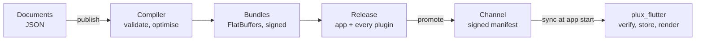

# Concepts

The words Plux uses, and how the pieces fit together. The specification defines each
precisely ([§2.2](../requirements.md#22-core-concepts)); this page is the short version for
someone starting out.

## What you build

| Concept | What it is |
|---|---|
| **App** | One Flutter host app as Plux knows it: its theme, translations, limits, the plugins it contains, and the environments it is released to. |
| **Plugin** | A self-contained feature of an app — a set of pages with their assets — developed, versioned and switched off on its own. |
| **Page** | A screen or part of one, written as a tree of widget nodes in JSON ([document model](../reference/document-model.md)). Every page has an app-wide **route** name. |
| **Widget** | A node of a page: a Flutter widget (Layer 1, [widgets](../reference/widgets.md)), a Plux component built from widgets (Layer 2), or later a native widget of the host (Layer 3). |
| **Binding** | A PXL expression in place of a literal value — a parameter, a translation, a theme token ([PXL](../reference/pxl.md)). |
| **Host app** | Your Flutter app. It adds the `plux_flutter` runtime and shows Plux pages next to its own screens ([host app guide](host-app.md)). |

## How it reaches a device

| Concept | What it is |
|---|---|
| **Publish** | The server validates the documents, compiles each plugin and the app into a **bundle**, and signs the bundle's hash. A published plugin **version** never changes. |
| **Bundle** | A binary container of FlatBuffers sections — pages, components, strings, the theme — that the runtime reads in place from a memory-mapped file ([bundle format](../reference/bundle-format.md)). |
| **Release** | One version of the app bundle together with one version of every plugin: what a device runs. Releases are numbered by an increasing **sequence**. |
| **Environment and channel** | Where a release is visible: an environment (`staging`, `production`) has its own signing key; a channel within it (`production`, `beta`) points at one release. Promoting moves the pointer; a rollback is a new, higher sequence with older content. |
| **Manifest** | The signed description of the release a channel points at: every bundle's hash, the control switches and the limits. Devices trust it only when the embedded key verifies it. |
| **Delta** | The difference between two versions of a bundle; a device that has the older one downloads only the delta. |
| **Baseline** | The release embedded in the host app at build time (`plux pull`), so the first launch renders offline. |

## What the runtime does

At start the runtime shows the release it already has — cached or baseline — without waiting
for the network. In the background, on its own isolate, it asks the server for the channel's
manifest; if a newer release exists, it verifies the manifest, downloads every bundle that
changed (as deltas where possible), verifies each against the signed hash, and **stages** the
release. The staged release becomes **active** atomically at a safe point — when no Plux page is
on screen, or at the next start — so a page never changes under the user. If a new release
fails repeatedly, the device returns to its **last known good** release.

Pages render as ordinary Flutter widgets. Each page and component sits inside an **error
boundary**: a failure shows a fallback and is reported, and never reaches the host app. A
**kill switch** in the channel turns a plugin, or the whole app, off without a new release.
Telemetry — sync results, errors and, with the user's consent, screen views and render
performance — goes back to the server in batches ([telemetry](../reference/telemetry.md)).

## What arrives later

Phase 3 renders. Navigation between pages and to native screens arrives in P4, actions, state,
data and animation in P5, hardware-bound device keys and key rotation in P6, Plux Functions in
P7, and Studio in P11 ([spec §5](../requirements.md#5-delivery-phases-and-milestones)).
