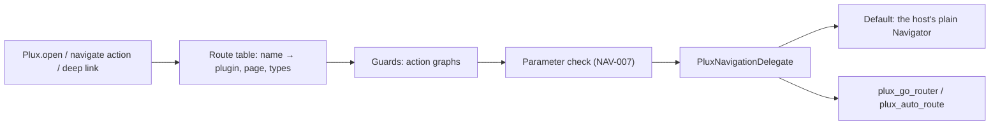

# Phase 4 Plan — Routing, Host Integration and No-Code Generation

- **Status:** Approved by the maintainer on 2026-10-01, with the approvals of §2.1. R0 (fast CI), R1 (decisions and contracts), R2 (action engine core) and R3 (routing core) are done; R4 (guards, deep links, push, auth, user context), R5 (router adapters) and R6 (native catalogue) passed their shared exit gate on 2026-10-02; R7 (mixed screens and the host API) is implemented and passes its tests.
- **Date:** 2026-10-01
- **Phase:** P4 (spec §5.1). It starts from `main` at `a0c3087`, with P3 merged and CI green.
- **Decisions:** the maintainer's answers of 2026-10-01 (§2).

This plan says what P4 delivers, in what order, and how each part is proved. It also says what P4 leaves for later phases, and in which phase each item continues.

Requirement statuses live only in the `Status` column of [requirements.md](../requirements.md). Where this plan says a requirement "ends `DONE`" or "stays `WIP`", that is the target at the phase exit, not its status today.

---

## 1. Goal and exit criteria

**Goal (spec §5.1).** P4 delivers the following:

- route addressing;
- plugin → plugin and plugin → native navigation;
- native → plugin screens by an app-wide route name;
- **mixed screens**: native slots inside plugin pages, and `PluxView`s inside native screens, with shared exposed state;
- typed parameters and results;
- discovery of `go_router` and `auto_route` routes;
- deep links and guards;
- one place to register native routes, widgets and actions, with no changes to existing code;
- `plux native scan`;
- `plux codegen` typed routes;
- **`plux create`**, which generates projects for no-code apps.

**Exit criteria.** The spec's three criteria, plus this phase's gate.

1. The example host app mixes native and plugin content in both directions, across screens and within one screen, with typed routes.
2. A generated project builds and runs unchanged.
3. Unknown routes and bad parameters fail safely.
4. Definition of Done (spec §5.3) DoD-1 to DoD-9 holds, with the changes to P4's requirements in §4.1 applied (two moved to P10, two actions moved into P4).
5. Every milestone passes the milestone exit gate that P3 used (§11).
6. CI is faster (milestone R0):
   - a pull request that changes only documentation finishes in at most 3 minutes;
   - a focused Go or Dart change finishes in at most 8 minutes;
   - the full suite takes less wall-clock time than today's 15 minutes;
   - no gate is removed.

---

## 2. Decisions (maintainer, 2026-10-01)

| # | Topic | Decision | Where it lands |
|---|---|---|---|
| D1 | Scope | P4 delivers everything the spec tags P4, all 31 `MUST`s, except the two that move to P10 under D9. | This plan |
| D2 | Action execution | P4 builds the real core of the action-graph engine: steps, typed inputs evaluated by PXL, outputs and `onError`. It implements the P4 actions (`navigate`, `pop`, `openDialog`, `openBottomSheet`, `switchTab`, `callNative`) plus `condition` and `emitHostEvent`. Those two are re-tagged from P5 to P4, which is a specification change. Every other action is refused with `PLX-4010`. **P5 continues from this core.** The handoff is documented in §9.1, in the engine ADR, and in the engine's reference page. | R1, R2 |
| D3 | Routers | The core `plux_flutter` package drives the host's plain `Navigator` by default, with no router dependency. `NAV-006` requires plain `Navigator` apps to work. Two optional packages, `plux_go_router` and `plux_auto_route`, adapt the two routers. `go_router` and `auto_route` are approved as dependencies of those packages only. | R1, R3, R5 |
| D4 | Shared state | P4 builds the native side now: `Plux.state<T>` reads, writes and watches an exposed state entry, and plugin bindings react to native writes. Plugin-side writes arrive with P5's `setState`, so `HST-021` and `STA-030` stay `WIP`. | R7 |
| D5 | Project generator | The generator is a Go library. In P4 the CLI writes the project to a directory, to a zip, or by a git push that uses the developer's own `git`. The server endpoint for Studio's download comes in **P11** and reuses the same library (§9.4). | R9 |
| D6 | Push | P4 delivers the platform configuration and a hook, with no push SDK:<br>• on iOS, the push entitlement and the remote-notification background mode;<br>• on Android, the notification permission;<br>• a documented `Plux.handlePushPayload` that resolves a payload to a route.<br>Work that later phases need is documented in §9.3. | R4, R9 |
| D7 | Add-to-app | Native hosts written in Kotlin and Swift, in `apps/add_to_app/`, embed a Flutter module. CI builds both hosts and runs the starter flows on an emulator and a simulator. | R10 |
| D8 | CI speed | CI runs only what a change can affect, and becomes as fast as it can without hurting quality. Every gate stays. Milestone R0 comes first, so every later milestone benefits. | R0 |
| D9 | Quick start | `HST-034` and `DX-001` (≤ 10 minutes, verified by recorded usability sessions) move to a later phase. They are measured after the maintainer has tested the project by hand and given feedback. **Chosen phase: P10** (§4.1). | R1 |

### 2.1 Approvals (maintainer, 2026-10-01, at the start of R0)

The maintainer approved this plan and answered the stops of §11 that could be settled before R0:

| # | Stop | Decision |
|---|---|---|
| A1 | The plan | Approved. The maintainer aims to handle as much as possible in this phase. |
| A2 | R0's CI gate changes (§7, ADR-0043) | Approved as planned: per-job selection by `tools/cmd/affected`, the Makefile split into `mk/` fragments, and a CI OK that accepts a skipped job only when the selection skipped it. R0 is committed and pushed to the session branch so a dispatched CI run can prove it. |
| A3 | New CI actions (§4.4) | None: caches use `actions/cache`, already pinned in the workflows, and its `restore` and `save` parts. |
| A4 | The API 26 cadence (§7.2) | Narrowed as proposed: API 35 on every affected pull request; API 26 on `main`, the daily and manual runs, and pull requests that change Android-specific files or dependencies. |
| A5 | Widening `analyzer` (§4.4) | Approved for `plux_native_scan`, a development-only tool no shipped package depends on. |
| A6 | The R1 contract additions (§4.3) | Approved as listed there. |
| A7 | Coverage floors of the new packages (§8) | The repository defaults in `coverage.json` (80% for Go and Dart). |

At R0's review the same day, the maintainer accepted its three recommendations (ADR-0043):

| # | Topic | Decision |
|---|---|---|
| A8 | The iOS device job on pull requests | It runs for the runtime, the starter app and their dependencies, iOS-specific files and the flows' fixture; server-only changes leave it to the Android 35 job. Every run on `main`, the daily and manual runs keeps it. |
| A9 | §7.2's levers | §7.2 records what R0 did and what it did not, as ADR-0043 does. |
| A10 | `CI-002` | `DONE` with R0: the top-level Makefile, affected-only jobs and dependency caching all hold. R0 merges together with the following milestones. |

At the start of R1 the maintainer settled five gaps that §4.3 did not list (additive document and registry changes; ADR-0039, ADR-0040):

| # | Topic | Decision |
|---|---|---|
| A11 | Host event declarations | The app document gains `hostEvents`: name, typed fields, description. This is `HST-013`'s declaration, tagged P5: P4 delivers its plugin-to-host half (`emitHostEvent`, `Plux.events`, generated event classes) and P5 the host-to-Plux half (`ACT-002`). |
| A12 | `NAV-010`'s custom timeline | Deferred to P5, which adds timelines to the document model; until then no transition can name one. P4 delivers the listed transitions and predictive back, and `NAV-010` stays `WIP` (§3.2). Recorded in §5.2 and ADR-0040. |
| A13 | Typed results of plugin pages | Page documents gain an optional `result` type, as native routes have; `pop` and the presenting actions are checked against it (`NAV-003`, `NAV-005`). |
| A14 | The outcome of a guard graph | A registry value type `GuardResult` (`decision`: `allow`, `redirect` or `fallback`; the redirect's `route` and its `params` as strings, converted by the target route's parameter types as deep links are) and its enum `GuardDecision`; a guard graph declares `GuardResult` as its output (`NAV-009`). |
| A15 | Authentication in guards | PXL's `user` root gains a built-in `authenticated`, read from the host's auth delegate (`HST-010`); the user context cannot declare an attribute of that name. |

At R1's review (2026-10-02) the maintainer accepted its three recommendations:

| # | Topic | Decision |
|---|---|---|
| A16 | How a guard graph returns its result | `stop` moves to P4 (spec 1.2.0, Appendix D): a graph returns its declared output with `stop`, so a guard returns its `GuardResult` without a second mechanism (ADR-0039). |
| A17 | §4.3's R1 notes | Confirmed: the route table stays in the plugins' `Meta.pages`; bundle fields, the `NativeCatalogueService` and its migration land with the code that uses them (R3, R4, R6); the native catalogue schema needed nothing. |
| A18 | The P4 runtime's version | `plux_flutter` becomes 0.2.0 with R2; the auth delegate gains `isAuthenticated`. |

At R2 and R3's exit gate (2026-10-02), when CI measured the armeabi-v7a APK over its budget, the maintainer decided:

| # | Topic | Decision |
|---|---|---|
| A19 | Size budgets | The Android budgets rise to ≤ 10 MiB per APK and ≤ 4 MiB per App Bundle download, per ABI; the IPA stays ≤ 3 MiB (spec 1.2.1, `RT-061`, `NFR-009`; ADR-0036, Revision; [size journey](../benchmarks/size.md) round 2). The runtime is not trimmed to fit. |

At R2 and R3's review (2026-10-02) the maintainer accepted their recommendations, and asked that documents always match what is implemented:

| # | Topic | Decision |
|---|---|---|
| A20 | Waiting for the user | While an `openDialog` or `openBottomSheet` step shows its page, neither the step bound nor the run bound counts time (ADR-0039, [action engine](../reference/action-engine.md) §4), as implemented in R2. |
| A21 | The specification's version header | It stays at 1.1.9 while P4 adds revision rows (1.2.0, 1.2.1), as in P3, and R11 sets it to the latest revision. |

During R4–R6 (2026-10-02) the maintainer decided:

| # | Topic | Decision |
|---|---|---|
| A22 | The router in `PluxConfig` | Router adapters wrap the host's router: `PluxConfig(router: PluxGoRouter(myGoRouter))` or `PluxAutoRoute(myRouter)`. The core defines a `PluxRouterAdapter` interface (the navigation delegate, the routes it discovers, the navigator key), since `plux_flutter` cannot name a router's type without depending on it (ADR-0041's snippet updated). |
| A23 | A kill switch's fallback page with guards | A plugin's declared fallback page that has guards, or asks for an assurance level above `AL0`, gives way to the generic fallback: the kill switch never opens a guarded page (ADR-0040). |
| A24 | The native catalogue on the device | The app bundle's schemas section gains the catalogue's declarations (routes, slots, custom actions with their types) as optional fields, so the runtime maps slot props by index and checks values crossing into host code (ADR-0041). |
| A25 | Router examples in the starter | The starter app has no flavours, so each adapter ships `example/main.dart` instead. Starter flavours, one per router (plain `Navigator`, `go_router`, `auto_route`) with their device CI jobs, are deferred to P10 with the ten-minute quick start (`HST-034`, `DX-001`); not a P4 deliverable. |
| A26 | The CI licence allowlist | The hand-checked list of `ci.yml`'s dependency review gains `go_router`, `auto_route`, `material_ui`, `cupertino_ui`, `intl` and the repository's new packages, each licence file read by hand. |
| A27 | The host build default | `plux native scan` and `sync` default to the host's `pubspec.yaml` version; the runtime cannot read it, so `PluxConfig.hostBuild` has no default and the host passes the same string (ADR-0041 reworded). |
| A28 | Reading `plux.yaml` | The CLI reads `plux.yaml` and the `pubspec.yaml` version with a standard-library parser, so `plux.yaml` keeps to `key: value` lines and lists of names; the YAML library's use widens only if a need arises. |
| A29 | Publishing the new packages | `plux_go_router`, `plux_auto_route` and `plux_native_scan` stay `publish_to: none`; publishing to pub.dev is decided later, after the implementation. |

Earlier decisions that still hold:

- **Device farm (`QA-006`).** Firebase Test Lab on the Spark plan, in a later phase. It is listed in §9.6.
- **Contributor legal review.** It stays open (work log, *Open decisions*).

---

## 3. Requirements

### 3.1 Delivered in P4 (target: `DONE` at the exit)

| Area | IDs | Milestone |
|---|---|---|
| Navigation | `NAV-001`, `NAV-002`, `NAV-003`, `NAV-004`, `NAV-005`, `NAV-006`, `NAV-007`, `NAV-008`, `NAV-011`, `NAV-012` | R3, R4, R5, R7 |
| Native catalogue, slots, custom actions | `WGT-032`, `WGT-033`, `HST-031`, `CLI-006` | R6 |
| Host | `HST-011`, `HST-030`, `HST-032`, `HST-033` | R4, R8, R10 |
| Generated projects | `GEN-001`, `GEN-002`, `GEN-003`, `GEN-005`, `GEN-006` | R9 |

`NAV-006` asks for an `auto_route` adapter only as a `SHOULD`. P4 ships it anyway (D3).

### 3.2 P4 delivers its part; a later phase completes it (stays `WIP`)

| ID | P4 delivers | Completed in |
|---|---|---|
| `WGT-030` | The runtime and CLI parts: `plux.yaml` slot list, `plux native scan`, one-place registration | P11: the Studio catalogue shows the slots |
| `ACT-060` | Registration of custom actions with typed inputs and outputs | P11: the Studio action catalogue |
| `NAV-009` | Guards for authentication, kill switch and custom PXL conditions; a feature-flag guard on the document's flag defaults; an assurance-level guard that fails closed | P6: real assurance levels (`SEC-007`); P9: flag targeting |
| `NAV-010` | Platform default, fade, slide in four directions, scale, shared axis and none, plus Android predictive back | P5: custom timelines (animations) |
| `HST-010` | The auth-delegate API: token, refresh on `401`, logout signal. Guards use it. | P5: data sources consume it; P7: functions consume it |
| `HST-021` | Mixed screens in both directions; native-side state | P5: plugin-side writes (`STA-030`) |

### 3.3 Moved out of P4 (spec re-tag and ADR in R1)

| ID | To | Why |
|---|---|---|
| `HST-034` | P10 | See §4.1 |
| `DX-001` | P10 | Same requirement, seen from the documentation side |

### 3.4 Cross-phase items P4 advances

| ID | Tag | What P4 adds |
|---|---|---|
| `HST-001` | P3 | Native route, slot and action registration, `setAuthDelegate`, `events`, and native-side exposed state. It stays `WIP` until P5 adds plugin-side state writes. |
| `RT-021` | P3 | Action errors are contained per run and routed to `onError`, for every action P4 runs. It stays `WIP`: it is complete once P5 runs the whole catalogue. |
| `ANL-001` | P3 | `screen_view` with source and target routes, and action-run events for P4's actions. |
| `REL-080` | P2 | Compatibility per host build, computed from native catalogues (`WGT-032`). |
| `DX-002` | P3 | Guides on routing, mixed screens, deep links, add-to-app and no-code apps. |
| `NFR-002` | P3 | A benchmark from tap to first frame of a cached page, through the new navigation path. |
| `NFR-011` | P5 | An early per-step measurement of the engine core. Recorded, not gated. |
| `HST-013` | P5 | The app document's `hostEvents` declaration (A11), `emitHostEvent`, `Plux.events` and generated event classes: the plugin-to-host half. P5 adds the host-to-Plux half (`ACT-002`). |

---

## 4. Specification changes, ADRs and dependencies (milestone R1)

Every change in this section lands before any code that relies on it, in the R1 pull request. `make spec-lint` passes after every edit to the spec.

### 4.1 Specification changes (spec 1.1.8 → 1.2.0)

- **Re-tag actions.** `condition` and `emitHostEvent` move from P5 to P4, and `stop` with them at R1's review (A16):
  - in Appendix D;
  - in `schema/actions/condition.json` and `schema/actions/emitHostEvent.json` (`"phase": "P4"`), regenerated with `make gen`.
- **Re-tag the quick start.** `HST-034` and `DX-001` move from P4 to P10. **Why P10:**
  - P10 is the developer-experience phase: the Dev app, QR pairing, and the CLI viewer for logs and traces.
  - A ten-minute path from `flutter create` to a page on a device depends most on that tooling.
  - By then the maintainer has used P4–P9 by hand, so the guide and the recorded sessions measure the product as it ships.
  - Moving it any earlier would mean measuring a quick start that P5–P9 change again.
- **Phase table.** Appendix K's count for P4 drops from 31 to 29 `MUST`s, and P10's rises by 2.
- **Spec §5.1.** The P4 row adds "the action-graph engine core". The P5 row reads "action catalogue completion".
- **New error codes (Appendix F, `schema/errors.json`), all in the `PLX-4xxx` range:**
  - a navigation refused by a guard;
  - a deep link with no mapping;
  - a native slot not registered;
  - a custom action not registered (`PLX-4200` remains "native route not registered");
  - an exposed state entry written with the wrong type.
- **Statuses** move only as milestones prove them (R11).

The two `MUST` re-tags change when requirements are delivered, not what they say. Each gets the ADR below (Document Control).

### 4.2 ADRs

| ADR | Title | Content |
|---|---|---|
| 0023 *(reserved)* | Mixed native and plugin screens: native slots and `PluxView` with shared exposed state | Slot layout and boundaries, typed slot events, `PluxView` sizing modes, the exposed-state bridge, and the P4/P5 split on writes |
| 0024 *(reserved)* | No-code generated projects and shell-update detection | The Go generator library: templates, determinism, outputs (directory, zip, git), what the shell holds, the P11 server endpoint, and shell-update detection deferred to P11 (`GEN-004`) |
| 0039 | Action engine core and its P4/P5 boundary | Run model, scopes, step outputs, `onError`, cancellation, limits, the handler registry, `PLX-4010` for later actions, and **what P5 adds** |
| 0040 | Navigation: plain `Navigator` by default, router adapters as packages | The `PluxNavigationDelegate` seam, Navigator 2.0 pages, shells and tabs, transitions, typed results, guards, deep links and push payloads |
| 0041 | Native catalogue and host builds | `plux.yaml`, the analyzer-based scanner run with `dart run`, the catalogue format and API, validation at publish (`WGT-032`), `REL-080` |
| 0042 | Quick start moves to P10 | The re-tag of `HST-034` and `DX-001` (D9) |
| 0043 | Affected-only CI | The R0 design. It changes CI gates, so it needs the maintainer's approval. |

The ADR index is updated, and 0023 and 0024 move from *Planned* to *Accepted*.

### 4.3 Contract changes (all additive: `SCH-000`, `SRV-000`, `BND-000`)

**Document schema.** The app document gains these fields. Each gets a structural rule, a semantic check in the compiler, and conformance vectors.

- `navigation.notFound`: the route shown for an unknown name (`NAV-011`).
- `navigation.deepLinks`:
  - the hosts and custom schemes the app answers on;
  - path patterns mapped to route names, with typed parameter extraction.
  - `https://<host>/p/<route-name>?…` is always mapped (`NAV-008`).
- `navigation.shells`: tabbed shells. Each tab has an id, a label, an icon and an initial route, and keeps its own stack (`NAV-005` switch tab, `NAV-006`).
- `push`: whether the app uses push, and its payload mapping (D6).

A page's `routeOptions` (`guards`, `transition`) and the app's `entryRoute`, `flags`, `state` (including `exposed`) and `userContext` already exist. The compiler starts checking them more strictly where P4 gives them meaning, for example a guard graph's output type.

**Bundle.** The app bundle gains:

- the app-wide route table (name → plugin and page, with parameter and result types);
- the deep-link table;
- the shell definitions.

Each is a new optional section or field, and a runtime that needs it declares a `required_features` flag (`BND-008`).

**API (`proto/plux/v1`).** A `NativeCatalogueService` with three calls:

- `UploadNativeCatalogue(app, host_build, catalogue)`;
- `GetNativeCatalogue`;
- `ListHostBuilds`.

Release compatibility is extended per host build (`REL-080`). `buf breaking` passes.

**Native catalogue schema.** It already exists (`host`, `routes` with parameters and result, `slots`, `actions`). It gains slot event descriptors and an optional result type for custom actions, both additive.

**R1 notes** (2026-10-01; confirmed at R1's review, A17):

- *The native catalogue schema needed nothing.* Its slots already have typed events and its actions already have an output; the sentence above was written against an older reading.
- *Added at the start of R1* (§2.1, A11, A13–A15): the app's `hostEvents`, a page's `result`, the registry entries `GuardResult` and `GuardDecision`, and PXL's built-in `user.authenticated`, each with its compiler check.
- *The route table is not copied into the app bundle.* Each plugin bundle's `Meta.pages` already maps its pages to route names, and the runtime indexes them; the page section gains `Page.result` instead (ADR-0040).
- *Bundle fields and the API land with the code that uses them.* The app bundle's not-found route, deep links, shells and push (R3, R4), `Page.result` (R3), and the `NativeCatalogueService` with its migration (R6) are designed in ADR-0040 and ADR-0041 and added in those milestones, in the same merged pull request as R1, so no field is written that nothing reads.

### 4.4 Dependencies (`dependencies.md`)

- **`go_router` and `auto_route`** (D3), approved for `plux_go_router` and `plux_auto_route` only. The licence and publisher of each are recorded.
- **`analyzer`.** Its approved use widens from `plux_widget_api` to a second development-only tool, `plux_native_scan`, which no shipped package depends on. Approved by the maintainer (§2.1, A5).
- **No new Go module.**
  - The generator resizes icons with the standard library's `image` and `image/png`, using an in-house, deterministic area-averaging resize.
  - It writes zips with `archive/zip`.
  - It pushes with the developer's `git` binary, as an `exec`, so there is no `go-git`.
- **CI actions.** R0 may add pinned GitHub Actions for caches (for example `gradle/actions/setup-gradle`). Each one is presented with ADR-0043 for approval before it is used.

---

## 5. Architecture

### 5.1 Action engine core (R2) — ADR-0039

**Where.** `packages/plux_flutter/lib/src/actions/`:

- `engine.dart`;
- `run.dart`;
- `scope.dart`;
- `handlers/`;
- a generated `dispatch.g.dart` built from `schema/actions/*.json`, with the same generator pattern as `render.g.dart`.

**Input.** The bundle's existing `Actions { graphs: [Graph] }` section, which the compiler already produces (`graphs.go`), with steps, inputs as PXL programs, and edges.

**Run model.**

- A trigger starts a **run**. In P4 the triggers are:
  - widget events through `NodeContext.fire`, which replaces P3's `PLX-4010` no-op;
  - native slot events;
  - guards;
  - deep-link and push openings.
- A run executes steps in graph order. Each step's inputs are PXL programs, evaluated by the existing VM (`lib/src/pxl/vm.dart`) over a scope with these parts:
  - `params`;
  - `state` (read-only in P4);
  - `event` (the trigger's payload);
  - `steps.<id>.<output>` (earlier steps' outputs);
  - `user` (`HST-011` attributes, as declared).
- Outputs are type-checked against the action descriptor.
- `condition` branches.
- A failing step routes to its `onError` edge, or else the graph's. An error with no handler ends the run and is reported. Errors never escape the run (`RT-021`).
- A run is cancelled when its page is disposed.
- Step count and run duration are bounded by entries in the limits registry (`LIM-001`). New entries are added there if they are missing, never hard-coded.

**Handlers.** One `ActionHandler` per descriptor id:

- `navigate`, `pop`, `openDialog`, `openBottomSheet` and `switchTab` call the navigation delegate (§5.2);
- `callNative` calls the host's registered action (§5.4);
- `condition` evaluates a boolean;
- `emitHostEvent` posts a typed event to `Plux.events`;
- `stop` ends the run with the graph's result, or fails it with a custom error (A16).

Every other id gets a shared handler that fails the step with `PLX-4010` ("not available in this runtime"). The step's `onError` can handle it, and the run continues safely.

**Telemetry.** Action-run events (Appendix G) for the actions P4 runs. Payloads are never recorded.

**Tests.**

- Unit tests for each handler.
- Property tests on graph shapes from the compiler's vectors. The graphs are shared with Go in `schema/testdata/actions`.
- Error containment and cancellation tests.
- A micro-benchmark per step (§3.4, `NFR-011` early measurement).

### 5.2 Routing core (R3) — ADR-0040

**Route table.** At activation, the runtime builds the app-wide route table from the app bundle. It maps a name to a plugin, a page, parameter types and a result type. Native code and plugins address routes by **name only** (`NAV-001`, `NAV-003`).

The default navigation path:



**The seam.** `PluxNavigationDelegate` is the one interface every navigation goes through. It covers push, replace, pop with a result, pop until, clear and push, present (dialog, bottom sheet, full-screen dialog), and switch tab (`NAV-005`).

- **The default delegate** drives the nearest `Navigator` (the plain API). It needs no dependency and works in any app, including apps that use `MaterialApp.router`.
- **Navigator 2.0 (`NAV-006`).** `PluxPage`, a `Page` subclass, lets apps that use a declarative pages list put Plux routes in it. `Plux.pageFor(name, params)` builds one.

**Typed results.**

- `Plux.open<T>(context, name, params)` returns `Future<T?>` (`NAV-003`).
- `pop(result)` in a plugin page checks the result against the route's declared result type before it completes the future. A result of the wrong type is reported and completes with `null`. It never throws into host code.

**Parameters (`NAV-007`).** Parameters are validated on entry, against the route's types. Missing or invalid parameters render the page's error fallback and report `PLX-4101`.

**Unknown routes (`NAV-011`).** An unknown name resolves to `navigation.notFound`, else to the host's `PluxConfig.notFoundBuilder`, else to a built-in page, and reports `PLX-4100`.

**Telemetry (`NAV-012`).** Every completed navigation emits `screen_view` with the route, the source route and, on leaving, the time on screen (Appendix G).

**Transitions (`NAV-010`).**

- A page's `routeOptions.transition` maps to page-route builders: platform default, fade, slide (four directions), scale, shared axis, none.
- **Predictive back.** Android's predictive-back transition is used where the platform supports it. `android:enableOnBackInvokedCallback="true"` is set in the starter app, the generated projects and the host guide.
- A **custom timeline** is deferred to P5 (§2.1, A12): the document model has no timeline a transition could name until P5's animations, so the transition enum has no custom member in P4 and no document can ask for one. P5 adds the member, its compiler check and its rendering together; `NAV-010` stays `WIP` (§3.2, ADR-0040).

**Shells and tabs.**

- `PluxShell` renders a `navigation.shells` entry. Each tab has its own nested `Navigator` and keeps its stack, and `switchTab` selects a tab.
- In `go_router` apps, the adapter maps shells and tabs to `StatefulShellRoute` branches instead (§5.3).

### 5.3 Router adapters (R5)

**`packages/plux_go_router`:**

- `PluxGoRoutes().routes` puts Plux pages into a `GoRouter` as `GoRoute`s.
- Shells map to `StatefulShellRoute.indexedStack`, with independent tab stacks.
- A delegate implementation uses `context.push` and `context.go`, and maps typed results through `push<T>`.
- Guards run as a `redirect`.
- **Discovery (`HST-031`).** The host's existing named `GoRoute`s are read from `GoRouter.configuration` at start-up. The host only passes its router, wrapped as `PluxGoRouter(router)` (A22), to `Plux.initialize`. Plugins can then navigate to those routes as native routes.

**`packages/plux_auto_route`:**

- the equivalent of the above;
- routes discovered from the generated `RouteInfo`;
- the delegate built on `StackRouter`.

**Both adapters:**

- have their own `AGENTS.md` entries, coverage floors, and an example (`example/main.dart`); examples as starter flavours are deferred to P10 (A25);
- are pinned to router version ranges, with an upper bound at the next major.

### 5.4 Native catalogue, slots and custom actions (R6) — ADR-0041

**One-place registration (`HST-031`, `ACT-060`).** Everything is registered in one `PluxConfig` passed to `Plux.initialize`:

```dart
Plux.initialize(PluxConfig(
  nativeRoutes: {'profile': PluxNativeRoute<ProfileParams, void>(...)},
  nativeSlots: {'MapCard': PluxNativeSlot(MapCard.new)},
  nativeActions: {'openScanner': PluxNativeAction<ScanIn, ScanOut>(...)},
  router: PluxGoRouter(myGoRouter), // optional: discovery through plux_go_router (A22)
));
```

Existing widgets and routes are not modified.

**`plux.yaml`** lists the class names of the slot widgets (`WGT-030`).

**`plux native scan` (`CLI-006`)** builds the catalogue by static analysis only, with no change to host code.

- The Go CLI runs `dart run plux_native_scan` in the host project. That package is development-only and built on `analyzer` (§4.4).
- It reads:
  - native routes from `GoRoute(name: …)` and `auto_route` annotations, or from the `nativeRoutes` registration;
  - slot props from the constructor parameters of the classes listed in `plux.yaml`;
  - custom actions from the `nativeActions` registration.
- It writes `plux.catalogue.json`, which conforms to the native catalogue schema. Its output is byte-for-byte deterministic, with sorted keys and no timestamps.

**`plux native sync --build <id>`** uploads the catalogue for one host build (`NativeCatalogueService`).

**Server.**

- Catalogues are stored per app and host build, under row-level security, as every tenant table is.
- **At publish and release (`WGT-032`),** every native route, slot and custom action that a plugin uses is validated against the catalogue of every host build the release targets. Mismatches produce diagnostics that carry JSON paths.
- **Release compatibility (`REL-080`)** is computed per host build. A device whose build lacks something gets the newest compatible release, and the publisher sees how many devices that affects.

**Runtime.**

- **Slot nodes (`WGT-033`):**
  - props come from bindings and update reactively;
  - typed events start graphs;
  - layout is constraints in, size out;
  - a failure is contained by the page's `PluxBoundary` (`RT-020`).
- **`callNative`** validates inputs and outputs against the catalogue types. A missing action reports its new error code.
- **`navigate` to a native route** returns its typed result (`NAV-002`). A native route that is not registered reports `PLX-4200`.

### 5.5 Mixed screens and the host API (R7) — ADR-0023

**`PluxView` v2 (`NAV-004`):**

- It takes a route or an exported component name, never a plugin.
- `inputs` are typed (with generated classes from R8), and `onEvent` receives typed events.
- It has its own error boundary.
- `sizing` can be `intrinsic`, `fixed` or `expand`.
- Several `PluxView`s on one screen share the runtime and its state.

**`Plux.events`.** A stream of typed host events from `emitHostEvent`, filtered by name.

**Exposed state (D4).**

- `Plux.state<T>(name)` returns a handle with `value`, `set(T)` and `watch()`, which is a `Stream<T>`.
- Writes are type-checked against the app document's `state` entry, which must be `exposed`. A write of the wrong type reports the new error code.
- Plugin bindings that read the entry rebuild through the existing Riverpod `select` path.
- Plugin-side writes are P5 (`setState`). Until then, plugins only read exposed state.

**Starter app.** It shows both directions on one screen:

- a native screen with two `PluxView`s that share a counter;
- a plugin page with a native map-card slot whose events drive a plugin action.

### 5.6 Auth delegate and user context (R4)

**`Plux.setAuthDelegate(PluxAuthDelegate)` (`HST-010`):**

- `isAuthenticated`;
- `accessToken()`;
- `refresh()`, called once on a `401` and then retried once;
- a stream of logout signals.

The authentication guard uses it. Tokens are never logged, traced or persisted (`SEC-092`), and a test proves that.

**`setUserContext` (`HST-011`):**

- It takes a pseudonymous ID and attributes, validated against the app's `userContext` declaration.
- Only attributes declared non-sensitive can reach analytics. A redaction test covers each event type.
- In P4 the attributes are visible to guard PXL. Rollouts and experiments use them from P9.

### 5.7 Guards, deep links and push payloads (R4)

**Guards (`NAV-009`).** `routeOptions.guards` are action graphs whose output is the registry type `GuardResult`: *allow*, *redirect(route, params)* or *fallback* (A14). A graph returns its value with `stop`, which moved to P4 at R1's review (A16, ADR-0039). The guard kinds:

- **Authentication**, through the auth delegate.
- **Kill switch**, through P3's per-plugin switch.
- **Custom PXL** conditions.
- **Feature flag.** It reads the app document's flag values, which the host can override through generated accessors (R8). Targeting comes in P9.
- **Minimum assurance level.** Until P6 the runtime knows no level above `AL0`, so a guard that asks for a higher level always takes its redirect or fallback. It **fails closed**.

Guards run on every entry: `Plux.open`, `navigate`, deep links, push payloads and adapter redirects. The compiler rejects redirect loops (`SCH-040`, already a semantic rule).

**Deep links (`NAV-008`).**

- `Plux.handleDeepLink(Uri)` resolves a link through `navigation.deepLinks`, then runs the guards, then navigates. `https://<host>/p/<route-name>?…` always resolves.
- An unmapped link reports its new code and opens nothing.
- The adapters connect this to the router's own deep-link handling.
- Platform configuration (Android intent filters, iOS associated domains and URL schemes) is generated by `plux create` and documented for existing apps.

**Push payloads (D6).**

- `Plux.handlePushPayload(Map<String, Object?>)` reads a documented key, `plux: {route, params}`, through the same mapping and guards.
- The host's own push SDK calls it when a notification is opened. Plux ships no push SDK.

### 5.8 `plux codegen` and `plux init` (R8)

**`plux codegen` (`HST-030`).** It reads the app document, either a local project or the pulled release, and writes `lib/plux/plux.g.dart`, deterministically. The file holds:

- `PluxScreens` route builders with typed parameter and result classes, for example `PluxScreens.loanCalculator(amount: …)` returning `Future<LoanResult?>`;
- typed host-event classes;
- exposed-state accessors;
- feature-flag accessors.

Misuse is a compile error in the host app, and a host fixture proves that with `dart analyze`.

**`plux init` (`HST-032`):**

- adds `plux_flutter`, plus an adapter when a router is detected;
- writes `plux.yaml` and the configuration;
- embeds the signing root public keys, fetched with the existing `plux keys`;
- wires `Plux.initialize` into `main.dart` only when `main` has the plain `runApp` shape, and otherwise prints the exact lines to add;
- runs `plux doctor`.

It is idempotent: a second run changes nothing.

### 5.9 `plux create` and the generator library (R9) — ADR-0024

**Library.** A Go package in an Apache-2.0 path next to the compiler. P11's server endpoint reuses it. It holds:

- **Templates.** A Flutter project as embedded files, rendered with `text/template` from a typed `ShellSpec`: name, bundle and application IDs, version, icons, splash, permissions and push configuration.
- **Determinism.** No timestamps, sorted output, the same zip bytes for the same input. A test checks it.
- **Icons and splash.** From one source PNG, resized in-house (§4.4) for Android mipmaps and the iOS `AppIcon` set.
- **Embedded baseline release.** The app's default plugin is the entry route. It is fetched like `plux pull`.
- **Permissions and usage descriptions** derived from the plugins' declared capabilities. One mapping table, from capability to Android permission and iOS usage-description key, covers every capability, and a test proves it.
- **Push configuration** (D6), present only when the app declares `push`.
- **Build scripts**, plus **CI templates** for GitHub Actions and GitLab CI that make signed release builds (`GEN-003`). The templates reference secrets by name and contain none.

**CLI.** `plux create <app> --out <dir> | --zip <file> | --git <remote> [--branch]`. The `--git` mode commits and pushes with the developer's own `git`, and never stores credentials.

**Proofs:**

- **`GEN-002`.** A CI job generates the sample app, builds it with the pinned Flutter for Android and iOS, and launches it on an emulator and a simulator. It checks that the first page renders, reusing the e2e harness.
- **`GEN-005`.** The test publishes a new plugin release and checks that the generated app shows it without a rebuild.
- **`GEN-006`.** The test adds a native route and a slot to the generated project, runs `plux native scan`, and uses both from a plugin.

**P11 note (D5).** Studio's "download project" endpoint wraps the same library on the server (the zip output, and git push with server-held credentials under P9's secret handling). Shell-update detection (`GEN-004`) belongs to P11 and compares `ShellSpec`s, so P4 makes `ShellSpec` a stable, versioned type.

### 5.10 Add-to-app (R10)

**Layout.**

- `apps/add_to_app/plux_module/` is a Flutter module with `plux_flutter` and the starter's pages.
- `android_host/` is Kotlin with Gradle. It uses a cached `FlutterEngine` and opens `FlutterActivity` and a `FlutterFragment`.
- `ios_host/` is Swift. It uses a `FlutterEngine` and a `FlutterViewController`, embedded with CocoaPods as the Flutter add-to-app guide describes.

**Flows** (`HST-033`), against a server built from source:

- a native screen opens a Plux page by route name;
- the page renders offline from the baseline;
- sync applies an update;
- a native route is opened from the plugin.

**Tests.**

- On Android, UiAutomator tests in `androidTest`, using accessibility labels.
- On iOS, XCUITest.
- They run inside the existing Android and iOS e2e jobs, so no extra emulator or simulator boots.

---

## 6. Milestones

Each milestone is a set of commits with `make check` green, ending at the exit gate (§11). R0 and R1 come first; after them, R2 → R3 → R4 is the critical path, and R6, R8 and R10 can overlap with it where they do not depend on it.

| # | Milestone | Delivers | Depends on |
|---|---|---|---|
| **R0** | **Fast CI** | The affected-only CI of §7 | — |
| **R1** | **Decisions and contracts** | Spec 1.2.0 (§4.1), ADR-0023, 0024 and 0039–0043, schema and proto additions with migrations and vectors, `make gen`, `dependencies.md`, new error codes, the routing table in `packages/AGENTS.md` | — |
| **R2** | **Action engine core** | §5.1: engine, scopes, handlers for the nine actions, `PLX-4010` for the rest, run telemetry, containment tests, the step micro-benchmark | R1 |
| **R3** | **Routing core** | §5.2: route table, `PluxNavigationDelegate` over plain `Navigator`, `PluxPage`, typed results, all `NAV-005` operations, shells and tabs, transitions with predictive back, `NAV-007`, `NAV-011`, `NAV-012` | R2 |
| **R4** | **Guards, deep links, push, auth, user context** | §5.6, §5.7 | R3 |
| **R5** | **Router adapters** | §5.3: `plux_go_router`, `plux_auto_route`, discovery, examples (starter flavours deferred to P10, A25) | R3, R4 |
| **R6** | **Native catalogue** | §5.4: one-place registration, slot nodes, `callNative`, native routes, `plux_native_scan`, `plux native scan` and `sync`, `NativeCatalogueService`, publish validation, `REL-080` per host build | R2 |
| **R7** | **Mixed screens and host API** | §5.5: `PluxView` v2, `Plux.events`, `Plux.state<T>`, the starter's mixed screens | R3, R6 |
| **R8** | **`plux codegen` and `plux init`** | §5.8 | R1 (contracts), R7 (state and events) |
| **R9** | **`plux create`** | §5.9: generator library, CLI outputs, CI build-and-launch job, the `GEN-005` and `GEN-006` tests | R4, R6, R8 |
| **R10** | **Add-to-app** | §5.10: Kotlin and Swift hosts, module, flows inside the existing device jobs | R3 |
| **R11** | **Close the phase** | See below | all |

**R11 delivers:**

- the starter app showing every P4 feature (DoD-8);
- guides for routing, mixed screens, deep links and push, add-to-app, native catalogue, codegen and init, and no-code apps (DoD-7, `DX-002`);
- the action catalogue page marking what runs in P4;
- benchmarks for the navigation path (`NFR-002`) and per-step cost (`NFR-011`, early) in `docs/benchmarks/p4-routing.md` (DoD-4);
- a closing size round in [size.md](../benchmarks/size.md) for the P4 runtime (round 2 recorded R2 and R3, A19);
- the specification's version header set to its latest revision (A21);
- the threat-model delta (DoD-6), covering deep links as untrusted input, guard bypass, native-action input validation, the git push credentials in `plux create`, and catalogue upload authorisation;
- the runbook for P4's failure modes (DoD-9);
- spec statuses;
- the DoD review;
- the P5 handoff (§9.1).

---

## 7. CI speed-up (milestone R0) — ADR-0043

**Today.** The main run 36873945253 takes about 15 minutes of wall clock. The longest jobs:

| Job | Minutes |
|---|---:|
| Runtime benchmark | 14.4 |
| iOS e2e | 14.2 |
| Android 35 | 9.8 |
| Android 26 | 8.0 |
| Size (Android) | 8.0 |
| Sync benchmark | 7.7 |
| Go lint | 6.2 |
| Size (iOS) | 5.4 |
| Compose | 5.3 |
| Go test | 4.6 |
| Dart | 3.5 |

Change detection works per toolchain. Any change to the `Makefile` or `ci.yml` marks every area as changed, so PR #11, which only touched build files and documentation, ran every heavy job.

**Principles.**

- Every gate stays.
- What a change cannot affect does not run on its pull request.
- Everything runs on every push to `main` and nightly.
- When in doubt, run.

### 7.1 Run only what a change affects

**`tools/cmd/affected`** (Go standard library only, like every tool) maps the changed files to the jobs that must run. It writes the `changes` job's outputs, one per job instead of one per toolchain.

**How it decides:**

- **Dependency graphs, not hand-kept globs.**
  - For Go, it uses `go list -deps` to find the packages each test job and binary depend on.
  - For Dart, it uses the pub workspace's path dependencies.
  - A change to a library therefore runs exactly the jobs that build it.
- **A committed rules file**, `ci/affected.json`, maps each heavy job to its roots. Examples:
  - the runtime benchmark: `packages/plux_flutter/lib/src/render/**`, `pxl/**`, `bundle/**` and its harness;
  - the sync benchmark: `sync/**`, `delta/**`, `verify/**`, the server's release, manifest and API packages, and `netsim`;
  - size: anything under `plux_flutter/lib`, `pubspec.*` or `native/`;
  - device e2e: the runtime, the starter app, the server packages it runs, and `test/e2e/**`.
- **`ci.yml` per job.** A change inside one job's block of `ci.yml` runs that job. A change outside job blocks (triggers, `env`, `defaults`) runs everything. The block is found by its indentation, so no YAML library is needed.
- **The `Makefile` per area.** It is split into included fragments (`mk/go.mk`, `mk/dart.mk`, `mk/studio.mk`, `mk/repo.mk`, `mk/device.mk`). A change to a fragment runs its area. A change to the root `Makefile` runs everything.
- **Documentation only** (`docs/**` without the spec, `*.md` outside packages, `site/**`) runs only the repository checks and the docs site.
- **A file no rule names** runs everything, and the tool prints why.

**Tests of the tool.** A table of real past changes and the jobs each one must run. PR #11 is one row.

**`ci-ok`** still requires every job. A skipped job counts as a pass only when `affected` skipped it.

**Locally.** `make check-changed` runs the same tool against `origin/main` and runs the matching `make` targets, so a contributor gets CI's selection without pushing.

### 7.2 Make the heavy jobs faster

What R0 did (approved §2.1 A9; the timings before and after are in ADR-0043):

| Job | Lever |
|---|---|
| Runtime benchmark | Three parallel jobs, one per part of a run (start-up, opening the page, the native control with scrolling), each running both runtimes alternately on one runner with the same statistics and 10% gate; a policy test checks they cover every part. The Linux desktop packages' archives are cached. |
| Device end-to-end (Android) | Gradle's distribution and caches restored; the driver and the app built while the emulator boots. API 35 on every affected PR, API 26 on `main`, nightly, and PRs that touch Android-specific paths (§2.1 A4). |
| Device end-to-end (iOS) | On pull requests, only for the runtime, the starter app, iOS-specific files and the flows' fixture (§2.1 A8). Its steps stay in order: building during the simulator's boot made it slower. |
| Size (Android) | The device job's Gradle cache; runs only when the runtime's shipped code or dependencies change (§7.1). |
| Go lint | The pinned Go tools restored from a cache keyed on the pins and the toolchain. The full lint still runs. |

Considered and not done, with the reasons in ADR-0043: Go's test cache across runs (it keys files on their modification times, which a fresh checkout changes); reusing the `go-build` server binary (the jobs would start three minutes later); Docker layer caching (a new action, §2.1 A3); an emulator snapshot (the boot overlaps the build); sharding Go tests (not on the critical path).

### 7.3 Targets and proof

| Change | Target |
|---|---|
| Documentation only | ≤ 3 min |
| A focused Go-only or Dart-only change | ≤ 8 min |
| The full suite (`main`, nightly, or a change that touches everything) | Less wall-clock time than today |

ADR-0043 records the before and after timings of real runs, one per row. A nightly run of the full suite proves that nothing which is skipped on pull requests goes stale.

The maintainer approves before any of this lands, because it changes CI gates (AGENTS §7).

---

## 8. Testing strategy (spec §28, `testing.md`)

| Layer | What |
|---|---|
| Compiler and server (Go) | Semantic checks for routes, deep links, shells, guards and native usage. Golden vectors in `schema/testdata`. The catalogue API under row-level security. `WGT-032` validation with a release matrix per host build. Generator determinism (same zip bytes). Fuzzing of the deep-link pattern parser and the catalogue decoder. |
| Runtime (Dart) | Engine handlers, containment and cancellation. Every navigation operation against plain `Navigator`, `PluxPage`, `go_router` and `auto_route` (one shared suite run by each delegate). Typed results. Parameter errors (`PLX-4101`). Unknown routes (`PLX-4100`). Each guard kind, including fail-closed assurance. Deep-link and push resolution. Slots (layout, events, boundary). Exposed state. Transitions, with goldens for each kind and a predictive-back test. `screen_view` events. |
| Host tooling | `plux_native_scan` on fixture host apps (`go_router`, `auto_route`, plain, slots with every parameter shape). `plux codegen` output compiled against a fixture, plus negative compile tests. `plux init` idempotence. `plux create` output tests. |
| End to end | Starter flows for both directions of mixed screens, deep link → guard → page, push payload → page, and a typed result returned to native code. The generated-project build-and-launch job (`GEN-002`). Add-to-app hosts (`HST-033`). |
| Shared vectors | Route tables, deep-link mappings and action graphs shared by Go and Dart, so the compiler and the runtime agree. |
| Gates | Coverage floors for new packages are set when each package lands (the maintainer approves each). `make trace` names every requirement that becomes `DONE`. The device e2e flows pass at least 40 times in a row, as in P3. |

---

## 9. Handoffs to later phases

### 9.1 P5 — continuing the action engine (D2)

P5 starts from ADR-0039 and the engine as it is, and adds:

- every remaining Appendix D action: state (`setState`, `patchState`, `resetState`), flow (`switch`, `forEach`, `parallel`, `delay`, `stop`, `callFlow`), data, forms, device and feedback actions. Each one replaces its `PLX-4010` handler.
- the triggers of `ACT-002`: page and app lifecycle, state watchers, timers, push-notification open as a trigger (P4 only *routes* a push), host events and data-source events;
- plugin-side writes to exposed state (`STA-030`). `HST-021` and `HST-001` can then be `DONE`.
- the custom timelines of `NAV-010`;
- data sources and functions consuming the `HST-010` auth delegate;
- the `NFR-011` gate, using P4's measurement method;
- `RT-021` marked `DONE` when the whole catalogue runs.

### 9.2 P6

- **Assurance levels (`SEC-007`).** The assurance guard of `NAV-009` then sees real levels instead of failing closed.

### 9.3 P9 — push and flags (D6)

- **Silent push (`SYN-060`).** `SYN-060` `SHOULD` accept silent FCM and APNs pushes that trigger an immediate control-document check. P9 adds:
  - `Plux.handleSilentPush`, with the same no-SDK pattern: the host's push SDK passes the payload in;
  - the background-fetch wiring on each platform;
  - the server's sending side, through the operator's FCM and APNs credentials.
  - `plux create` already includes the entitlement and background mode (D6), so generated projects need no change.
- **Flag targeting.** Feature-flag guards and the generated flag accessors evaluate targeting through `setUserContext` attributes (`HST-011`). `NAV-009` can then be `DONE`, once P6 has also landed.

### 9.4 P10 — quick start (D9)

- `HST-034` and `DX-001`: the quick-start guide is written against the Dev app and QR pairing, and is timed in recorded usability sessions. It starts after the maintainer's hands-on testing and feedback.

### 9.5 P11 — Studio

- the native slots and custom actions in Studio's catalogues (`WGT-030`, `ACT-060`);
- the project-download endpoint wrapping the P4 generator library (`GEN-001` via Studio);
- shell-update detection (`GEN-004`) on the versioned `ShellSpec`.

### 9.6 Unassigned to a specific phase

- **Device farm (`QA-006`).** Firebase Test Lab on the Spark plan; it needs a Google Cloud project, a service-account secret, an instrumentation wrapper and a staging server. The add-to-app UiAutomator and XCUITest suites from R10 run on the farm unchanged, which lowers its cost when it comes.

---

## 10. Risks

| Risk | Mitigation |
|---|---|
| Router APIs change between versions (`go_router` above all) | Adapters in separate packages, pinned ranges, a shared delegate test suite, and the core free of router dependencies |
| `analyzer` API churn breaks `plux native scan` | The scanner is development-only, its `analyzer` version is pinned, and fixture tests run on every change to it |
| The generated project drifts from Flutter's own templates | It is generated against the pinned Flutter, and the CI build-and-launch job runs on every change to the generator and on every Flutter pin bump |
| The engine core leaks P5 semantics early | The ADR-0039 boundary, `PLX-4010` for everything else, and a test that every non-P4 descriptor fails its step |
| Guards without real assurance levels and flags look done | They fail closed until P6, and `NAV-009` stays `WIP` |
| The affected-only selection misses a dependency | Unknown files run everything, the dependency graphs are computed, everything runs on `main` and nightly, and the tool's test table includes past changes |
| CI time grows with the new device flows | Add-to-app and generated-app flows run inside the existing device jobs, with no extra emulator boots |
| Runtime size grows | Size round 2 records R2 and R3. The per-build budgets are 10 MiB per APK, 4 MiB per App Bundle download and 3 MiB for the IPA (A19), and the 10% baseline gate catches each regression. The adapters are optional packages, so apps that do not use them pay nothing. |
| Deep links as an attack surface | Mapped routes only, parameters typed and validated, guards always applied, the parser fuzzed, and coverage in the threat-model delta |

---

## 11. Process

- **Branch and pull requests.** Every milestone gets its own pull request on a `<type>/<short-kebab-description>` branch, so the maintainer reviews smaller changes. R0 and R1 go first.
- **Milestone exit gate** (the P3 gate, unchanged):
  1. every `make` gate passes locally, with its exit code checked, not its output;
  2. the e2e flows pass at least 40 times with the race detector, and every intermittent failure is root-caused;
  3. a dispatched CI run is green in every job;
  4. the milestone's open items are fixed or put to the maintainer;
  5. the hand-off note and the report say what was verified and how.
- **Stops for the maintainer** (AGENTS §7), already known:
  - approving this plan;
  - R0's CI gate changes and any new CI actions;
  - widening `analyzer` (§4.4);
  - the R1 contract additions;
  - the coverage floors of the new packages;
  - the API 26 cadence proposal (§7.2).

  All six were settled on 2026-10-01 (§2.1). Later stops are put to the maintainer at the milestone that meets them.
- **Work log.** `docs/WORKLOG.md` tracks the current milestone. This plan is changed only by decisions, which are dated and listed in §2.
