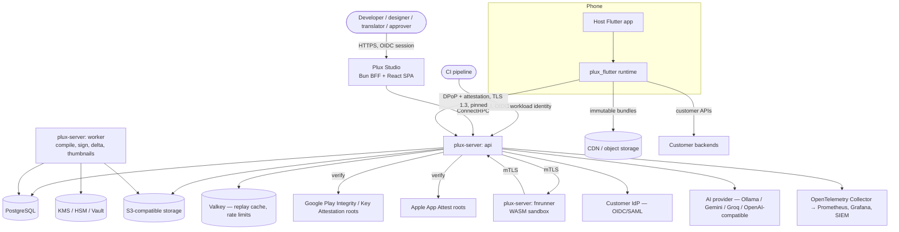
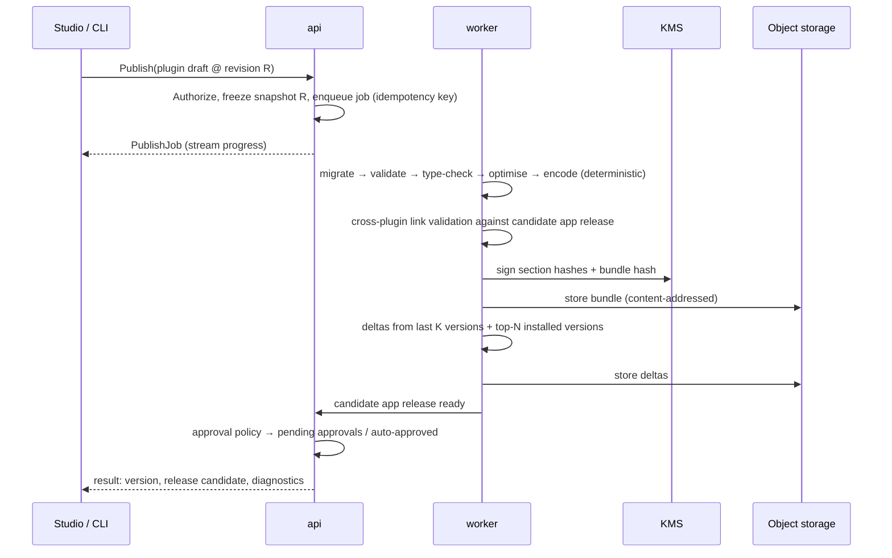
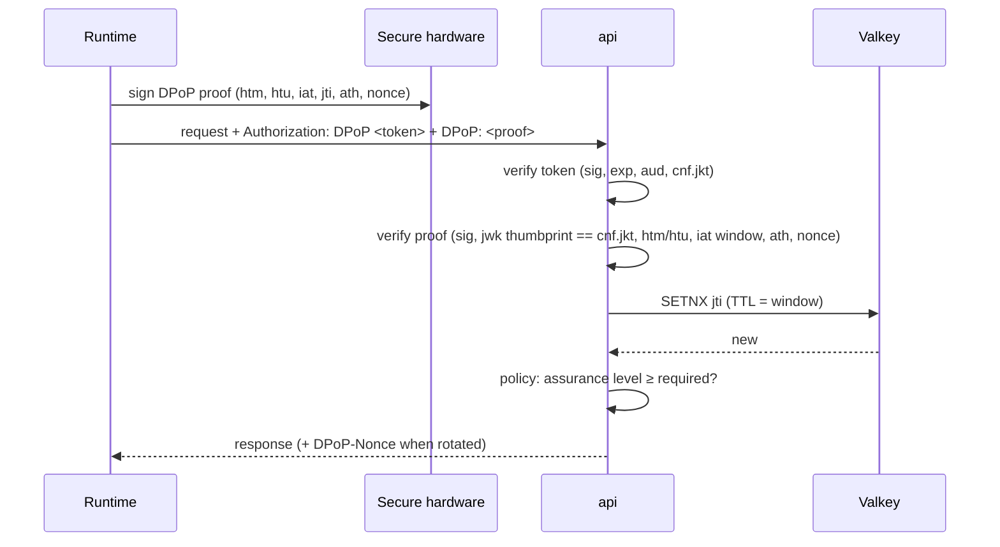
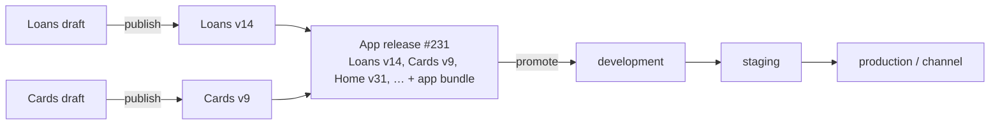
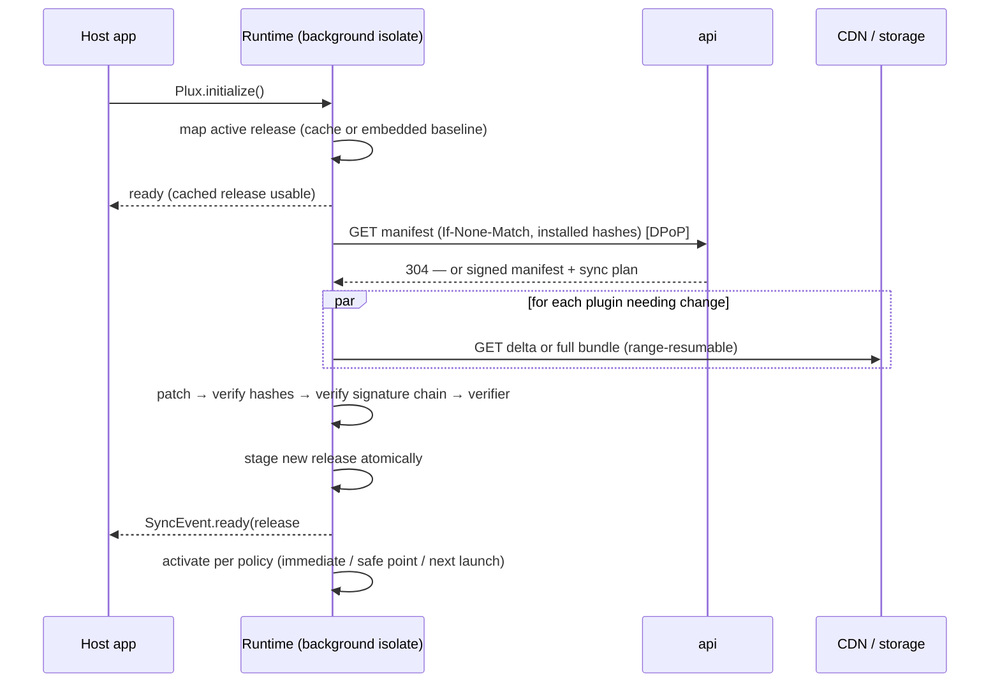
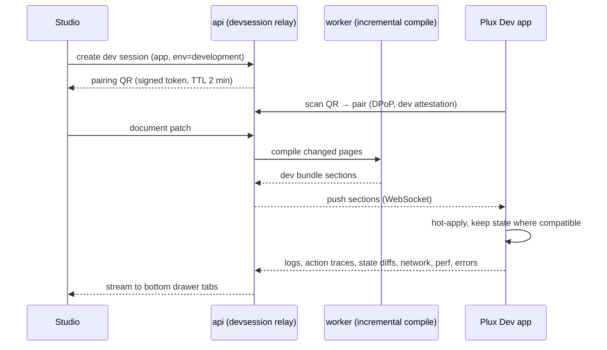
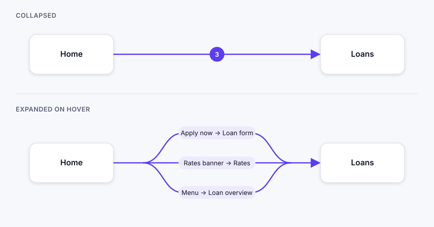
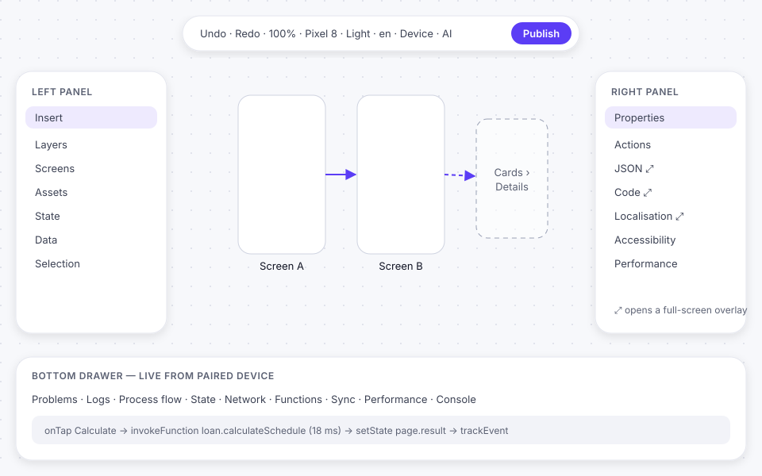

# Plux — System Requirements Specification

**Document ID:** `SRS-PLUX-001`
**Version:** 1.1.6
**Status:** Draft — living document, revised as implementation proceeds
**Date:** 2026-09-27
**Applies to:** Plux Schema, Plux Compiler, Plux Server, Plux Functions, `plux_flutter` runtime, Plux Dev app, Plux Studio, Plux CLI, Plux AI

> **Plux — Plugin Experience.** Build native Flutter screens visually, compile them into signed binary plugins, and ship them to every device in seconds — with high-assurance security, zero parse cost, and full control over who changes what.

---

## Table of Contents

1. [Introduction and Goals](#1-introduction-and-goals)
2. [Product Overview](#2-product-overview)
3. [Scope and Non-Goals](#3-scope-and-non-goals)
4. [Document Conventions](#4-document-conventions)
5. [Delivery Phases and Milestones](#5-delivery-phases-and-milestones)
6. [System Architecture](#6-system-architecture)
7. [Plux Document Model](#7-plux-document-model)
8. [Widget Catalogue — the Layered Model](#8-widget-catalogue--the-layered-model)
9. [Compiler and Bundle Format](#9-compiler-and-bundle-format)
10. [Releases, Versioning, Deltas and Device Sync](#10-releases-versioning-deltas-and-device-sync)
11. [Plux Server (Backend)](#11-plux-server-backend)
12. [Flutter Runtime](#12-flutter-runtime)
13. [Navigation and Host Integration](#13-navigation-and-host-integration)
14. [Actions, Expressions, State, Data and Presentation](#14-actions-expressions-state-data-and-presentation)
15. [Security](#15-security)
16. [Plux Functions — the Compute Layer](#16-plux-functions--the-compute-layer)
17. [Localisation and Accessibility](#17-localisation-and-accessibility)
18. [Governance, Rollouts and Experiments](#18-governance-rollouts-and-experiments)
19. [Observability and Analytics](#19-observability-and-analytics)
20. [Plux Dev App and Live Debugging](#20-plux-dev-app-and-live-debugging)
21. [Plux Studio](#21-plux-studio)
22. [Plux CLI, Testing Toolkit and Developer Experience](#22-plux-cli-testing-toolkit-and-developer-experience)
23. [AI Generation](#23-ai-generation)
24. [Payments](#24-payments)
25. [Collaboration](#25-collaboration)
26. [Multi-tenant Operation](#26-multi-tenant-operation)
27. [Deployment and Operations](#27-deployment-and-operations)
28. [Quality Assurance and Verification](#28-quality-assurance-and-verification)
29. [CI/CD and Software Supply Chain](#29-cicd-and-software-supply-chain)
30. [Non-Functional Targets](#30-non-functional-targets)
31. [Standards and Compliance Mapping](#31-standards-and-compliance-mapping)
32. [Architecture Decision Records](#32-architecture-decision-records)
33. [Repository Layout](#33-repository-layout)
34. [Decisions, Editions and Risks](#34-decisions-editions-and-risks)
35. [Glossary](#35-glossary)
- [Appendix A — Plux Document Example](#appendix-a--plux-document-example)
- [Appendix B — Bundle Container](#appendix-b--bundle-container)
- [Appendix C — Widget Catalogue](#appendix-c--widget-catalogue)
- [Appendix D — Built-in Action Catalogue](#appendix-d--built-in-action-catalogue)
- [Appendix E — Binding Expressions (PXL)](#appendix-e--binding-expressions-pxl)
- [Appendix F — Error Code Catalogue](#appendix-f--error-code-catalogue)
- [Appendix G — Metrics and Telemetry Events](#appendix-g--metrics-and-telemetry-events)
- [Appendix H — Configuration Reference](#appendix-h--configuration-reference)
- [Appendix I — Host Integration API Sketch](#appendix-i--host-integration-api-sketch)
- [Appendix J — Brand](#appendix-j--brand)
- [Appendix K — Requirement Index](#appendix-k--requirement-index)
- [Document Control](#document-control)

---

## 1. Introduction and Goals

### 1.1 Purpose

This document is the authoritative requirements baseline for **Plux**, a server-driven UI and plugin platform for Flutter mobile applications — highly secure, and suitable for financial applications such as banking. It specifies *what* every Plux component must do, how well, and in which delivery phase. The engineering handbook (to be written under `docs/engineering/`) specifies *how* it is built. When this document and any other source disagree, this document wins until it is amended by pull request.

### 1.2 Product vision

Mobile teams lose weeks to app-store release cycles for changes that are "just UI" — a new loan product page, a campaign banner, an onboarding tweak, a regulatory disclosure. Existing answers force a trade-off: code generators still need a store release; JSON-driven UI frameworks are slow to parse and hard to secure; code-push tools patch Dart code and sit uneasily with store policies and security teams.

Plux removes the trade-off:

- Developers design **apps → plugins → pages → actions** in **Plux Studio**, or author them as JSON, or generate them with AI.
- The **Plux Server** validates, compiles and **signs** every published plugin into a **FlatBuffers binary**, and computes **binary deltas against every older version**.
- Teams can build a **complete app without code**: creating an app in Studio generates a ready-to-build Flutter project, and every screen and flow after that is built in Studio (§22.4). Existing apps instead add the package and adopt Plux one screen — or one widget — at a time.
- The **`plux_flutter`** package — added to any new or existing Flutter app with `flutter pub get` — downloads **all plugins at app start** (deltas only), caches them, verifies them, and renders them as **native Flutter widgets with zero parse cost**. Any plugin screen can navigate to any other plugin screen or to any native screen.
- Logic that declarative actions cannot express — a loan amortisation schedule, a fee engine, an eligibility rule — runs as **Plux Functions**: unrestricted Go code compiled to WebAssembly and executed in a sandbox — on the server for trusted results, or on the device for offline logic.
- Every request from a device is **bound to a hardware-backed key (DPoP)** and **backed by platform attestation**, so an operator can trust that the caller is its genuine, unmodified app on a genuine device.

### 1.3 Design goals

| # | Goal | Consequence for the design |
|---|---|---|
| G1 | **Performance is a feature.** | Binary bundles read zero-copy from memory-mapped files; expressions are pre-compiled bytecode; rebuilds are fine-grained; deltas are tiny. Every performance claim has a benchmark in CI (§30). |
| G2 | **High-assurance security by default.** | Hardware-bound keys, DPoP on every request, Play Integrity / App Attest, signed and anti-rollback updates, sandboxed compute, tamper-evident audit. The `maximum` security profile (§15.12) is one switch. |
| G3 | **Developer joy.** | Ten minutes from `flutter create` to a Studio-built page on a real phone. Typed routes, typed functions, clear errors with fix-its, live device preview with logs and action traces. |
| G4 | **No-code or incremental — the team chooses.** | New apps can be built entirely in Studio from a generated project. Existing apps adopt Plux one screen, one widget slot or one flow at a time, with two-way navigation and two-way embedding between plugin and native content on the same screen. |
| G5 | **Offline-first, resilient and bounded.** | All plugins are cached locally; the last known good release always runs; a broken release is rolled back automatically; a failing page never crashes the host app; every size and resource is governed by configurable limits (§30.4). |
| G6 | **Correct by construction.** | Everything is validated and type-checked at publish time — references, route parameters, expressions, accessibility, performance budgets — so errors are caught in Studio, not on a customer's phone. |
| G7 | **Governed change.** | Immutable versions, four-eyes approvals bound to content hashes, staged rollouts, kill switches, and a full answer to "what exactly did this user see on this date?". |
| G8 | **Self-hosted by design.** | Every capability runs on the operator's own infrastructure, including air-gapped networks, with no dependency on a vendor cloud. |
| G9 | **Standards over invention.** | RFC 9449 DPoP, TUF-style update security, OpenTelemetry, OpenAPI, ICU/CLDR, WCAG 2.2, OWASP MASVS/ASVS, W3C Design Tokens, SLSA. Invent only where no standard exists, and document why in an ADR. |
| G10 | **Readable end to end.** | An experienced engineer can read the repository and understand why each decision was made. Every significant decision has an ADR; every requirement has a test. |

### 1.4 Priority order for trade-offs

When requirements conflict, resolve in this order:

1. **Security and correctness** — never traded away.
2. **Performance** — on the device first, then the server, then Studio.
3. **Developer experience** — ease of use for the developers building with Plux.
4. **Operability** — observability, upgrades, recovery.
5. **Feature breadth.**

### 1.5 Target markets and strategic context

| Market | Why Plux | What they need most |
|---|---|---|
| **Financial services, fintech and payments** | Regulated products change often (rates, fees, disclosures, campaigns) but store releases are slow and risky. | Security (§15), four-eyes governance (§18), audit reconstruction (`SEC-142`), Functions for financial logic (§16), deep localisation (§17), self-hosting (§27). |
| **Quick-commerce, delivery and logistics** | Campaigns, flash sales and rider flows change daily; couriers work on poor networks. | Tiny deltas, offline outbox, real-time tracking, scheduled campaigns, A/B tests, geo targeting (§10, §14, §18). |
| **Enterprises with platform teams** | Many apps, many teams, shared design systems, compliance. | SSO/SCIM, RBAC, approval policies, shared component libraries, GitOps export, SIEM export (§18, §21). |
| **Solo developers and startups** | Ship fast, iterate without resubmitting to stores — or without writing code at all. | Free local stack, generated no-code projects, templates, AI generation, live device preview (§20, §22, §23). |
| **Super-apps** | Host partner mini-apps safely inside one binary — a common pattern in payment and lifestyle apps. | Mini-app mode with isolation and capability grants (`HST-020`). |

### 1.6 Intended audience

- Engineers building any Plux component, human or AI agent.
- Reviewers and maintainers deciding scope.
- Security, risk and compliance reviewers at operator organisations.
- Prospective customers and employers evaluating the engineering quality of the project.

---

## 2. Product Overview

### 2.1 Components

| Component | Technology | Role |
|---|---|---|
| **Plux Schema** | JSON Schema 2020-12, widget descriptors | The versioned document model for apps, plugins, pages, components, actions, state, data, themes and translations. Single source for validation, code generation, Studio panels and AI grounding. |
| **Plux Compiler** | Go library | Validates, type-checks, optimises and encodes documents into signed FlatBuffers bundles. Runs in the server, in the CLI and in CI — same code everywhere. |
| **Plux Server** | Go, ConnectRPC, PostgreSQL, S3-compatible storage | Stores documents, runs the publish pipeline, manages releases, deltas, rollouts, experiments, approvals, devices, telemetry and Functions. One binary, deployable as separate roles (`api`, `worker`, `fnrunner`). |
| **Plux Functions** | Go → WebAssembly | Sandboxed compute for logic that declarative actions cannot express, running on the server (`wazero`) or on the device (interpreter). |
| **`plux_flutter`** | Dart, Flutter, Riverpod, FFI | The runtime package: sync, verification, rendering, navigation, actions, state, local database, animations, security. |
| **Plux Dev app** | Flutter | A ready-made host app that pairs with Studio by QR code, shows drafts live on a real device, and streams logs, action traces, state and network to Studio. |
| **Reference host apps** | Flutter | *Plux Bank* and *Plux Express*: reference integrations demonstrating financial and delivery use cases end to end. |
| **Plux Studio** | Bun, TypeScript, React, shadcn/ui, WebGL canvas | The web workspace: apps grid, plugin graph, a Figma-like design canvas, editors, releases, approvals, experiments, localisation, analytics and administration. |
| **Plux CLI** | Go (single static binary) | `plux create`, `init`, `pull`, `codegen`, `validate`, `publish`, `fn`, `test`, `ai` and more — for developers and CI. |
| **Plux AI** | Provider-agnostic adapter in Go | Generates pages, flows, actions, translations, mock data and function scaffolds as schema-valid JSON. |

### 2.2 Core concepts

| Concept | Definition |
|---|---|
| **Organization** | A tenant. Owns apps, teams, members, keys, policies. |
| **App** | A product that runs inside one host application (e.g. "CBE Mobile"). Owns plugins, theme, locales, data sources, environments, the native route catalogue and security policy. |
| **Plugin** | A versioned collection of resources — pages, components, assets, translations, state, data bindings, local collections, action flows and function references — that together form one cohesive feature area of an app (e.g. "Loans", "Onboarding", "Campaigns"). The unit of ownership, locking, versioning and delta sync. |
| **Page** (screen) | A navigable screen, dialog or bottom sheet within a plugin, with an app-wide unique route name, typed parameters, state, data sources and a widget tree. |
| **Node** | One widget instance in a page tree. |
| **Component** | A reusable, linked widget subtree with typed props, slots and events. Editing the master updates all instances. |
| **Template** | A saved snapshot of a widget subtree that is copied on insert. Visibility: private, organization or public. |
| **Action graph** | A typed, bounded graph of actions triggered by an event (tap, page enter, state change…). |
| **PXL** | Plux Expression Language — a small, typed, side-effect-free expression language compiled to bytecode (§14.2). |
| **Plugin version** | An immutable, compiled, signed build of a plugin. |
| **App release** | An immutable, validated set of plugin versions plus app-level resources. The unit that devices activate atomically. |
| **Bundle** | The compiled binary of a plugin version (`.pxb`) or of app-level resources. |
| **Manifest** | The signed document describing the current app release for a channel, with hashes and delta availability. |
| **Delta** | A binary patch that transforms an installed bundle into a newer one. |
| **Environment** | An isolated deployment target for an app (development, staging, production, custom). |
| **Channel** | A release stream within an environment (e.g. `production`, `beta`, `internal`). |
| **Native route** | A screen implemented in the host app's own Flutter code and made known to Plux (by router discovery or one-place registration), so plugin pages can navigate to it. |
| **Native slot** | A widget implemented in the host app's own code, placed inside a plugin page and rendered natively on the device. |
| **Generated project** | A complete, ready-to-build Flutter project produced by Plux for no-code apps. |
| **Plux Function** | A versioned, sandboxed Go/WASM function invoked from actions. |
| **Assurance level** | The server's confidence in a device, derived from attestation (AL0–AL3, `SEC-007`). |

### 2.3 End-to-end flow

```mermaid
flowchart LR
    subgraph Author
      S[Plux Studio / CLI / AI] -->|JSON documents| D[(Drafts in PostgreSQL)]
    end
    subgraph Publish
      D --> V[Validate + type-check] --> C[Compile to FlatBuffers] --> G[Sign] --> X[Deltas vs every older version]
      X --> A{Approval policy}
    end
    subgraph Release
      A -->|approved| R[App release] --> RO[Rollout: channel, %, targeting]
    end
    subgraph Device
      RO -->|signed manifest| M[Runtime at app start] --> DL[Download deltas for ALL plugins] --> VE[Verify signature + hashes] --> AC[Atomic activate] --> RE[Render + run actions]
      RE -->|DPoP + attestation| F[Plux Functions]
      RE -->|telemetry| T[Analytics / health]
      T -->|regression| RO
    end
```



### 2.4 Personas and usage models

#### 2.4.1 Solo developer — "Sara ships a side project without code"

Sara runs `docker compose up` for a free local Plux stack, creates an app in Studio and downloads the generated Flutter project, builds it once for the stores, opens Studio, types *"onboarding with three slides and a sign-up form"* into the AI prompt, tweaks it on the canvas, scans a QR code with the Plux Dev app and sees it on her phone. She publishes; her app picks it up on next launch. When she wants a paywall experiment, she clones a template and starts an A/B test. No store release after the first one.

#### 2.4.2 Enterprise platform team — "Many squads, one design system"

The platform team connects Plux to Entra ID via OIDC and SCIM, locks a shared component library built from the corporate design tokens, and defines approval policies: staging needs one reviewer, production needs two approvers from different teams. Each squad owns plugins. Releases are exported to Git for audit, published from CI with OIDC workload identity, and monitored in Grafana through the shipped dashboards.

#### 2.4.3 Financial services — "Launch a new loan product this week, not next quarter"

The product team builds the loan application plugin in Studio. The rate and schedule logic is a Plux Function (`loan.calculateSchedule@v3`) using exact decimal arithmetic. The security profile is `maximum`: hardware-bound DPoP keys, strong device integrity required for the application flow, screenshots blocked, confidential (encrypted) bundles, secure PIN pad with randomised layout, transaction signing bound to biometrics. Compliance approves the release with a WebAuthn step-up; the approval is bound to the exact bundle hash. A staged rollout reaches 5% of customers in one city first. When the regulator asks what a customer saw on 3 March, the audit trail reconstructs the exact release and page.

#### 2.4.4 Quick-commerce — "Flash sale at 18:00, rider flow change at 20:00"

Marketing schedules a campaign plugin to go live at 18:00 and expire at midnight, targeted by city, with two banner variants in an A/B test. Deltas are a few kilobytes, so couriers on 3G get the new proof-of-delivery step within one app start. Order tracking binds to a WebSocket stream; rider actions queue in an offline outbox and replay when the network returns. If crash rate rises, the rollout pauses itself.

### 2.5 Differentiation

| Alternative | Approach | Where Plux is different |
|---|---|---|
| Visual code generators | Generate Flutter source; a store release ships every change. | Plux ships changes without store releases, with governance and staged rollouts. |
| JSON server-driven UI libraries | Download JSON, parse and interpret at runtime. | Plux compiles to FlatBuffers (no parse), type-checks at publish, signs and delta-updates bundles, and ships a full platform (Studio, governance, security, analytics). |
| Flutter Remote Flutter Widgets (RFW) | Low-level widget library format. | Plux provides the full platform around a curated, versioned widget model, plus actions, state, data, security and tooling. |
| Dart code-push | Patches compiled Dart code. | Plux ships data, not code: no executable code is downloaded (store-policy-safe, `SEC-054`), changes are reviewable and governed per plugin. |
| Remote config / in-app messaging tools | Change values or overlay messages. | Plux ships entire screens and flows with navigation, state, data and compute. |

---

## 3. Scope and Non-Goals

### 3.1 In scope

- All components in §2.1, delivered in the phases of §5.
- Android and iOS host applications built with Flutter, including Flutter modules embedded in native apps (add-to-app).
- Self-hosted and air-gapped deployment (§27), and multi-tenant operation by one operator for many organisations (§26).
- No-code app generation: complete Flutter projects produced by Plux (§22.4).
- The reference host apps *Plux Bank* and *Plux Express* and a public demonstration environment.

### 3.2 Explicit non-goals

| Non-goal | Rationale |
|---|---|
| Downloading or executing native code, Dart code or JavaScript on the device. | Store policies and security. Plux ships declarative data, PXL bytecode and, optionally, WebAssembly run by a sandboxed interpreter with no direct platform access (`SEC-054`). |
| Changing an app's primary purpose after review. | Store policy. Plux documents responsible use and provides policy lints. |
| Hosting end-user data (a backend-as-a-service). | Plux calls customers' own APIs and Functions. It is not a general database for app users. |
| Real-time multi-user editing before Phase 14. | Exclusive per-plugin editing locks are used until then (`SRV-040`). |
| Lazy, per-plugin download on first navigation. | By design, **all plugins are synced at app start** so that any screen can reach any screen offline (`SYN-001`). |

---

## 4. Document Conventions

### 4.1 Normative language

The key words **MUST**, **MUST NOT**, **REQUIRED**, **SHALL**, **SHOULD**, **SHOULD NOT**, **MAY** and **OPTIONAL** are to be interpreted as described in [RFC 2119](https://www.rfc-editor.org/rfc/rfc2119) and [RFC 8174](https://www.rfc-editor.org/rfc/rfc8174).

### 4.2 Requirement identifiers

Every normative requirement carries a stable identifier `<AREA>-<NNN>`. Identifiers are **immutable**; a withdrawn requirement is marked `WITHDRAWN` and its number is never reused. Numbers are grouped by subsection in blocks of ten so that related requirements can be added without renumbering.

| Area | Meaning | Section |
|---|---|---|
| `SCH` | Document model and schema | §7 |
| `WGT` | Widget catalogue | §8 |
| `CMP` | Compiler | §9 |
| `BND` | Bundle format | §9 |
| `REL` | Releases, deltas, rollouts, kill switch (server side) | §10, §18 |
| `SYN` | Device sync (runtime side) | §10 |
| `SRV` | Plux Server | §11 |
| `RT` | Flutter runtime | §12 |
| `NAV` | Navigation | §13 |
| `HST` | Host integration | §13 |
| `ACT` | Actions | §14 |
| `PXL` | Expression language | §14 |
| `STA` | State | §14 |
| `DAT` | Data sources | §14 |
| `DB` | Local database | §14 |
| `ANI` | Animation | §14 |
| `THM` | Theming and design tokens | §14 |
| `AST` | Assets | §14 |
| `SEC` | Security | §15 |
| `FN` | Plux Functions | §16 |
| `I18N` | Localisation | §17 |
| `A11Y` | Accessibility | §17 |
| `GOV` | Governance, identity, approvals | §18 |
| `ABT` | Experiments and feature flags | §18 |
| `OBS` | Observability | §19 |
| `ANL` | Analytics and telemetry | §19 |
| `DEV` | Dev app and live debugging | §20 |
| `STU` | Plux Studio | §21 |
| `CLI` | Plux CLI | §22 |
| `TST` | Testing toolkit for Plux users | §22 |
| `DX` | Developer experience and documentation | §22 |
| `GEN` | No-code app generation | §22 |
| `AI` | AI generation | §23 |
| `PAY` | Payments | §24 |
| `COL` | Collaboration | §25 |
| `SAAS` | Multi-tenant operation | §26 |
| `DEP` | Deployment and operations | §27 |
| `QA` | Verification of Plux itself | §28 |
| `CI` | CI/CD and supply chain | §29 |
| `NFR` | Non-functional targets | §30 |
| `LIM` | Limits and quotas | §30 |

### 4.3 Phase and status tags

Each requirement carries a phase tag `P0`–`P15` (§5) indicating when it becomes binding, and a `Status` from this controlled vocabulary:

| Status | Meaning |
|---|---|
| `SPEC` | Specified, not yet implemented |
| `WIP` | Implementation in progress |
| `DONE` | Implemented and verified by an automated test |
| `WITHDRAWN` | No longer applicable; retained for traceability |

> **Maintenance note.** The `Status` column is the single source of truth for implementation progress and is updated in the same pull request that changes the code. No other document restates implementation status.

### 4.4 Priority

`MUST` requirements are release-blocking for their phase. `SHOULD` requirements may be deferred with a recorded justification in the work log. `MAY` requirements are discretionary.

### 4.5 Requirement table format

All requirement tables use the columns `ID | Phase | Priority | Requirement | Status`. A requirement that spans phases is tagged with the phase in which it first becomes binding; later extensions are separate requirements.

---

## 5. Delivery Phases and Milestones

Plux is delivered in sixteen phases. Each phase produces an **independently demonstrable, fully tested increment**; no phase leaves the system partially working. Core engine first, Studio last: the runtime, bundle format and security model are the foundations everything else depends on, and they are the hardest to change later.

```mermaid
flowchart LR
    subgraph M1["M1 — Engine"]
      P0[P0 Foundations] --> P1[P1 Schema + compiler] --> P2[P2 Backend core] --> P3[P3 Runtime rendering] --> P4[P4 Routing + host] --> P5[P5 Actions, state, DB, animation]
    end
    subgraph M2["M2 — High-assurance"]
      P6[P6 Security hardening] --> P7[P7 Plux Functions] --> P8[P8 Localisation + a11y] --> P9[P9 Enterprise + operations]
    end
    subgraph M3["M3 — Plux 1.0"]
      P10[P10 Dev app + debugging] --> P11[P11 Studio] --> P12[P12 AI generation]
    end
    subgraph M4["M4 — Growth"]
      P13[P13 Payments] --> P14[P14 Collaboration] --> P15[P15 Multi-tenant operation]
    end
    P5 --> P6
    P9 --> P10
    P12 --> P13
```



### 5.1 Phase definitions

| Phase | Theme | Deliverables | Exit criteria |
|---|---|---|---|
| **P0** | **Foundations** | Monorepo layout (§33) with Go modules joined by `go.work`, a Dart pub workspace and a Bun workspace; Makefile as the single entry point; CI for Go, Dart and Bun (lint, format, test, build, vulnerability and secret scanning, SBOM, Conventional Commits) behind one required gate; requirement traceability, specification lint and coverage gates (`tools/`); reproducible Go builds; REUSE-compliant licensing (ADR-0022); release workflow; this specification; `AGENTS.md`, `CLAUDE.md`, engineering handbook, ADR process, work log; pre-commit hooks; `CODEOWNERS`. | `make check` is green across all toolchains on a clean clone; CI required checks enforced on `main`. |
| **P1** | **Schema and compiler** | JSON Schema for the document model (§7); widget descriptor registry and generated coverage table (§8); FlatBuffers bundle schema and container format (§9); deterministic Go compiler with validation, PXL type-checking and optimisation; diagnostics with codes and JSON paths; generated types for Go, Dart and TypeScript; conformance test vectors. | Golden tests pass; the same input produces byte-identical output across runs and platforms; every Layer 1 widget in scope for P3 has a descriptor. |
| **P2** | **Backend core** | Plux Server (`api` and `worker` roles); ConnectRPC API (§11); PostgreSQL schema and migrations; object storage; organisations, apps, plugins, pages; drafts with snapshots and per-plugin editing locks; publish pipeline (validate → compile → sign → store); immutable plugin versions and app releases; delta generation against every older version; signed manifest endpoint; CLI `login`, `validate`, `publish`, `pull`; Docker Compose stack; baseline logging, metrics and tracing. | A plugin authored as JSON is published via the CLI; the manifest and deltas are fetched and verified by a test client; compose stack starts with one command. |
| **P3** | **Runtime rendering** | `plux_flutter` package on Riverpod; memory-mapped zero-copy bundle reader; FlatBuffers verifier; signature and hash verification; renderer for P3 widget set; theming and assets; **sync of all plugins at app start** with deltas, manual sync API, atomic activation, last-known-good rollback, baseline bundles; error boundaries; minimal example host app. | Example host app renders published pages offline; render and sync benchmarks recorded; corrupted and tampered bundles are rejected in tests. |
| **P4** | **Routing and host integration** | Route addressing; plugin → plugin and plugin → native navigation; native → plugin screen by app-wide route name; **mixed screens**: native slots inside plugin pages and `PluxView` inside native screens, with shared exposed state; typed parameters and results; `go_router`/`auto_route` discovery; deep links; guards; one-place registration of native routes, widgets and actions without changes to existing code; `plux native scan`; `plux codegen` typed routes; **`plux create`** generated projects for no-code apps. | The example host app mixes native and plugin content in both directions — across screens and within one screen — with typed routes; a generated project builds and runs unchanged; unknown routes and bad parameters fail safely. |
| **P5** | **Actions, state, data, local DB, animation** | Action graph engine and built-in catalogue (Appendix D); PXL VM; Riverpod-based scoped state with fine-grained rebuilds; forms and validators; data sources (REST, GraphQL, WebSocket, SSE) with caching, pagination and offline outbox; local database adapter layer (Drift default, others pluggable); animations (implicit, timelines, transitions, Hero, Lottie, Rive). | A complete multi-page flow (login → dashboard → form → result) built from JSON alone runs on device with API calls, local persistence and animations, meeting §30 performance targets. |
| **P6** | **Security hardening** | Hardware-backed device keys; Play Integrity, Android Key Attestation and App Attest; device registration and assurance levels; **DPoP (RFC 9449)** on every request with nonces and replay protection; sender-constrained tokens; certificate pinning; TUF-style update metadata and key rotation; confidential (encrypted) bundles; RASP; secure widgets; encrypted local storage; security profiles; audit log; threat model; OWASP MASVS L2 + resilience checklist. | Security test suite passes: replayed, forged, mis-bound and expired requests are rejected; tampered and rolled-back bundles are rejected; MASVS checklist complete with evidence. |
| **P7** | **Plux Functions** | Interface-only Go SDK; standard-Go WASM build pipeline; `fnrunner` role on `wazero` with resource limits and deny-by-default capabilities; **on-device execution** through a sandboxed WASM interpreter for functions placed on the device; typed schemas for binding; versioning and aliases; server invocation protected by DPoP and assurance levels; `plux fn` CLI. | A loan calculator runs on the device offline and on the server with a trusted result; limit, fuzz and isolation tests pass on both; latency targets met. |
| **P8** | **Localisation and accessibility** | ICU MessageFormat and CLDR; English, German, Arabic and Amharic at launch; non-Gregorian calendar support (Ethiopian first); RTL; runtime locale switch; translation workflow and import/export; WCAG 2.2 AA checks at publish; accessibility report. | One plugin runs in all launch locales and RTL; publish-time accessibility checks pass on reference apps. |
| **P9** | **Enterprise and operations** | Teams, roles and custom roles; SSO (OIDC, SAML) and SCIM; generic approval engine with four-eyes and step-up; break-glass; change freezes; environments and promotion; staged rollouts, targeting, scheduling, health-based auto-pause and rollback; kill switch; experiment and feature-flag engine; telemetry ingestion and dashboards; observability stack; Helm chart; HA; backups; air-gapped install; license files. | A self-hosted HA install passes a scripted regulated-industry audit walkthrough: approvals, rollout, kill switch, rollback, audit export and "what did the user see" reconstruction. |
| **P10** | **Dev app and live debugging** | Plux Dev app; QR pairing; live draft push with incremental compile; streaming of logs, action traces (process flow), state, network, function calls, sync and performance; on-device inspect mode; mocks and network simulation; `plux_devtools` for developers' own host apps (debug builds only). | Edit-to-device latency target met; a Studio-less developer can debug a flow using the CLI viewer; devtools proven absent from release builds. |
| **P11** | **Plux Studio** | Studio shell, design system and themes; **Plux Canvas** (WebGL design surface with a Flutter-compatible layout engine and conformance suite); apps grid; plugin graph with bundled arrows; plugin canvas with ghost screens; no-code project generation and shell-update detection; screen editor with panels, full-screen overlays and bottom drawer; multi-device frames; components and templates; release, approval, experiment, function, localisation, design system, data, analytics, device and admin screens. | A complete app is built in Studio alone, previewed on a paired device, approved and released; Studio performance targets met. |
| **P12** | **AI generation** | Provider-agnostic AI adapter with structured JSON output; prompt → page/plugin/flow; screenshot → page; edit selection; actions, translations, mock data and function scaffolds; review-before-apply; evaluation suite; MCP server. | ≥ 95% of the evaluation prompts produce schema-valid, publishable output with a supported free provider. **Plux 1.0 is tagged at the end of P12.** |
| **P13** | **Payments** | Payment action and server-side provider interface; adapters for Telebirr, Chapa, M-Pesa and Stripe; SCA transaction signing; webhooks; reconciliation. | Sandbox payments complete end to end for every adapter with SCA; PCI DSS scope stays at SAQ A. |
| **P14** | **Collaboration** | Real-time co-editing (CRDT), presence, comments, mentions, notifications. | Two editors edit one plugin concurrently without data loss; validation remains authoritative on the server. |
| **P15** | **Multi-tenant operation** | Strict tenant isolation, per-tenant keys, quotas, usage metering interfaces, self-service organisation creation, public template gallery, status endpoint. | A new organisation is created and ships a plugin on a shared installation without operator involvement; isolation tests pass. |

### 5.2 Milestones

| Milestone | Phases | Demonstrates |
|---|---|---|
| **M1 — Engine** | P0–P5 | JSON → signed binary → device rendering with navigation, actions, state, data and animations. The core technical claim. |
| **M2 — High-assurance** | P6–P9 | Security, compute, localisation and governance sufficient for a pilot in a regulated industry. |
| **M3 — Plux 1.0** | P10–P12 | The complete developer product: live device debugging, Studio and AI. |
| **M4 — Growth** | P13–P15 | Payments, collaboration and multi-tenant operation. |

### 5.3 Definition of Done for a phase

| # | Criterion |
|---|---|
| DoD-1 | All `MUST` requirements tagged with the phase have `Status: DONE`. |
| DoD-2 | Coverage thresholds in `QA-001` are met for every component touched. |
| DoD-3 | Integration and end-to-end suites pass in CI against the Docker Compose stack, and from P9 also against a `kind` cluster using the Helm chart. |
| DoD-4 | Performance benchmarks for the phase (§30) have been executed and the results committed to `docs/benchmarks/` with methodology and device profile. |
| DoD-5 | All ADRs raised during the phase are merged and indexed. |
| DoD-6 | Security review for the phase is complete: threat-model delta, and for P6 onwards the relevant MASVS/ASVS checks with evidence. |
| DoD-7 | User-facing documentation for the phase's features is published in the docs site (`DX-002`). |
| DoD-8 | The reference host apps are updated to demonstrate the phase's features. |
| DoD-9 | An operational runbook covers the failure modes introduced in the phase. |

### 5.4 Forward-compatibility rules

> **BND-000** `P3` **MUST** — From the first tagged runtime release (end of P3), the bundle format and manifest format **MUST** evolve additively only: fields may be added, never removed, renumbered, retyped or given new semantics. Deprecated fields keep their slots. A bundle that needs a capability unknown to an older runtime **MUST** declare it in `required_features` (`BND-008`) so that the older runtime refuses it gracefully and keeps its last compatible release.

> **SCH-000** `P1` **MUST** — The document schema **MUST** carry an explicit `schemaVersion`. Every schema change **MUST** come with an automatic, tested forward migration. Documents are never silently reinterpreted.

> **SRV-000** `P2` **MUST** — The public API contract under `proto/plux/v1/` **MUST** be checked with `buf breaking` against the last tagged release; breaking changes require a new API version package (`v2`) and a deprecation period of at least two minor releases.

Rationale: an app installed from the store today must keep working, unmodified, against every future Plux server and every future bundle — or refuse cleanly and keep running its last good release. This is what makes over-the-air UI safe for regulated industries.

---

## 6. System Architecture

### 6.1 Context diagram



### 6.2 Technology stack

| Concern | Choice | Notes |
|---|---|---|
| Backend language | Go (latest stable) | `log/slog`, generics, `go:wasmexport`. |
| API | ConnectRPC + Protocol Buffers, managed with `buf` | One handler serves gRPC, gRPC-Web and Connect JSON over HTTP/1.1 and HTTP/2. Generated clients for Go, TypeScript (Connect-ES) and Dart. |
| Primary database | PostgreSQL (16+) | `pgx`, `sqlc`, versioned migrations, row-level security as defence in depth. |
| Job queue | PostgreSQL-backed (River) | No extra infrastructure for self-hosters. |
| Object storage | S3 API (any S3-compatible store for self-host; SeaweedFS in the Compose stack) | Bundles, deltas, assets, thumbnails, exports. |
| Shared cache | Valkey (Redis-compatible) | DPoP `jti` replay cache, nonces, rate limits. In-memory fallback for single-node. |
| Function runtime | WebAssembly compiled with standard Go (`GOOS=wasip1`); `wazero` on the server; a sandboxed interpreter on the device | One artifact, two placements (ADR-0011). |
| Mobile runtime | Flutter (latest stable), Dart 3, Riverpod 3 | FFI for `mmap` and `zstd`. Impeller renderer. |
| Bundle format | FlatBuffers | Zero-copy reads, forward-compatible evolution. |
| Local database | Drift on SQLite (SQLCipher) by default | Adapter interface for ObjectBox, Hive CE, Sembast and custom stores. |
| Studio | Bun, TypeScript (strict), React, TanStack Router and Query, shadcn/ui, Radix, Tailwind CSS, Monaco | Bun serves the SPA and acts as backend-for-frontend (BFF). |
| Studio canvas | **Plux Canvas**: a TypeScript WebGL2 scene graph with a Flutter-compatible layout engine | A Figma-like design surface; the device is the source of truth, and a layout conformance suite keeps the canvas faithful (ADR-0013). |
| Observability | OpenTelemetry, Prometheus, Grafana, structured JSON logs | Dashboards and alerts shipped in `deploy/`. |
| Packaging | Distroless multi-arch container images, Helm, Docker Compose | Signed with cosign; SBOMs in CycloneDX. |

### 6.3 Plux Server decomposition

The server is a **modular monolith**: one Go module and one binary, `plux-server`, whose modules communicate through in-process interfaces with the same boundaries a microservice split would have. It runs in one or more **roles**:

| Role | Responsibilities | Network exposure |
|---|---|---|
| `api` | All ConnectRPC services, manifest and control endpoints, device registration, token issuance, telemetry ingestion, dev-session relay. | Public (behind ingress). |
| `worker` | Publish pipeline jobs: compile, sign (via KMS), delta generation, asset processing, thumbnails, visual diffs, exports, scheduled rollouts, experiment statistics, retention jobs. | Internal only. |
| `fnrunner` | Executes Plux Functions in WASM sandboxes. Holds no database credentials. Egress only through an allowlisting proxy. | Internal only, mTLS. |

```
internal/
  api/          ConnectRPC handlers — thin; translate to domain calls and errors
  auth/         Studio sessions, PATs, CI OIDC federation, RBAC evaluation
  device/       registration, attestation (android/, ios/), assurance levels
  dpop/         DPoP proof validation, nonces, replay cache
  token/        sender-constrained access tokens, token exchange
  document/     drafts, snapshots, JSON Patch, locks, references graph
  schema/       JSON Schema validation, migrations, widget registry
  pxl/          expression parser, type checker, bytecode emitter
  compiler/     pipeline stages, optimiser, FlatBuffers encoder, diagnostics
  bundle/       container format, hashing, verification
  delta/        section diffing, zstd patching, delta cache
  release/      plugin versions, app releases, channels, promotion, manifests
  rollout/      targeting, bucketing, schedules, health gates, kill switch
  experiment/   assignment, exposure, statistics, feature flags
  function/     function registry, build pipeline, invocation routing
  fnrunner/     wazero host, capabilities, limits
  approval/     policy engine, approvals, break-glass, freezes
  audit/        hash-chained audit log, SIEM export
  l10n/         translation keys, workflow, import/export
  telemetry/    ingestion, aggregation, dashboards queries
  devsession/   pairing, live relay between Studio and devices
  ai/           provider adapters, structured output, repair loop
  payment/      provider interface and adapters (P13)
  signing/      KMS/HSM/Vault abstraction, TUF metadata
  tenancy/      organisations, teams, memberships, apps, environments, channels, access grants, trash
  storage/      PostgreSQL repositories, object storage
  cache/        shared expendable cache (rate limits, single-flight, replay) on Valkey or memory
  httpx/        SSRF-safe outbound client and input size guards
  jobs/         job definitions and scheduling
  config/       configuration loading and validation
  observability/ logging, metrics, tracing
  server/       role wiring, health endpoints, lifecycle
  pluxv1/       code generated from proto/plux/v1 (never edited by hand)
  plxerr/       unified error type and registered reasons
```

### 6.4 Runtime decomposition

```
plux_flutter/lib/src/
  core/         Plux facade, config, lifecycle, Riverpod container integration
  functions/    on-device WASM interpreter bridge (FFI), capability host, limits
  sync/         manifest client, planner, downloader, patcher, verifier, activator, storage GC
  bundle/       mmap reader (FFI), FlatBuffers accessors, verifier, section cache
  security/     device keys, attestation clients, DPoP signer, token manager, pinning, RASP hooks
  render/       node → widget factory, prop decoders, error boundaries, layer registries, native slots
  widgets/      Layer 1 builders; layer2/ Layer 2 components
  nav/          route model, navigator integration, go_router adapter, deep links, guards
  actions/      graph executor, built-in actions, custom action registry, tracing
  pxl/          bytecode VM and standard library
  state/        scoped Riverpod providers, persistence, forms
  data/         REST, GraphQL, WebSocket, SSE clients, cache, outbox
  db/           adapter interface; drift adapter lives in plux_db_drift
  anim/         timelines, transitions, gesture- and scroll-linked animation
  theme/        design tokens mapped to Material and Cupertino, white-label overlays
  l10n/         ICU formatter, locale resolution, calendar systems
  telemetry/    event buffer, batching, consent, crash capture
  devtools_api/ hooks consumed by plux_devtools (no-op in release)
```

### 6.5 Publish path



### 6.6 Device request path



### 6.7 Layering rules

| # | Rule |
|---|---|
| L-1 | ConnectRPC handlers contain no business logic; they authenticate, authorise, translate and delegate. |
| L-2 | Domain modules depend on interfaces, never on transport or on another module's storage. |
| L-3 | Only `signing/` touches private keys, and only through the KMS abstraction. |
| L-4 | `fnrunner` never receives database credentials or signing capabilities. |
| L-5 | The compiler is a pure library with no I/O except through injected interfaces, so it runs identically in the server, the CLI and tests. |
| L-6 | In the runtime, nothing on the UI isolate performs network I/O, decompression, patching or hashing of more than 64 KiB. |
| L-7 | Studio never talks to the database or object storage directly; all access goes through the API with the user's permissions. |

---

## 7. Plux Document Model

The document model is the contract between every author (Studio, CLI, AI, Git) and every consumer (compiler, Studio panels, validators, AI grounding). It is JSON, strictly validated, and versioned.

### 7.1 Hierarchy

| Level | Contains | Owns |
|---|---|---|
| **Organization** | Apps, teams, members | Keys, policies, limits |
| **App** | Plugins | Theme, locales, environments, data sources, native catalogue, security and sync policy, app state, shared collections, shared components, feature flags |
| **Plugin** | Pages | Plugin state, local collections, capabilities, fallback page, flows, function references |
| **Page** | Nodes | Route name, parameters, page state, data sources, lifecycle events, route options |
| **Node** | Child nodes or slots | Widget type, props, bindings, events |

### 7.2 General structure

| ID | Phase | Priority | Requirement | Status |
|---|---|---|---|---|
| `SCH-001` | P1 | MUST | The document model **MUST** be defined in JSON Schema 2020-12 under `schema/json/` and **MUST** be the single source of truth for document structure. Types for Go, Dart and TypeScript **MUST** be generated from it and committed. | DONE |
| `SCH-002` | P1 | MUST | Every entity (app, plugin, page, node, component, template, action graph, state entry, data source, collection, translation key, function reference) **MUST** have an immutable identifier (UUIDv7) and, where addressable by humans, a `key` (lower-kebab slug, unique within its parent). All cross-references **MUST** use identifiers, so renaming a key never breaks a reference. | DONE |
| `SCH-003` | P1 | MUST | Documents **MUST** be canonicalised with the JSON Canonicalization Scheme (RFC 8785) before hashing, diffing and storage, so that equal content has equal hashes. | DONE |
| `SCH-004` | P1 | MUST | Authoring validation **MUST** reject unknown properties, except properties prefixed with `x-`, which are preserved but ignored by the compiler. | DONE |
| `SCH-005` | P1 | MUST | Documents **MUST** respect size limits: at most 5,000 nodes per page (warning above 1,000), tree depth at most 64, at most 500 pages per plugin, at most 200 plugins per app, string props at most 64 KiB. These defaults are part of the limits framework of §30.4 and are configurable per installation, organisation, app and plugin. | DONE |
| `SCH-006` | P1 | MUST | The storage and Git export format **MUST** be one JSON file per page, component and action graph, plus one manifest file per plugin and app, so that diffs are reviewable line by line (`GOV-011`). | DONE |

### 7.3 Value types

| ID | Phase | Priority | Requirement | Status |
|---|---|---|---|---|
| `SCH-010` | P1 | MUST | The type system **MUST** include `string`, `int` (64-bit), `double`, `bool`, `decimal` (arbitrary precision, serialised as a string), `money` (`decimal` + ISO 4217 currency), `date`, `dateTime` (ISO 8601 with offset), `duration`, `color`, `enum`, `list<T>`, `map<string,T>`, named object types, `asset`, `route` and nullable variants of each. | DONE |
| `SCH-011` | P1 | MUST | A prop value **MUST** be exactly one of: a literal of the prop's type; a PXL binding (`{"$expr": "…"}`); a design token reference (`{"$token": "color.primary"}`); a translation reference (`{"$t": "<key-id>", "args": {…}}`); an asset reference (`{"$asset": "<asset-id>"}`). | DONE |
| `SCH-012` | P1 | MUST | Fields and state entries **MAY** be tagged `sensitive: true`. Sensitive values **MUST** be excluded from logs, traces, analytics, crash reports and session replay, and persisted only in encrypted storage (`SEC-092`). | WIP |

### 7.4 App, plugin and page documents

| ID | Phase | Priority | Requirement | Status |
|---|---|---|---|---|
| `SCH-020` | P1 | MUST | An **app** document **MUST** declare: key, name, description, icon (uploaded image or generated monogram), default and supported locales, theme reference, entry route, environments with variables, data source definitions, native route catalogue reference, security profile (§15.12), sync policy (§10.4), minimum runtime version and feature flags. | DONE |
| `SCH-021` | P1 | MUST | A **plugin** document **MUST** declare: key, name, description, icon, owning team, entry page, pages, plugin-scoped state, local DB collections, requested capabilities (network domains, functions, device APIs, native routes), tags and an optional fallback page shown when the plugin is disabled by kill switch. | DONE |
| `SCH-022` | P1 | MUST | A **page** document **MUST** declare: key, route name (`SCH-025`), kind (`screen`, `dialog`, `bottomSheet`, `fullscreenDialog`), title (translatable), typed parameters with required/optional and defaults, page state, data sources, lifecycle events (`onInit`, `onEnter`, `onResume`, `onLeave`, `onDispose`), route options (transition, guards) and security flags (`secure` to block screenshots, `requiresAssurance`). | DONE |
| `SCH-023` | P1 | MUST | A **node** **MUST** consist of: `id`, `type` (a registered widget type), `props`, `events` (event name → action graph reference or inline graph), `children` or named `slots` as the widget descriptor allows, optional `visible` (PXL boolean), optional `semantics`, optional `testId`, and optional responsive overrides per breakpoint (`WGT-010`). | DONE |
| `SCH-025` | P1 | MUST | Every page **MUST** have a **route name** that is unique across the whole app (default derived from its key, editable, e.g. `loan-calculator`). Native code, deep links and generated APIs address screens by route name only, never by plugin, so a screen can move between plugins without breaking any caller. | DONE |
| `SCH-024` | P1 | MUST | Page and plugin documents **MUST** declare a design-time mock for each data source and parameter so that Studio and tests can render pages without a live backend (`DAT-080`). | DONE |

### 7.5 Components, templates and the native catalogue

| ID | Phase | Priority | Requirement | Status |
|---|---|---|---|---|
| `SCH-030` | P1 | MUST | A **component** **MUST** declare typed props with defaults, named slots, emitted events, internal state and a version. Instances **MUST** reference a component by ID and version and **MAY** override props and fill slots. Components **MUST** be compiled once per bundle and instantiated by reference (`CMP-021`). | DONE |
| `SCH-031` | P1 | MUST | A **template** **MUST** store a snapshot subtree with name, description, category, tags, thumbnail, exposed parameters, visibility (`private`, `organization`, `public`) and a dependency list (tokens, assets, components). Inserting a template **MUST** copy it with fresh IDs. | DONE |
| `SCH-032` | P1 | MUST | The **native catalogue** **MUST** declare each host-app native route (key, description, typed parameters and result), each native slot widget and each custom action with its descriptor (`WGT-030`, `ACT-060`). It is produced without changing existing host code — by router discovery and static analysis (`HST-031`) — uploaded by the CLI (`CLI-006`) and versioned per host app build. | DONE |

### 7.6 Validation and the reference graph

| ID | Phase | Priority | Requirement | Status |
|---|---|---|---|---|
| `SCH-040` | P1 | MUST | Validation **MUST** run in three tiers — **structural** (JSON Schema), **semantic** (references resolve, types match, PXL type-checks, route parameters are satisfied at every navigate action, keys are unique, no redirect loops on `onEnter`) and **policy** (accessibility, performance budgets, security lints, store-policy lints) — and produce diagnostics with code, severity (`error`, `warning`, `info`), JSON path, message and, where possible, a machine-applicable fix. | DONE |
| `SCH-041` | P1 | MUST | The server and compiler **MUST** derive a **reference graph** from documents: page → page, page → other plugin's page, page → native route, and uses of components, state keys, translation keys, data sources, collections and functions. The graph powers Studio arrows (§21.6), "where used" and deletion protection (`STU-070`). | DONE |
| `SCH-042` | P1 | MUST | Validation of a single edited page **MUST** complete in ≤ 50 ms p95 (incremental), so Studio can show problems as the user types. | DONE |
| `SCH-043` | P1 | MUST | Schema migrations **MUST** be forward-only, deterministic and covered by golden tests from every released `schemaVersion` to the current one. | DONE |

---

## 8. Widget Catalogue — the Layered Model

Plux does **not** mirror all ~400 public Flutter widgets one-to-one. Many are framework plumbing, many properties are live Dart objects (callbacks, controllers, builders, focus nodes) that cannot be expressed as data, and Flutter's API changes every release while the bundle format must stay compatible for years (`BND-000`). Instead Plux uses three layers (ADR-0010):

| Layer | What | Size | Rule |
|---|---|---|---|
| **Layer 1 — Core primitives** | Curated Flutter widgets mirrored with the same name and semantics, plus a few structural primitives (`If`, `ForEach`, `Responsive`, `Slot`, `DataScope`, `FormScope`). | ~95 | Every property expressible as data is supported; callbacks become events, controllers become state bindings, builders become item templates. |
| **Layer 2 — Plux components** | Higher-level components built only from Layer 1 plus runtime services: secure inputs, money, KYC capture, OTP, tracking timelines, carousels, skeletons, charts… | ~50 | Opinionated, accessible, themeable; where financial and delivery teams get ready-made value. |
| **Layer 3 — Native slots** | Widgets from the host app's own Dart code, placed inside plugin pages and rendered natively, with typed props. | Unbounded | The escape hatch that makes mirroring everything unnecessary — and the way native and plugin content share one screen. |

The full catalogue with phases is in Appendix C.

### 8.1 Registry and descriptors

| ID | Phase | Priority | Requirement | Status |
|---|---|---|---|---|
| `WGT-001` | P1 | MUST | Every widget type **MUST** be defined by a **descriptor** under `schema/widgets/`: type name, layer, Flutter counterpart, props (type, default, constraints, since-version, deprecation), events, slots/children rules, platform support, minimum runtime version, accessibility requirements, performance cost hint and Studio metadata (category, icon, documentation). | DONE |
| `WGT-002` | P1 | MUST | Descriptors **MUST** be the single source for compiler validation, runtime prop decoding (generated Dart decoders), Studio property panels and AI grounding. No component may hand-maintain a parallel list. | DONE |
| `WGT-003` | P1 | MUST | A generated **coverage table** **MUST** compare each Layer 1 descriptor with the constructor parameters of its Flutter counterpart in the pinned Flutter SDK, and every excluded parameter **MUST** carry a recorded reason (`callback→event`, `controller→state`, `builder→template`, `non-serialisable`, `deprecated`, `deferred`). CI **MUST** fail when a Flutter upgrade adds a parameter that is neither supported nor excluded. | DONE |
| `WGT-004` | P1 | MUST | Widget schema changes **MUST** be additive. A new prop declares the minimum runtime version that understands it; the compiler **MUST** reject a publish that uses a prop or widget newer than the app's configured minimum runtime version, or it **MUST** raise the release's `required_features` accordingly with an explicit warning listing the affected install base (`REL-080`). | DONE |
| `WGT-005` | P1 | MUST | The pinned Flutter version **MUST** be the latest stable at each phase tag and **SHOULD** be upgraded at least quarterly. | WIP |

### 8.2 Behaviour rules

| ID | Phase | Priority | Requirement | Status |
|---|---|---|---|---|
| `WGT-010` | P1 | MUST | Nodes **MUST** support responsive prop overrides for window size classes `compact` (< 600 dp), `medium` (600–839 dp) and `expanded` (≥ 840 dp), aligned with Material 3. | DONE |
| `WGT-011` | P3 | MUST | Widgets that Flutter pairs with a Cupertino counterpart through an `.adaptive` constructor **MUST** support an `adaptive` prop that, when `true`, renders the platform-appropriate variant (ADR-0031). | DONE |
| `WGT-012` | P3 | MUST | Scrollable collections (`ListView`, `GridView`, sliver lists and grids, `PageView`) **MUST** be driven by an item template bound to a list value or a data source, built lazily, with declared empty, loading and error states and optional pagination. | WIP |
| `WGT-013` | P3 | MUST | Every interactive widget **MUST** accept a `testId` and semantics properties; the compiler derives a semantics label from visible text when none is set and emits a diagnostic when neither exists (`A11Y-002`). | DONE |
| `WGT-014` | P3 | MUST | An unknown or unregistered widget type at runtime **MUST** render a neutral placeholder inside an error boundary, report `PLX-4003` and never throw into the host app. | DONE |

### 8.3 Layer 2 and Layer 3

| ID | Phase | Priority | Requirement | Status |
|---|---|---|---|---|
| `WGT-020` | P3 | MUST | Layer 2 components **MUST** be implemented in Dart inside the Plux packages using only Layer 1 widgets, the theme, and runtime services, and **MUST** each have a descriptor, widget tests, golden tests in light/dark/RTL/200% text, and a screen-reader test script. | DONE |
| `WGT-021` | P3 | SHOULD | Heavy Layer 2 components with third-party dependencies (charts, maps, Lottie, Rive, video, camera, QR scanning) **SHOULD** live in optional packages so that apps pay only for what they use (`RT-060`). | SPEC |
| `WGT-030` | P4 | MUST | Host apps **MUST** be able to expose existing widgets as **native slots** (Layer 3) without modifying them: the widget class names are listed in `plux.yaml`, `plux native scan` derives their prop descriptors from constructor parameters using the Dart analyzer, and the builders are registered in one place at startup. Studio **MUST** show native slots in its catalogue with their props. | SPEC |
| `WGT-031` | P11 | MUST | On the Studio canvas a native slot **MUST** render as a labelled placeholder at its declared or constrained size, and **SHOULD** show a screenshot of the real widget captured from a paired device (`DEV-033`). | SPEC |
| `WGT-033` | P4 | MUST | A native slot **MUST** receive its props from plugin bindings (reactively, like any node), **MUST** be able to emit typed events into the page's action graphs, and **MUST** participate in layout like any other child (constraints in, size out). A failure inside a native slot is contained by the page's error boundary (`RT-020`). | SPEC |
| `WGT-032` | P4 | MUST | Publishing a plugin that uses a custom widget or custom action **MUST** be validated against the native catalogues of the host app builds targeted by the release; builds lacking the widget receive the last compatible release (`REL-080`). | SPEC |

---

## 9. Compiler and Bundle Format

### 9.1 Compiler

| ID | Phase | Priority | Requirement | Status |
|---|---|---|---|---|
| `CMP-001` | P1 | MUST | The compiler **MUST** be a Go library used unchanged by the server `worker`, the CLI, and tests (layering rule L-5). | DONE |
| `CMP-002` | P1 | MUST | Compilation **MUST** be deterministic: the same canonical input and compiler version **MUST** produce byte-identical output on every platform. No timestamps, map-iteration order or environment data may influence output. | DONE |
| `CMP-003` | P1 | MUST | The pipeline **MUST** run these stages in order: parse → migrate → structural validation → reference resolution → PXL type-checking → semantic validation → policy validation → optimisation → lowering of action graphs → encoding → asset processing → hashing. Each stage **MUST** be independently testable. | DONE |
| `CMP-004` | P1 | MUST | The compiler **MUST** emit diagnostics as structured data (`code`, `severity`, `path`, `range`, `message`, `fix`), human-readable output for the CLI, and **MUST** map PXL errors to the exact character range inside the expression. | DONE |
| `CMP-005` | P1 | MUST | The compiler version, schema version and required runtime features **MUST** be recorded in every bundle header. | DONE |

### 9.2 Optimisation

| ID | Phase | Priority | Requirement | Status |
|---|---|---|---|---|
| `CMP-020` | P1 | MUST | The compiler **MUST** intern strings into per-section string tables, deduplicate identical style objects, and omit props equal to their descriptor default. | DONE |
| `CMP-021` | P1 | MUST | Components **MUST** be compiled once per bundle and instantiated by reference, not inlined per use. | DONE |
| `CMP-022` | P1 | MUST | The compiler **MUST** fold constant PXL expressions, eliminate subtrees whose `visible` is constant `false`, and flatten redundant single-child wrappers where semantics are provably unchanged (e.g. nested `Padding` with additive insets). | DONE |
| `CMP-023` | P1 | MUST | For each PXL expression the compiler **MUST** record the exact state paths it reads, so that the runtime subscribes only to those paths (`STA-010`). | DONE |
| `CMP-024` | P1 | SHOULD | The compiler **SHOULD** insert repaint-boundary hints at page roots, list items and animated subtrees, and precompute static layout hints (fixed sizes, intrinsic-free paths). | DONE |

### 9.3 Assets and budgets

| ID | Phase | Priority | Requirement | Status |
|---|---|---|---|---|
| `CMP-030` | P2 | MUST | Raster images **MUST** be transcoded to WebP (and AVIF where the runtime supports it) at 1×, 2× and 3× densities, stripped of metadata, and content-addressed. | DONE |
| `CMP-031` | P2 | MUST | SVGs **MUST** be compiled to Flutter's `vector_graphics` binary format at publish time; raw SVG parsing on the device is not permitted. | DONE |
| `CMP-032` | P2 | SHOULD | Icon fonts **SHOULD** be subset to the glyphs used; text fonts **MAY** be subset by Unicode script ranges declared for the app's locales, never below full coverage of those scripts (Ethiopic, Latin, Arabic…). | WIP |
| `CMP-033` | P2 | MUST | Lottie animations **MUST** be packaged as dotLottie; Rive files are stored as-is. | DONE |
| `CMP-040` | P1 | MUST | The compiler **MUST** compute per-page budgets — node count, depth, estimated build cost (from descriptor cost hints), image bytes, animation count — and **MUST** fail publication when a configured hard budget is exceeded. Defaults are in §30.3; limits are governed by §30.4. | DONE |
| `CMP-041` | P1 | MUST | Development bundles **MUST** include a source map from compiled node and action indices to document JSON paths, used for errors and inspect mode (`DEV-030`). Release bundles **MUST NOT** include source maps; the server retains them for crash symbolication (`ANL-040`). | DONE |

### 9.4 Speed

| ID | Phase | Priority | Requirement | Status |
|---|---|---|---|---|
| `CMP-050` | P1 | MUST | Compiling a 50-page plugin without asset processing **MUST** complete in ≤ 1 s on the CI reference runner. | DONE |
| `CMP-051` | P10 | MUST | Incremental compilation **MUST** recompile only changed pages and their dependants, enabling edit-to-device latency within `DEV-010`. | SPEC |
| `CMP-052` | P1 | MUST | The compiler **MUST** be fuzzed continuously (`QA-004`) and **MUST NOT** panic on any input. | DONE |

### 9.5 Bundle format

A **plugin bundle** (`.pxb`) is a small container of independently addressable sections. Each section is an independent FlatBuffers buffer, so changing one page changes one section, and deltas are computed per section (ADR-0002, ADR-0003). The exact FlatBuffers schema lives in `schema/fbs/` and is decided in ADR-0002; this specification fixes the **design principles** (`BND-011`–`BND-018`) rather than an early sketch of the IDL. Appendix B describes the container.

| ID | Phase | Priority | Requirement | Status |
|---|---|---|---|---|
| `BND-001` | P1 | MUST | Bundle schemas **MUST** be defined in FlatBuffers IDL under `schema/fbs/` with a pinned `flatc` version; generated Go and Dart code **MUST** be committed and verified in CI. | DONE |
| `BND-002` | P1 | MUST | The distributable units **MUST** be: one **plugin bundle** per plugin version; one **app bundle** per app release (theme, translations, shared components, shared collections, flags, native catalogue reference); and one **manifest** per channel release (`REL-030`). | DONE |
| `BND-003` | P1 | MUST | The container **MUST** consist of a fixed header (magic `PLUX`, container version, bundle kind, flags), a section directory (section ID, kind, offset, length, SHA-256) and 8-byte-aligned section payloads, so sections can be memory-mapped and read without copying. | DONE |
| `BND-004` | P1 | MUST | Section kinds **MUST** include at least: `meta`, `page` (one per page), `component` (one per component), `actions`, `pxl` (bytecode), `styles`, `strings`, `l10n` (one per locale), `assets-index` and `schemas` (state, data-source and local-collection schemas; Appendix B.2). | DONE |
| `BND-005` | P1 | MUST | Hashes **MUST** be SHA-256. The bundle hash is the hash of the header plus the section directory, which in turn commits to every section hash. | DONE |
| `BND-006` | P3 | MUST | The runtime **MUST** run the FlatBuffers verifier on each section before first use, even after signature verification, and **MUST** reject sections that fail. | DONE |
| `BND-007` | P1 | MUST | Bundles **MUST** be compressed with zstd for transport only; at rest on the device they are stored uncompressed (or encrypted, `SEC-053`) to allow memory mapping. | DONE |
| `BND-008` | P1 | MUST | The header **MUST** list `required_features` (e.g. `pxl.v2`, `widget.SecurePinPad.v3`). A runtime that does not support every listed feature **MUST** refuse the bundle, report `PLX-3010`, and keep its last compatible release. | WIP |
| `BND-009` | P1 | MUST | Bundles **MUST NOT** contain native code, Dart code, JavaScript or any format executable outside the Plux PXL VM and action interpreter (`SEC-054`). | DONE |
| `BND-010` | P1 | MUST | Bundle sizes **MUST** be governed by the limits framework (§30.4), with defaults of 20 MiB per plugin bundle, 1 MiB per page section and 100 MiB per app release. | DONE |

### 9.6 Bundle design principles

| ID | Phase | Priority | Requirement | Status |
|---|---|---|---|---|
| `BND-011` | P1 | MUST | Widget types, props, actions and enum values **MUST** be encoded by **permanent numeric IDs** assigned by the registry; an ID is never reused or reassigned, so registry order can change without breaking installed runtimes. | DONE |
| `BND-012` | P1 | MUST | Each section kind **MUST** have its own root type and FlatBuffers file identifier, so each section is independently verifiable and readable. | DONE |
| `BND-013` | P1 | MUST | All indices and counts inside sections **MUST** be 32-bit; the format **MUST NOT** impose smaller structural caps than the limits in §30.4. | DONE |
| `BND-014` | P1 | MUST | Sections **MUST** reference each other only by stable IDs (never by offsets into another section), so any section can be replaced by a delta independently. | DONE |
| `BND-015` | P1 | MUST | Node trees **MUST** be stored as flat arrays with index references and props as typed values keyed by prop ID, matching the value types of `SCH-010`, so the runtime reads them zero-copy. | DONE |
| `BND-016` | P1 | MUST | Variants — experiment variants, platform variants, responsive overrides and locale overrides — **MUST** be encoded as override layers over a base node, not as duplicated subtrees. | DONE |
| `BND-017` | P1 | MUST | The format **MUST** encode component definitions and instances with overrides and slot fills, animation timelines, action graphs (including parallel and bounded iteration), state and data-source schemas, local collection schemas and device-placed function modules. | DONE |
| `BND-018` | P1 | MUST | Runtimes **MUST** ignore unknown props, sections and fields unless they are listed in `required_features` (`BND-008`), so new optional capabilities never break older runtimes. | WIP |

---

## 10. Releases, Versioning, Deltas and Device Sync

### 10.1 Release model

Publishing freezes a plugin draft into an immutable **plugin version**. Because any plugin page may navigate to any other plugin's page, devices never activate plugin versions individually: they activate an **app release** — a validated, consistent set of plugin versions plus the app bundle. Rollouts, rollbacks, approvals and audit all operate on app releases.



| ID | Phase | Priority | Requirement | Status |
|---|---|---|---|---|
| `REL-001` | P2 | MUST | Plugin versions **MUST** be immutable and numbered with a monotonically increasing integer per plugin; an optional human label (e.g. `2.3.0`) and release notes **MAY** be attached. | DONE |
| `REL-002` | P2 | MUST | An **app release** **MUST** be an immutable set of exactly one version per active plugin plus one app bundle, numbered with a monotonically increasing release sequence per app. | DONE |
| `REL-003` | P2 | MUST | Creating an app release **MUST** validate all cross-plugin links, native route references (against targeted host catalogues), shared state and collection schemas, and function references across the whole set. A release with an unresolved reference **MUST NOT** be created. | WIP |
| `REL-004` | P2 | MUST | Releases **MUST** be built once and **promoted** unchanged between environments (development → staging → production); promotion never recompiles. | DONE |
| `REL-005` | P2 | MUST | Each environment **MUST** support multiple channels (default `production`, plus e.g. `beta`, `internal`); a device follows one channel, selected by host configuration or targeting (`REL-050`). | DONE |
| `REL-006` | P2 | MUST | Rolling back **MUST** be implemented as a new release sequence whose content equals an earlier release, so that device anti-rollback protection (`SEC-055`) is never weakened. Rollback **MUST** take effect with the next manifest check (≤ 60 s for online devices with the control channel, `SYN-060`). | DONE |
| `REL-007` | P2 | MUST | The server **MUST** retain every plugin version and app release referenced by any release in the retention window (default: forever for production, 90 days for development) so any device can delta-update from anything it may have installed. | DONE |

### 10.2 Deltas

| ID | Phase | Priority | Requirement | Status |
|---|---|---|---|---|
| `REL-020` | P2 | MUST | The server **MUST** be able to serve a delta from **every** older version of a bundle to its newest version. | DONE |
| `REL-021` | P2 | MUST | Deltas **MUST** be computed per section: unchanged sections (equal hash) are referenced, new sections are shipped whole, changed sections are shipped as zstd `--patch-from` binary patches against the old section (ADR-0003). | DONE |
| `REL-022` | P2 | MUST | Deltas from the last *K* versions (default 10) and from the *N* versions with most active installs (default 5) **MUST** be precomputed at publish time; all others **MUST** be computed on first request, deduplicated across concurrent requests (single-flight), and cached. | DONE |
| `REL-023` | P2 | MUST | If a delta is larger than 60% of the full compressed bundle, the server **MUST** instruct the device to download the full bundle instead. | DONE |
| `REL-024` | P2 | MUST | Delta artifacts **MUST** be content-addressed, immutable and cacheable indefinitely by CDNs (`Cache-Control: public, max-age=31536000, immutable`), and **MUST** support HTTP range requests. | DONE |
| `REL-025` | P2 | MUST | A property-based test **MUST** prove `apply(delta(a, b), a) == b` byte-for-byte for generated bundle pairs (`QA-002`). | DONE |

### 10.3 Manifest

| ID | Phase | Priority | Requirement | Status |
|---|---|---|---|---|
| `REL-030` | P2 | MUST | The manifest **MUST** contain: app ID, environment, channel, release sequence, issue time, expiry, app bundle descriptor, and for each plugin its key, version, bundle hash, size, required features, minimum runtime version and download locations; plus control flags (kill switches, mandatory update) and the rollout and experiment metadata the device needs. | DONE |
| `REL-031` | P2 | MUST | The manifest **MUST** be signed (§15.5) and **MUST** be served with an ETag so an unchanged manifest costs one conditional request and a `304` (≤ 1 KiB on the wire). | DONE |
| `REL-032` | P2 | MUST | The manifest request **MUST** carry the device's installed release sequence and bundle hashes so the server can return a **sync plan** with the exact deltas to fetch. | DONE |
| `REL-033` | P2 | MUST | Manifest responses **MUST** be tailored per device only through rollout, targeting and experiment rules evaluated server-side; the same inputs **MUST** always yield the same manifest. | DONE |

### 10.4 Device sync

The sync model is deliberately simple: **at app start the runtime brings every plugin up to date**, using deltas; the user or host can trigger the same sync manually at any time; everything is cached so any screen can reach any other screen, even offline.



| ID | Phase | Priority | Requirement | Status |
|---|---|---|---|---|
| `SYN-001` | P3 | MUST | On every app start the runtime **MUST** sync **all** plugins of the app: fetch the manifest, download deltas (or full bundles) for every changed or new plugin and the app bundle, verify them, and stage them as one release. Plugins are never fetched lazily on navigation. | DONE |
| `SYN-002` | P3 | MUST | The runtime **MUST** expose `Plux.sync()` for manual sync (returning a progress stream and a result) and **SHOULD** ship an optional ready-made widget (`PluxSyncTile`) that host apps can place in a settings screen or bind to pull-to-refresh. | DONE |
| `SYN-003` | P3 | MUST | Startup behaviour **MUST** be configurable: `useCacheThenSync` (default — render the cached release immediately, sync in background) or `blockUntilSynced(timeout)` (wait up to the timeout, then continue with cache). With no cache and no baseline, the runtime **MUST** block until synced or failed and let the host show its own loading and error UI. | DONE |
| `SYN-004` | P3 | MUST | Activation of a newly staged release **MUST** follow the app's policy: `immediate` (only when no Plux page is on screen), `atSafePoint` (next time the navigation stack has no Plux page or the user returns to the app root), `nextLaunch`, or `forced` (for mandatory updates, `REL-070`). The runtime **MUST NOT** swap a release under a visible page. | DONE |
| `SYN-005` | P3 | MUST | Staging and activation **MUST** be atomic and crash-safe (write to a staging directory, fsync, atomic rename of a pointer file). A crash or power loss at any point **MUST** leave either the old or the new release fully active, never a mixture. | DONE |
| `SYN-006` | P3 | MUST | The runtime **MUST** keep the previous release as **last known good**. If a newly activated release causes ≥ 3 fatal runtime errors or crashes attributable to Plux within its first 2 launches, the runtime **MUST** revert to last known good, pin it until the release sequence changes, and report `PLX-3020`. | DONE |
| `SYN-007` | P3 | MUST | Host apps **MUST** be able to embed a **baseline release** at build time (`plux pull`, `CLI-004`), so the first launch works offline and the first sync is a delta from the baseline. | DONE |
| `SYN-008` | P3 | MUST | All bundles of the active release **MUST** be available locally so that navigation from any plugin page to any plugin page works fully offline. | SPEC |
| `SYN-010` | P3 | MUST | Downloads **MUST** run on a background isolate over HTTP/2 with configurable parallelism (default 4), resume with HTTP range requests, retry with exponential backoff and jitter, and honour server `Retry-After`. | WIP |
| `SYN-011` | P3 | MUST | After patching, every section and bundle hash **MUST** match the manifest; on mismatch the runtime **MUST** discard the result and download the full bundle once before failing the sync. | DONE |
| `SYN-012` | P3 | MUST | The runtime **MUST** garbage-collect releases other than active, staged and last known good, enforce the device disk quota of the limits framework (§30.4), and handle low-storage conditions without corrupting the active release. | WIP |
| `SYN-013` | P3 | MUST | The runtime **MUST** publish typed sync events (`checking`, `upToDate`, `downloading(progress)`, `staged`, `activated`, `failed(error)`, `rolledBack`) on `Plux.syncEvents`. | DONE |
| `SYN-014` | P3 | SHOULD | The runtime **SHOULD** offer opt-in background sync (Android WorkManager, iOS BGTaskScheduler) so updates are staged before the next app start. | SPEC |
| `SYN-015` | P3 | MUST | Sync **MUST** emit telemetry: duration, bytes transferred, delta ratio, number of plugins updated, failures by reason (`ANL-001`). | DONE |
| `SYN-060` | P9 | MUST | The runtime **MUST** check a lightweight signed **control document** (kill switches, forced rollback, mandatory update) on app resume and at most every 5 minutes while in foreground, and **SHOULD** accept silent push notifications (FCM/APNs) that trigger an immediate check. Target propagation for online devices: ≤ 60 s p95. | SPEC |

### 10.5 Compatibility gating

| ID | Phase | Priority | Requirement | Status |
|---|---|---|---|---|
| `REL-080` | P2 | MUST | For each release the server **MUST** compute which installed runtime versions and host app builds (from telemetry and registrations) can use it. Devices that cannot **MUST** receive the newest release compatible with them, and the publisher **MUST** see how many devices are affected before approving. | WIP |
| `REL-081` | P2 | MUST | Releases **MUST** carry an auto-generated changelog (pages added, removed and changed; actions and data sources changed; functions changed; translations changed) plus human notes. | DONE |

---

## 11. Plux Server (Backend)

### 11.1 API and platform

| ID | Phase | Priority | Requirement | Status |
|---|---|---|---|---|
| `SRV-001` | P2 | MUST | The server **MUST** be a single Go binary, `plux-server`, runnable in roles `api`, `worker` and `fnrunner` (or all roles in one process for single-node installs), selected by configuration. | WIP |
| `SRV-002` | P2 | MUST | All APIs **MUST** be defined in Protocol Buffers under `proto/plux/v1/`, linted with `buf lint`, and served with ConnectRPC (gRPC, gRPC-Web and Connect JSON). An OpenAPI 3.1 description **MUST** be generated for integrators who prefer plain HTTP/JSON. | DONE |
| `SRV-003` | P2 | MUST | The server **MUST** expose at least these services: `OrgService`, `IdentityService`, `AppService`, `PluginService`, `DocumentService`, `ComponentService`, `TemplateService`, `AssetService`, `PublishService`, `ReleaseService`, `ManifestService`, `DeviceService`, `TokenService`, `TelemetryService`, `ControlService`, and later `RolloutService`, `ExperimentService`, `FunctionService`, `LocalisationService`, `ApprovalService`, `AuditService`, `DevSessionService`, `AIService`, `PaymentService`, `AdminService`. | DONE |
| `SRV-004` | P2 | MUST | List endpoints **MUST** use opaque, integrity-protected page tokens, filtering, ordering and field masks; no endpoint may return an unbounded list. | DONE |
| `SRV-005` | P2 | MUST | Mutating endpoints **MUST** accept an idempotency key; retries with the same key within 24 h **MUST** return the original result. | DONE |
| `SRV-006` | P2 | MUST | Errors **MUST** follow one unified model: a typed domain error with a registered reason, translated only at the edge into a Connect code plus `google.rpc.ErrorInfo` (reason, domain `plux.dev`, metadata) and a Plux error code from Appendix F (ADR-0018). | DONE |
| `SRV-007` | P2 | MUST | The server **MUST** implement `/livez`, `/readyz` (checking PostgreSQL, object storage and, where configured, Valkey and KMS) and graceful shutdown that drains in-flight requests and jobs. | DONE |
| `SRV-008` | P2 | MUST | Configuration **MUST** be loaded from a file plus environment variables, reject unknown keys, validate every section at startup, and be checkable offline with `plux-server config validate` (Appendix H). | DONE |

### 11.2 Storage

| ID | Phase | Priority | Requirement | Status |
|---|---|---|---|---|
| `SRV-020` | P2 | MUST | PostgreSQL **MUST** be the system of record. Documents are stored as their canonical JSON bytes (RFC 8785), zstd-compressed and addressed by SHA-256, with relational metadata; queries are written in SQL and type-checked with `sqlc`. | DONE |
| `SRV-021` | P2 | MUST | Schema migrations **MUST** be versioned, applied automatically on start behind an advisory lock, and follow expand/contract so that rolling upgrades never require downtime (`DEP-030`). | DONE |
| `SRV-022` | P2 | MUST | Every table holding tenant data **MUST** carry the organisation ID, and PostgreSQL row-level security **MUST** enforce tenant isolation as defence in depth beneath application-level authorisation. | DONE |
| `SRV-023` | P2 | MUST | Bundles, deltas, assets and exports **MUST** be stored in S3-compatible object storage under content-addressed keys; the server **MUST** issue short-lived signed URLs or serve them itself when no CDN is configured. | DONE |
| `SRV-024` | P2 | MUST | Background work **MUST** run as durable jobs in PostgreSQL with retries, backoff, uniqueness keys and visibility in the admin UI. | WIP |

### 11.3 Documents, drafts and editing locks

Branching is deliberately **not** part of the model (ADR-0015). Each plugin has exactly one **draft**, a linear history of **snapshots**, and immutable **published versions**. One person edits a plugin at a time.

| ID | Phase | Priority | Requirement | Status |
|---|---|---|---|---|
| `SRV-030` | P2 | MUST | Document writes **MUST** use optimistic concurrency with a revision number and **MUST** accept JSON Patch (RFC 6902) for partial updates so that Studio autosave sends only changes. | DONE |
| `SRV-031` | P2 | MUST | Every accepted write **MUST** create an append-only snapshot of the affected documents (compressed, deduplicated); users **MUST** be able to list, compare and restore snapshots. Snapshots are retained for at least 90 days and every published version's source snapshot is retained forever. | DONE |
| `SRV-040` | P2 | MUST | Editing a plugin **MUST** require holding its **editing lock**. Locks are acquired explicitly, renewed by heartbeat (every 30 s), expire after 2 minutes without heartbeat, and show the holder to everyone else. | DONE |
| `SRV-041` | P2 | MUST | Another user **MUST** be able to request the lock (notifying the holder) and a user with `plugin.lock.override` **MUST** be able to take it over; takeovers are audited and the previous holder's unsaved changes are preserved as a snapshot. | DONE |
| `SRV-042` | P2 | MUST | App-level documents (theme, locales, data sources, native catalogue, shared state) **MUST** have their own lock, separate from plugin locks. | DONE |

### 11.4 Publish pipeline

| ID | Phase | Priority | Requirement | Status |
|---|---|---|---|---|
| `SRV-050` | P2 | MUST | Publishing **MUST** be an idempotent, durable job that freezes the draft at a given revision and streams progress (stage, percentage, diagnostics) to the caller. | DONE |
| `SRV-051` | P2 | MUST | A publish **MUST** fail without side effects if any diagnostic has severity `error`; warnings **MUST** be acknowledged explicitly by the publisher or by policy. | DONE |
| `SRV-052` | P2 | MUST | Signing **MUST** happen only in the `worker` role through the signing abstraction (§15.9); the signature and key ID are stored with the version. | DONE |
| `SRV-053` | P2 | MUST | A publish of a 50-page plugin including deltas for the last 10 versions **MUST** complete in ≤ 15 s p95 on the reference deployment (§30). | DONE |

### 11.5 Assets, search, notifications and integrations

| ID | Phase | Priority | Requirement | Status |
|---|---|---|---|---|
| `SRV-060` | P2 | MUST | Asset uploads **MUST** be size-limited, type-sniffed (not trusted by extension), stripped of metadata and deduplicated by hash; an optional malware-scanning hook (e.g. ClamAV) **MUST** be supported. | DONE |
| `SRV-061` | P9 | SHOULD | The server **SHOULD** provide full-text search across apps, plugins, pages, components, templates, translation keys and functions, scoped by the caller's permissions. | SPEC |
| `SRV-062` | P9 | MUST | The server **MUST** send notifications (approval requested, release published, rollout paused, lock requested, function failing) via in-app inbox, email (SMTP), and webhooks to Slack, Microsoft Teams and Telegram. | SPEC |
| `SRV-063` | P9 | MUST | Outbound webhooks **MUST** follow the Standard Webhooks specification (signed with HMAC, timestamped, with IDs for deduplication) and retry with backoff. | SPEC |
| `SRV-064` | P2 | MUST | A public API **MUST** be available to personal access tokens (scoped, expiring, revocable) and to CI via OIDC workload identity federation (e.g. GitHub Actions) without long-lived secrets. | DONE |
| `SRV-065` | P2 | MUST | Rate limits **MUST** apply per principal, per device and per IP, returning `RESOURCE_EXHAUSTED` with retry information. | DONE |

---

## 12. Flutter Runtime

### 12.1 Package and platforms

| ID | Phase | Priority | Requirement | Status |
|---|---|---|---|---|
| `RT-001` | P3 | MUST | The runtime **MUST** be published as `plux_flutter` (pub.dev and private registries) with a stable, semantically versioned public API, 100% dartdoc coverage of public members and maximum pub points. | SPEC |
| `RT-002` | P3 | MUST | Supported host platforms **MUST** be Android 7.0 (API 24) and later and iOS 15 and later, on the latest stable Flutter and the previous stable. | SPEC |
| `RT-003` | P3 | MUST | The runtime **MUST** use Riverpod as its state engine and **MUST** work both in host apps that use Riverpod (sharing or nesting the `ProviderContainer`) and in apps that do not (self-contained container). | DONE |
| `RT-004` | P3 | MUST | `Plux.initialize()` **MUST** return in ≤ 50 ms p95 on the mid-tier reference device (§30) when a cached or baseline release exists; all network, decompression, patching and hashing happen on background isolates (layering rule L-6). | WIP |

### 12.2 Rendering

| ID | Phase | Priority | Requirement | Status |
|---|---|---|---|---|
| `RT-010` | P3 | MUST | Bundles **MUST** be read zero-copy from memory-mapped files via FFI; the runtime **MUST NOT** deserialise a whole bundle or page into intermediate object graphs before building widgets. | DONE |
| `RT-011` | P3 | MUST | Widget construction **MUST** be lazy: a page builds only the nodes reachable in the current frame; item templates are instantiated on demand by lazy list and grid builders. | DONE |
| `RT-012` | P3 | MUST | Each node widget **MUST** subscribe only to the state paths its bindings read (`CMP-023`), using Riverpod `select`, so a state change rebuilds only dependent nodes. | DONE |
| `RT-013` | P3 | MUST | Decoded page descriptors and component definitions **MUST** be cached in a bounded LRU keyed by section hash and released on memory-pressure signals. | DONE |
| `RT-014` | P3 | MUST | Network images **MUST** be decoded at their laid-out size (`cacheWidth`/`cacheHeight`) and cached on disk and in memory with bounded sizes; placeholders **SHOULD** use ThumbHash or BlurHash when the document provides one. | DONE |
| `RT-015` | P3 | MUST | The runtime **MUST** emit timeline events for page build, first frame and action execution, visible in Flutter DevTools and aggregated into telemetry (`ANL-001`). | WIP |
| `RT-016` | P3 | MUST | The device is the **source of truth** for rendering. The Studio canvas reproduces layout through a Flutter-compatible engine kept faithful by the layout conformance suite (`STU-005`); interactive behaviour is verified only on devices (§20). | SPEC |

### 12.3 Fault isolation

| ID | Phase | Priority | Requirement | Status |
|---|---|---|---|---|
| `RT-020` | P3 | MUST | Every page and every component instance **MUST** be wrapped in an error boundary. A build, decode or PXL error **MUST** render a themed fallback (configurable per app and plugin), log the error with its node path, report it (`ANL-040`), and **MUST NOT** crash the host app or affect other pages. Layout and paint errors are contained by Flutter to the render object that raised them and reach the host's `FlutterError.onError` (ADR-0031). | WIP |
| `RT-021` | P3 | MUST | Uncaught errors in action execution **MUST** be contained to the action run, routed to the nearest `onError` handler (`ACT-020`), and reported. | SPEC |
| `RT-022` | P3 | MUST | A plugin disabled by kill switch or failing verification **MUST** render its declared fallback page, or the app-level fallback, for every route into it. | DONE |

### 12.4 Web target (withdrawn)

The Studio canvas no longer uses a Flutter Web build of the runtime (ADR-0013); see §21.1.

| ID | Phase | Priority | Requirement | Status |
|---|---|---|---|---|
| `RT-050` | P11 | — | Withdrawn: the runtime is not compiled to Flutter Web; the Studio canvas is a separate design surface (`STU-003`). | WITHDRAWN |
| `RT-051` | P11 | — | Withdrawn: removed together with `RT-050`. | WITHDRAWN |

### 12.5 Modularity and size

| ID | Phase | Priority | Requirement | Status |
|---|---|---|---|---|
| `RT-060` | P3 | MUST | Optional capabilities **MUST** ship as separate packages so apps pay only for what they use: `plux_flutter` (core), `plux_db_drift`, `plux_lottie`, `plux_rive`, `plux_maps`, `plux_charts`, `plux_media`, `plux_scanner`, `plux_security` (RASP), `plux_payments`, `plux_devtools` (debug only). The on-device function interpreter **MUST** be part of an optional package (`plux_functions`) so apps that do not place functions on the device do not ship it. | WIP |
| `RT-061` | P3 | MUST | The core package **MUST** add ≤ 3 MiB to a release APK (arm64) and ≤ 3 MiB to an iOS IPA (thinned), measured in CI against a blank Flutter app. | SPEC |

---

## 13. Navigation and Host Integration

### 13.1 Routes

A Plux screen is addressed by its **app-wide unique route name** with typed parameters, e.g. `loan-calculator?productId=…` — never by plugin (`SCH-025`). Native routes are addressed as `native:<routeKey>`.

**Direction rule:** Plux knows where plugin pages navigate (it compiled the actions), so plugin → plugin and plugin → native links are part of the reference graph and appear as arrows in Studio. Plux does **not** know which native screens open plugin pages — native code can call Plux from anywhere — so native → plugin navigation is supported at runtime but is **not** part of the reference graph and has no arrows in Studio.

| ID | Phase | Priority | Requirement | Status |
|---|---|---|---|---|
| `NAV-001` | P4 | MUST | Any plugin page **MUST** be able to navigate to any page of any plugin in the same app, with typed parameters checked at compile time (`SCH-040`). | SPEC |
| `NAV-002` | P4 | MUST | Any plugin page **MUST** be able to navigate to any native route declared in the native catalogue, with typed parameters and an optional typed result. | SPEC |
| `NAV-003` | P4 | MUST | Native code **MUST** be able to open any plugin page from anywhere by route name only — `Plux.open(context, 'loan-calculator', params)` — without knowing which plugin contains it, (returning a typed `Future` result when the page pops with a value) and via `PluxScreens` generated by `plux codegen` (`HST-030`). | SPEC |
| `NAV-004` | P4 | MUST | Native code **MUST** be able to embed a plugin page or exported component inline inside any native widget tree with `PluxView('<route or component name>')` — again without naming a plugin — with typed inputs, events back to native code, its own error boundary and sizing modes (intrinsic, fixed, expand). | SPEC |
| `NAV-005` | P4 | MUST | Navigation operations **MUST** include push, replace, pop (with result), pop until route, clear stack and push, present as dialog / bottom sheet / full-screen dialog, and switch tab in a tabbed shell. | SPEC |
| `NAV-006` | P4 | MUST | The runtime **MUST** integrate with Navigator 2.0 and **MUST** ship an adapter for `go_router` (Plux pages as routes, shells with independent tab stacks); an adapter for `auto_route` **SHOULD** be provided. Apps using plain `Navigator` **MUST** also work. | SPEC |
| `NAV-007` | P4 | MUST | Parameters **MUST** be validated at runtime on entry; missing or invalid parameters **MUST** render the error fallback and report `PLX-4101`, never crash. | SPEC |
| `NAV-008` | P4 | MUST | Deep links (`https://<host>/p/<route-name>?…` and custom schemes) and push-notification payloads **MUST** be resolvable to Plux routes through a documented mapping, with guards applied. | SPEC |
| `NAV-009` | P4 | MUST | Route guards **MUST** support: authentication required (delegated to the host, `HST-010`), minimum assurance level (`SEC-007`), feature flag, kill switch and custom PXL conditions, each with a redirect or fallback. | SPEC |
| `NAV-010` | P4 | MUST | Page transitions **MUST** be configurable per route (platform default, fade, slide in four directions, scale, shared axis, none, or a custom timeline) and **MUST** support Android predictive back. | SPEC |
| `NAV-011` | P4 | MUST | Unknown routes **MUST** resolve to a configurable not-found page and report `PLX-4100`. | SPEC |
| `NAV-012` | P4 | MUST | Every navigation **MUST** emit a `screen_view` telemetry event with source and target routes (`ANL-001`). | SPEC |

### 13.2 Host API

| ID | Phase | Priority | Requirement | Status |
|---|---|---|---|---|
| `HST-001` | P3 | MUST | The host API **MUST** provide: `initialize`, `open`, `PluxView`, `sync`, `syncEvents`, `nativeRoutes`, `nativeSlots` and `nativeActions` registration, `setAuthDelegate`, `setUserContext`, `events` (typed events emitted by plugins), exposed state read/write, `setLocale`, `setThemeMode`, `setConsent` and `dispose` (Appendix I). | WIP |
| `HST-010` | P4 | MUST | Host apps **MUST** supply an **auth delegate** that provides the end-user access token for data sources and functions, refreshes it on `401`, and receives logout signals. Plux **MUST NOT** implement end-user login itself. | SPEC |
| `HST-011` | P4 | MUST | `setUserContext` **MUST** accept a pseudonymous user ID and targeting attributes (tier, segment, region…) used for rollouts and experiments; attributes are never sent to analytics unless declared non-sensitive. | SPEC |
| `HST-012` | P3 | MUST | Plux pages **MUST** inherit the host's `ThemeData` by default and **MAY** override it with the app's Plux theme or a white-label overlay (`THM-003`). | DONE |
| `HST-013` | P5 | MUST | Plugins **MUST** be able to emit typed events to the host (e.g. `loanApplicationSubmitted`) and the host **MUST** be able to send typed events into Plux; event types are declared in the app document and generated as Dart classes (`HST-030`). | SPEC |

### 13.3 Registration, code generation and setup

| ID | Phase | Priority | Requirement | Status |
|---|---|---|---|---|
| `HST-020` | P9 | MUST | The runtime **MUST** support a **mini-app mode** in which one host binary runs several Plux apps (e.g. partner mini-apps in a super-app), each with its own bundles, state, storage namespace, theme and capability grants approved by the host; one mini-app **MUST NOT** read another's state, storage or events. | SPEC |
| `HST-030` | P4 | MUST | `plux codegen` **MUST** generate typed Dart APIs from the app document: route builders with typed parameters and results, event classes, exposed-state accessors and feature-flag accessors, so misuse is a compile error in the host app. | SPEC |
| `HST-031` | P4 | MUST | Integrating native routes, native slots and custom actions **MUST NOT** require changing existing host code beyond one registration point at startup: apps using `go_router` or `auto_route` have their existing named routes discovered automatically; other apps register routes, slot builders and actions in the `Plux.initialize` configuration; `plux native scan` derives descriptors by static analysis (`WGT-030`) and `plux native sync` uploads the catalogue for a host build. | SPEC |
| `HST-021` | P4 | MUST | **Mixed screens** **MUST** be supported in both directions: a plugin page may contain native slots (`WGT-033`), and a native screen may contain any number of `PluxView`s (`NAV-004`). Both sides share state through exposed state entries (`STA-030`), which are observable from native code as streams, so native and plugin content on one screen stay consistent. | SPEC |
| `HST-032` | P4 | MUST | `plux init` **MUST** add the dependencies, create configuration, embed the signing root public keys, wire initialisation into `main.dart` where it can do so safely (or print exact instructions), and run `plux doctor`. | SPEC |
| `HST-033` | P4 | MUST | The runtime **MUST** work inside Flutter modules embedded in native Android and iOS apps (add-to-app). | SPEC |
| `HST-034` | P4 | MUST | Time from `flutter create` to rendering a published Plux page on a device, following the quick-start guide, **MUST** be ≤ 10 minutes for a developer new to Plux (verified by recorded usability sessions, `DX-001`). | SPEC |

---

## 14. Actions, Expressions, State, Data and Presentation

### 14.1 Actions

An **action graph** is a small, typed, bounded program attached to a trigger. Nodes are actions from the built-in catalogue (Appendix D), custom host actions or function calls; edges are `next`, `onSuccess`, `onError` and named branches. Later steps can read earlier outputs as `steps.<stepId>.output`.

| ID | Phase | Priority | Requirement | Status |
|---|---|---|---|---|
| `ACT-001` | P5 | MUST | Action graphs **MUST** be directed and acyclic, typed end to end (inputs, outputs, branch conditions), and type-checked at compile time. | SPEC |
| `ACT-002` | P5 | MUST | Triggers **MUST** include widget events (tap, long press, double tap, change, submit, focus, scroll end, refresh, swipe, drag end), page lifecycle events, state-change watchers, timers, app lifecycle (resume, pause), push-notification open, host events and data-source events (loaded, failed). | SPEC |
| `ACT-003` | P5 | MUST | Each trigger **MUST** declare a concurrency policy — `parallel`, `drop` (ignore while running), `restart` (cancel running), `queue`, `debounce(ms)`, `throttle(ms)` — defaulting to `drop` for taps, so double taps never double-submit. | SPEC |
| `ACT-004` | P5 | MUST | Action runs **MUST** be cancellable and **MUST** be cancelled when their owning page or component is disposed, unless marked `detached`. | SPEC |
| `ACT-005` | P5 | MUST | Action runs **MUST** be bounded: at most 10,000 executed steps per run, `forEach` bounded by list length and a configurable cap (default 1,000), per-step timeout (default 30 s) and per-run timeout (default 120 s). There are no unbounded loops. | SPEC |
| `ACT-006` | P5 | MUST | Steps **MUST** support retry policies (count, exponential backoff, jitter, retryable-error filter). | SPEC |
| `ACT-007` | P5 | MUST | Mutating API and function steps **MUST** support **optimistic updates**: apply a state change immediately and roll it back automatically if the step fails. | SPEC |
| `ACT-008` | P5 | MUST | Interpreter overhead **MUST** be ≤ 20 µs per step p95 on the mid-tier reference device, excluding the step's own work. | SPEC |
| `ACT-020` | P5 | MUST | Errors **MUST** be typed (`network`, `http(status)`, `timeout`, `validation`, `function(code)`, `permission`, `cancelled`, `custom`) and routed to the step's `onError` edge, then the page, plugin and app error handlers in that order; unhandled errors show a themed, localised error message and are reported. | SPEC |
| `ACT-030` | P5 | MUST | Every action run **MUST** produce a structured trace (run ID, trigger, steps with start/end, status, redacted inputs/outputs, errors). Traces are streamed to paired Studio sessions in development (`DEV-020`) and sampled into telemetry in production. | SPEC |
| `ACT-031` | P5 | MUST | Values tagged `sensitive` **MUST** never appear in traces, logs or telemetry, even in development. | SPEC |
| `ACT-060` | P4 | MUST | Host apps **MUST** be able to register custom actions with typed inputs and outputs in the one-place startup registration (`HST-031`), without modifying existing code; Studio lists them in the action catalogue. | SPEC |
| `ACT-061` | P5 | MUST | Plugins **MUST** be able to declare reusable named action graphs ("flows") callable from other graphs with typed inputs and outputs, within the plugin or across plugins through declared exports. | SPEC |

### 14.2 PXL — Plux Expression Language

PXL is a small, typed, side-effect-free expression language with CEL-like syntax. It is parsed and type-checked by the Go compiler and executed by a bytecode VM in Dart. It is not a general-purpose language: there are no loops, no assignments and no I/O. Appendix E is the reference.

| ID | Phase | Priority | Requirement | Status |
|---|---|---|---|---|
| `PXL-001` | P1 | MUST | PXL **MUST** be pure, deterministic and total: every evaluation terminates within an operation budget (default 10,000 operations) and returns a value or a typed error. | DONE |
| `PXL-002` | P1 | MUST | PXL **MUST** be statically typed against the schemas of state, parameters, data sources, step outputs, flags and environment variables available at each use site. | DONE |
| `PXL-003` | P1 | MUST | PXL **MUST** be compiled to compact bytecode at publish time; the runtime **MUST NOT** parse PXL source. | DONE |
| `PXL-004` | P5 | MUST | The Dart VM **MUST** evaluate a typical binding (≤ 20 operations) in ≤ 2 µs p95 on the mid-tier reference device. | SPEC |
| `PXL-005` | P1 | MUST | `decimal` and `money` arithmetic **MUST** be exact, with explicit rounding modes (half-even default, half-up, down, up, ceiling, floor) and currency-aware scale. Floating-point is never used for money. | DONE |
| `PXL-006` | P1 | MUST | PXL **MUST** support null-safe navigation (`a?.b`), null coalescing (`??`), conditional (`c ? a : b`), list/map literals and the standard library in Appendix E. | WIP |
| `PXL-007` | P1 | MUST | A shared conformance suite of expressions, inputs and expected results **MUST** pass identically in the Go evaluator (used for constant folding and server-side validation), the Dart VM and the Studio language service. | WIP |
| `PXL-008` | P11 | MUST | Studio **MUST** provide PXL autocompletion, hover types, inline errors and signature help through a language service (compiled to WASM from the Go implementation). | SPEC |

### 14.3 State

| ID | Phase | Priority | Requirement | Status |
|---|---|---|---|---|
| `STA-001` | P5 | MUST | State **MUST** be scoped: `app` (shared by all plugins), `plugin`, `page` (per page instance), `component` (per instance), and `run` (variables within one action run). | SPEC |
| `STA-002` | P5 | MUST | Every state entry **MUST** have a declared type, default value and optional validation; writes of the wrong type are compile errors, or typed runtime errors when the value comes from outside (API, host). | SPEC |
| `STA-003` | P5 | MUST | State entries **MUST** declare persistence: `memory` (default), `session` (until app kill), `persisted` (local storage), or `secure` (encrypted, keys in Keystore/Keychain). | SPEC |
| `STA-004` | P5 | MUST | Computed state (PXL over other state) **MUST** be supported, memoised and recomputed only when its dependencies change. | SPEC |
| `STA-010` | P5 | MUST | State **MUST** be implemented with Riverpod providers so that each binding rebuilds only when the exact path it reads changes (`RT-012`). | SPEC |
| `STA-020` | P5 | MUST | Forms **MUST** have first-class state: fields, values, validators, dirty/touched flags, submit status and error messages. Built-in validators **MUST** include required, length, range, regex, email, phone number by region (E.164, default region from the device locale), IBAN (with checksum), date range, decimal precision, and custom PXL; asynchronous validators via API or function **MUST** be supported with debouncing. | SPEC |
| `STA-030` | P5 | MUST | State entries marked `exposed` **MUST** be readable, writable and observable (as streams) by the host through typed accessors (`HST-030`), so native and plugin content on the same screen stay in sync (`HST-021`). | SPEC |
| `STA-040` | P5 | MUST | Persisted state **MUST** be versioned; a release changing the type of persisted state **MUST** provide a migration expression or explicitly reset the value, validated at publish. | SPEC |

### 14.4 Data sources

| ID | Phase | Priority | Requirement | Status |
|---|---|---|---|---|
| `DAT-001` | P5 | MUST | Data source definitions **MUST** support REST (JSON), GraphQL, WebSocket, Server-Sent Events, Plux Functions, local database queries and static data. | SPEC |
| `DAT-002` | P5 | MUST | REST data sources **MUST** be importable from OpenAPI 3.x and GraphQL data sources from a schema, producing typed operations with request and response schemas usable by PXL and Studio. | SPEC |
| `DAT-003` | P5 | MUST | Base URLs and non-secret configuration **MUST** be per environment. Secrets (API keys) **MUST NOT** appear in bundles; calls requiring server-held secrets **MUST** go through a Plux Function or the host's auth delegate (`SEC-107`). | SPEC |
| `DAT-004` | P5 | MUST | Responses **MUST** be mapped to typed models through declared selectors and PXL transforms; mapping failures are typed errors. | SPEC |
| `DAT-010` | P5 | MUST | Caching policies **MUST** include `networkOnly`, `cacheFirst`, `networkFirst` and `staleWhileRevalidate`, with TTLs, cache keys and optional encrypted persistence. | SPEC |
| `DAT-011` | P5 | MUST | Paginated sources (cursor, page, offset) **MUST** bind to lists for infinite scrolling with loading, end and error states. | SPEC |
| `DAT-012` | P5 | MUST | WebSocket and SSE sources **MUST** bind streams to state with reconnection, backoff and resubscription, for real-time use cases such as order tracking. | SPEC |
| `DAT-020` | P5 | MUST | Mutations **MAY** be marked `offlineCapable`; such mutations **MUST** be persisted in an encrypted **outbox** when offline and replayed in order with idempotency keys when connectivity returns, with success, failure and conflict events available to action graphs. | SPEC |
| `DAT-030` | P5 | MUST | Every outbound request **MUST** target a domain in the plugin's declared capabilities; requests to other domains **MUST** be blocked and reported (`SEC-080`). | SPEC |
| `DAT-031` | P5 | MUST | File uploads and downloads **MUST** support progress, cancellation and size limits. | SPEC |
| `DAT-080` | P5 | MUST | Every data source **MUST** support design-time mocks (static fixtures, generated examples from schemas, or recorded responses) with selectable states (`loading`, `empty`, `error`, `success`) for Studio, the Dev app and tests. | SPEC |

### 14.5 Local database

| ID | Phase | Priority | Requirement | Status |
|---|---|---|---|---|
| `DB-001` | P5 | MUST | Local persistence **MUST** be accessed only through a `PluxDatabaseAdapter` interface (collections, typed queries, reactive watches, transactions, migrations). | SPEC |
| `DB-002` | P5 | MUST | The default adapter **MUST** be Drift on SQLite, with SQLCipher encryption available and required under the `strict` and `maximum` profiles. | SPEC |
| `DB-003` | P5 | SHOULD | Additional adapters **SHOULD** be provided for ObjectBox, Hive CE and Sembast, and host apps **MUST** be able to supply a custom adapter (e.g. to reuse an existing database). | SPEC |
| `DB-004` | P5 | MUST | Collections **MUST** be declared in documents with typed fields, primary keys, indexes and scope (plugin-private or app-shared); plugin-private collections are namespaced so plugins cannot read each other's private data. | SPEC |
| `DB-005` | P5 | MUST | Schema changes **MUST** produce versioned migrations at publish time; destructive changes (dropping a field or collection, narrowing a type) **MUST** require an explicit migration plan and a warning acknowledged by the publisher. | SPEC |
| `DB-006` | P5 | MUST | Actions **MUST** support insert, update, upsert, delete, query (filter, sort, limit, offset) and watch; watched queries bind to lists and re-render only changed items. | SPEC |
| `DB-007` | P5 | MUST | Database work **MUST** run off the UI isolate; a watched query over 1,000 rows **MUST** deliver updates within one frame budget (16 ms) after a single-row change on the mid-tier device. | SPEC |
| `DB-008` | P5 | MUST | The host **MUST** be able to wipe Plux-managed data (per plugin or all) on logout or account switch. | SPEC |
| `DB-009` | P5 | MUST | A simple typed key-value store **MUST** be available for small settings without declaring a collection. | SPEC |

### 14.6 Animation

| ID | Phase | Priority | Requirement | Status |
|---|---|---|---|---|
| `ANI-001` | P5 | MUST | Animatable props **MUST** support implicit animation (duration, curve, delay) whenever their bound value changes. | SPEC |
| `ANI-002` | P5 | MUST | Explicit **timelines** **MUST** support keyframes on transform, opacity, color, size and custom animatable props, with curves, staggering across list items, repeat, reverse, and control from actions (`play`, `pause`, `seek`, `reverse`). | SPEC |
| `ANI-003` | P5 | MUST | Nodes **MUST** support enter and exit transitions when inserted or removed (visibility changes, list changes). | SPEC |
| `ANI-004` | P5 | MUST | Hero (shared element) transitions between Plux pages, and between Plux and native pages using matching tags, **MUST** be supported. | SPEC |
| `ANI-005` | P5 | MUST | Lottie (dotLottie) and Rive **MUST** be supported, with Rive state-machine inputs bindable to Plux state. | SPEC |
| `ANI-006` | P5 | SHOULD | Gesture-driven (drag progress) and scroll-linked animations (parallax, collapsing headers) **SHOULD** be supported, including spring physics. | SPEC |
| `ANI-007` | P5 | MUST | All animations **MUST** honour the platform's reduce-motion setting by shortening or disabling motion as declared per animation. | SPEC |
| `ANI-008` | P5 | MUST | The compiler **MUST** warn about expensive animation patterns (animating layout of large subtrees, opacity over large complex subtrees) and suggest alternatives. | SPEC |

### 14.7 Theming and design tokens

| ID | Phase | Priority | Requirement | Status |
|---|---|---|---|---|
| `THM-001` | P3 | MUST | Themes **MUST** be defined as design tokens (color, typography, spacing, radius, elevation, motion, breakpoints) in the W3C Design Tokens Community Group format and mapped to Material 3 and Cupertino themes. | DONE |
| `THM-002` | P3 | MUST | Themes **MUST** provide light and dark modes and follow the system setting by default; high-contrast variants **SHOULD** be supported. | DONE |
| `THM-003` | P3 | MUST | Plux **MUST** inherit the host theme by default, and **MUST** support white-label **brand overlays** selectable at runtime by the host (one app, many brands). | DONE |
| `THM-004` | P3 | MUST | Typography **MUST** define per-script font families with fallbacks (e.g. Latin, Cyrillic, Arabic, Devanagari, Ethiopic) so no text renders as missing glyphs. | DONE |
| `THM-005` | P3 | MUST | Icons **MUST** include Material Symbols and Cupertino icons (subset at compile time) and custom SVG icon sets. | DONE |

### 14.8 Assets

| ID | Phase | Priority | Requirement | Status |
|---|---|---|---|---|
| `AST-001` | P3 | MUST | Bundled assets **MUST** be content-addressed and deduplicated across all plugins of an app release. | DONE |
| `AST-002` | P3 | MUST | Remote images **MUST** be supported with placeholders, error images, caching and optional pinning of their domains. | DONE |
| `AST-003` | P2 | MUST | Per-asset and per-plugin size limits **MUST** be enforced at publish with clear diagnostics. | DONE |

---

## 15. Security

Security is the first priority (§1.4). Plux targets **OWASP MASVS v2 level L2 plus the resilience category (MASVS-RESILIENCE)** on the device, **OWASP ASVS 5.0 level 2** for the server and Studio, and alignment with **PSD2 strong customer authentication** and **PCI DSS 4.0** where payments are involved (§31).

### 15.1 Threat model summary

| Adversary | Goal | Primary controls |
|---|---|---|
| Network attacker | Read or modify traffic; inject UI | TLS 1.3, certificate pinning, signed manifests and bundles, DPoP |
| Token thief (malware, logs, proxy) | Replay a stolen access token | DPoP sender-constraint to a non-exportable hardware key; short token lifetime |
| Repackaged or modified app | Talk to the backend as the genuine app | Play Integrity, Key Attestation, App Attest, signature checks, RASP |
| Compromised or rooted device, hooking frameworks | Extract secrets, bypass checks, automate fraud | Hardware-backed keys, assurance levels, RASP, fail-closed `maximum` profile |
| Update-channel attacker (CDN or storage compromise) | Push malicious UI, freeze or roll back updates | TUF-style signed metadata, anti-rollback, expiry, verify-before-load |
| Malicious or careless insider | Publish harmful changes | RBAC, four-eyes approvals bound to hashes, step-up auth, audit, break-glass review |
| Compromised CI or dependency | Inject code into Plux itself | SLSA provenance, signed artifacts, SBOM, pinned toolchains, reviews |
| Abusive client | Exhaust resources, enumerate data | Rate limits, quotas, sandboxed functions, input limits |

| ID | Phase | Priority | Requirement | Status |
|---|---|---|---|---|
| `SEC-000` | P6 | MUST | A STRIDE threat model **MUST** be maintained in `docs/security/threat-model.md`, reviewed at the end of every phase from P6, and every mitigation **MUST** reference the requirement that implements it. | SPEC |

### 15.2 Device identity and attestation

| ID | Phase | Priority | Requirement | Status |
|---|---|---|---|---|
| `SEC-001` | P6 | MUST | On first launch the runtime **MUST** generate a non-exportable P-256 key pair in secure hardware — Android Keystore backed by StrongBox where available, otherwise TEE; iOS Secure Enclave — used for DPoP proofs. The private key **MUST** never exist outside secure hardware. | SPEC |
| `SEC-002` | P6 | MUST | On Android, registration **MUST** verify the **Key Attestation** certificate chain of the DPoP key up to Google's attestation roots, checking the challenge, security level (StrongBox/TEE), verified boot state, bootloader lock, package name and signing certificate digest, and checking the attestation revocation list. | SPEC |
| `SEC-003` | P6 | MUST | On Android, registration and token refresh **MUST** include a **Play Integrity** token (standard request) whose request hash binds the server challenge and the DPoP key thumbprint; the server **MUST** verify app integrity (`PLAY_RECOGNIZED`), device integrity verdicts and the request hash, with required verdict levels set by the security profile. | SPEC |
| `SEC-004` | P6 | MUST | On iOS, registration **MUST** use **App Attest**: verify the attestation object to Apple's App Attest root, the nonce (hash of the server challenge and the DPoP key thumbprint), App ID and environment, and store the attested key and counter. Sensitive requests **MUST** carry an App Attest **assertion** whose counter strictly increases. | SPEC |
| `SEC-005` | P6 | MUST | Registration **MUST** follow a challenge–response flow: single-use server challenge (TTL ≤ 5 min) → attestation evidence → verification → device record (device ID, DPoP key thumbprint `jkt`, platform, app build, attestation results, assurance level). | SPEC |
| `SEC-006` | P6 | MUST | Devices **MUST** re-attest periodically (default every 24 h), on app update, and when risk signals appear (RASP detection, anomaly), and the server **MUST** be able to revoke a device, forcing re-registration. | SPEC |
| `SEC-007` | P6 | MUST | Attestation results **MUST** map to an **assurance level**: `AL0` unverified; `AL1` app integrity verified; `AL2` app integrity and hardware-backed key on a device meeting basic device integrity; `AL3` AL2 plus strong device integrity (Play `MEETS_STRONG_INTEGRITY`, or App Attest with a clean risk profile) and no RASP findings. Pages (`requiresAssurance`), routes, data sources and functions **MUST** be able to require a minimum level. | SPEC |
| `SEC-008` | P6 | MUST | Debug builds, emulators and simulators **MUST** use an explicit development attestation provider that is accepted only by non-production environments; production environments **MUST** reject it. | SPEC |
| `SEC-009` | P6 | MUST | The behaviour when an attestation provider is unavailable **MUST** be policy-driven: `failClosed` (`maximum`), or `grace(duration)` with the last known assurance level (standard). | SPEC |

### 15.3 Tokens and DPoP

Every device → server request is protected by an OAuth 2.0 access token that is **sender-constrained with DPoP (RFC 9449)** to the device's hardware key. A stolen token is useless without the key, and the key cannot leave the device.

| ID | Phase | Priority | Requirement | Status |
|---|---|---|---|---|
| `SEC-020` | P6 | MUST | The server **MUST** issue short-lived access tokens (default 5 min, max 15 min) in the JWT profile of RFC 9068, signed by a server key, containing `cnf.jkt` = JWK SHA-256 thumbprint (RFC 7638) of the device's DPoP key, the device ID, app ID, environment and assurance level. | SPEC |
| `SEC-021` | P6 | MUST | Every device request (manifest, control, functions, telemetry, token refresh, dev session) **MUST** carry a DPoP proof: a JWT with header `typ: dpop+jwt`, `alg: ES256` and the public `jwk`, and claims `htm`, `htu`, `iat`, `jti`, `ath` (hash of the access token) and `nonce` when required. | SPEC |
| `SEC-022` | P6 | MUST | The server **MUST** reject a request unless: the proof signature verifies with the embedded key; the key's thumbprint equals the token's `cnf.jkt`; `htm` and the normalised `htu` match the request; `iat` is within the configured window (default ±60 s); `ath` matches; the nonce is valid; and `jti` has not been seen within the window. | SPEC |
| `SEC-023` | P6 | MUST | The `jti` replay cache **MUST** be shared across all `api` replicas (Valkey) and **MUST** fail closed if unavailable under the `maximum` profile. | SPEC |
| `SEC-024` | P6 | MUST | The server **MUST** issue DPoP nonces (`DPoP-Nonce` response header, `use_dpop_nonce` error) and rotate them at least every 5 minutes, so proofs cannot be pre-generated. | SPEC |
| `SEC-025` | P6 | MUST | Token refresh **MUST** require a fresh DPoP proof and fresh attestation evidence (Play Integrity token or App Attest assertion); refresh does not use long-lived bearer refresh tokens. | SPEC |
| `SEC-026` | P6 | MUST | End-user identity **MUST** be kept separate from device identity: when a function or data source needs the user, the host's user token is exchanged or forwarded (OAuth 2.0 Token Exchange, RFC 8693) and verified by the server against the customer's IdP JWKS; functions receive verified user claims (`FN-002`). | SPEC |
| `SEC-027` | P6 | MUST | Strong customer authentication **MUST** be supported: a second hardware key created with user-authentication-required (Android `setUserAuthenticationRequired` with biometric/device credential; iOS `.biometryCurrentSet` access control) signs transaction payloads. Its signature proves possession and inherence in one step. | SPEC |
| `SEC-028` | P6 | MUST | Transaction signing **MUST** implement dynamic linking: the signed payload contains the amount, currency and payee (or equivalent transaction summary) exactly as displayed, and the server **MUST** verify that the executed operation matches the signed payload. | SPEC |
| `SEC-029` | P6 | MUST | A negative test suite **MUST** show rejection of: replayed proofs, reused `jti`, wrong `htu`/`htm`, stale `iat`, missing or stale nonce, token/key mismatch, expired tokens, tokens from another environment, and proofs signed by software keys when hardware keys are required. | SPEC |

### 15.4 Transport

| ID | Phase | Priority | Requirement | Status |
|---|---|---|---|---|
| `SEC-040` | P6 | MUST | All external traffic **MUST** use TLS 1.3 (TLS 1.2 with AEAD ciphers only when explicitly allowed by configuration) and HSTS. | SPEC |
| `SEC-041` | P6 | MUST | The runtime **MUST** pin the SPKI hashes of the Plux server's certificate chain with at least two pins (one backup key not in use), deliver pin updates only through signed control metadata, and report pin failures. | SPEC |
| `SEC-042` | P6 | SHOULD | Customer API domains **SHOULD** support optional pinning configured in the app document. | SPEC |
| `SEC-043` | P6 | MUST | Traffic between `api`, `worker` and `fnrunner` **MUST** use mutual TLS with certificates from an internal CA or the platform's service mesh. | SPEC |

### 15.5 Update integrity

The update channel follows the design of **The Update Framework (TUF)**: separate keys for separate roles, thresholds, expiry, and protection against rollback, freeze and mix-and-match attacks (ADR-0004).

| ID | Phase | Priority | Requirement | Status |
|---|---|---|---|---|
| `SEC-050` | P6 | MUST | Update metadata **MUST** use four roles: **root** (offline; delegates and rotates the others; threshold of *m* of *n* keys), **targets** (signs bundle hashes and release contents), **snapshot** (signs the set of current metadata versions) and **timestamp** (short expiry; signs the latest snapshot, preventing freeze attacks). | SPEC |
| `SEC-051` | P3 | MUST | Host apps **MUST** embed the root public keys at build time (`plux init`, `plux pull`); the runtime **MUST** accept root rotations only when signed by the previous root threshold. | SPEC |
| `SEC-052` | P3 | MUST | The runtime **MUST** verify, before loading anything: metadata signatures and expiry, the manifest's release against the metadata, every bundle and section hash, and the FlatBuffers verifier (`BND-006`). Nothing unverified is ever parsed beyond the container header. | DONE |
| `SEC-053` | P6 | MUST | **Confidential bundles** **MUST** be supported: each release is encrypted with AES-256-GCM using a per-release content key, delivered only to devices meeting the configured assurance level, wrapped to a device-held key-agreement key (ECDH P-256 in secure hardware). On the device, bundles are stored encrypted and decrypted into memory. | SPEC |
| `SEC-054` | P1 | MUST | Bundles and manifests **MUST NOT** carry native code, Dart code or scripts. The only executable content permitted is PXL bytecode, action graphs and WebAssembly modules of device-placed functions, and each **MUST** run in a sandboxed interpreter with no direct access to platform APIs — only to host capabilities the plugin declared (`FN-012`). The runtime **MUST NOT** compile downloaded code to native instructions (no JIT, no AOT on device). | WIP |
| `SEC-055` | P3 | MUST | The runtime **MUST** refuse any manifest whose release sequence is lower than the highest sequence it has accepted for that channel (anti-rollback); rollbacks are delivered as new sequences (`REL-006`). | DONE |
| `SEC-056` | P6 | MUST | Signing keys for development environments **MUST** differ from production keys; a production runtime **MUST** reject bundles signed with development keys. | SPEC |

### 15.6 On-device protection

| ID | Phase | Priority | Requirement | Status |
|---|---|---|---|---|
| `SEC-070` | P6 | MUST | The `plux_security` package **MUST** detect: root/jailbreak, hooking frameworks (e.g. Frida, Xposed/LSPosed, Substrate), debugger attachment, emulator/simulator, app repackaging (signature mismatch), untrusted installer source, active screen mirroring or recording, overlay (tapjacking) attempts and accessibility services with suspicious capabilities (a common vector for financial malware). | SPEC |
| `SEC-071` | P6 | MUST | Each detection **MUST** trigger a policy-defined response — `report`, `warn` (show a message), `degrade` (disable pages or functions requiring `AL3`), or `block` (show a blocking screen) — and be reported to the server, where it lowers the device's assurance level. | SPEC |
| `SEC-072` | P6 | MUST | Tokens, keys and secure state **MUST** be stored only in Keystore/Keychain-protected storage; nothing sensitive may be stored in plain shared preferences, files or logs. | SPEC |
| `SEC-073` | P6 | MUST | The local database, response cache and outbox **MUST** be encrypted at rest under the `strict` and `maximum` profiles, with keys wrapped by secure hardware. | SPEC |
| `SEC-074` | P6 | MUST | Release builds **MUST** contain no Plux dev tooling, verbose logging or source maps; this **MUST** be enforced by compile-time constants and verified by a test inspecting a release build (`DEV-050`). | SPEC |
| `SEC-080` | P5 | MUST | Plugins **MUST** only perform operations covered by their declared capabilities (network domains, functions, device APIs such as camera, location, contacts, biometrics, native routes); the host **MUST** approve the capability set per app, and undeclared operations **MUST** be blocked and reported. | SPEC |

### 15.7 Secure UI

| ID | Phase | Priority | Requirement | Status |
|---|---|---|---|---|
| `SEC-090` | P6 | MUST | Secure input widgets **MUST** be provided: `SecureTextField` (no suggestions, autocorrect, clipboard or keyboard learning; obscured), `SecurePinPad` (optional randomised layout, no key-press animation leakage, haptic feedback only) and `OtpInput` (SMS User Consent API on Android, one-time-code autofill on iOS). | SPEC |
| `SEC-091` | P6 | MUST | Pages marked `secure` **MUST** block screenshots and screen recording (Android `FLAG_SECURE`; iOS protection against capture with a covering view when capture is detected) and **MUST** be blurred in the app switcher. | SPEC |
| `SEC-092` | P6 | MUST | Fields tagged `sensitive` **MUST** be masked in any display that is not explicitly unmasked by the user, and excluded from telemetry, traces, crash reports and session replay (`SCH-012`). | SPEC |
| `SEC-093` | P6 | MUST | Android views on `secure` pages **MUST** filter touches when obscured by overlays. | SPEC |
| `SEC-094` | P6 | SHOULD | Secure pages **SHOULD** support an inactivity lock that requires biometric or device-credential re-authentication after a configurable idle time. | SPEC |

### 15.8 Server, Studio and API security

| ID | Phase | Priority | Requirement | Status |
|---|---|---|---|---|
| `SEC-100` | P2 | MUST | Studio users **MUST** authenticate via OIDC (any compliant IdP) or built-in accounts with Argon2id password hashing; multi-factor authentication (TOTP or WebAuthn/passkeys) **MUST** be mandatory for roles that can publish, approve, manage keys or manage members. | DONE |
| `SEC-101` | P2 | MUST | Studio **MUST** use a backend-for-frontend: OAuth tokens stay server-side; the browser holds only a `__Host-` prefixed, `HttpOnly`, `Secure`, `SameSite=Strict` session cookie; state-changing requests require a CSRF token; a strict nonce-based Content Security Policy with Trusted Types is enforced. | WIP |
| `SEC-102` | P2 | MUST | Authorisation **MUST** be deny-by-default, evaluated in the service layer for every call against RBAC permissions and resource scope (`GOV-002`), with PostgreSQL row-level security as a second barrier. | DONE |
| `SEC-103` | P9 | MUST | Approving releases, publishing to production, key operations, role changes, secret changes and break-glass actions **MUST** require WebAuthn step-up authentication performed within the last 5 minutes. | SPEC |
| `SEC-104` | P2 | MUST | All inputs **MUST** be validated with size limits (request body, JSON depth, string length, array length) to prevent resource-exhaustion attacks. | DONE |
| `SEC-105` | P2 | MUST | Every server-side fetch of a user-supplied URL (OpenAPI import, AI providers, function HTTP, webhooks) **MUST** go through an SSRF-safe client that blocks private, link-local and metadata address ranges unless explicitly allowlisted, and re-validates after DNS resolution and redirects. | DONE |
| `SEC-106` | P2 | MUST | Secrets (environment secrets, provider credentials) **MUST** be encrypted with envelope encryption under a KMS key, never returned in full after creation, and accessible only to the components that need them. | DONE |
| `SEC-107` | P2 | MUST | The compiler **MUST** detect secret-like values (API keys, private keys, tokens, by pattern and entropy) in documents and fail publication. | DONE |
| `SEC-108` | P2 | MUST | Containers **MUST** run as non-root on distroless images with a read-only root filesystem, dropped capabilities, and seccomp `RuntimeDefault`. | DONE |
| `SEC-109` | P2 | MUST | The server and Studio **MUST** meet OWASP ASVS 5.0 level 2 and address the OWASP API Security Top 10 (2023), with a checklist and evidence in `docs/security/`. | WIP |

### 15.9 Key management

| ID | Phase | Priority | Requirement | Status |
|---|---|---|---|---|
| `SEC-120` | P2 | MUST | All signing and encryption keys **MUST** be accessed through a signing abstraction with backends for PKCS#11 HSMs, AWS KMS, Google Cloud KMS, Azure Key Vault and HashiCorp Vault Transit. File-based keys are allowed only in development. | WIP |
| `SEC-121` | P6 | MUST | Root keys **MUST** be offline and used only in documented key ceremonies with an *m*-of-*n* threshold; online role keys **MUST** be rotatable without an app store release. | SPEC |
| `SEC-122` | P6 | MUST | Metadata **MUST** carry algorithm identifiers to allow future algorithm migration (crypto agility), including a path to post-quantum signatures. | SPEC |

### 15.10 Audit

| ID | Phase | Priority | Requirement | Status |
|---|---|---|---|---|
| `SEC-140` | P2 | MUST | Every state-changing operation and every security-relevant event **MUST** be recorded in an append-only audit log: actor, action, target, timestamp, source IP, user agent, request ID, and hashes of before and after content. | DONE |
| `SEC-141` | P6 | MUST | Audit entries **MUST** be hash-chained (each entry includes the previous entry's hash), with periodic signed checkpoints, so any deletion or modification is detectable by `plux-server audit verify`. | SPEC |
| `SEC-142` | P9 | MUST | Given an app, a device or user identifier, and a timestamp, the server **MUST** reconstruct which release was active, which bundle hashes were loaded, and render the page exactly as the user saw it (from the retained bundle) — "what did the user see". | SPEC |
| `SEC-143` | P9 | MUST | Audit logs **MUST** be exportable to SIEMs via syslog (RFC 5424), CEF, OTLP logs and signed webhooks, with configurable retention (default 10 years for production audit data, reflecting financial-sector record-keeping obligations). | SPEC |

### 15.11 Privacy and data protection

| ID | Phase | Priority | Requirement | Status |
|---|---|---|---|---|
| `SEC-160` | P6 | MUST | Plux **MUST** be designed for compliance with the EU GDPR (DSGVO) and comparable national data-protection laws (§31): data minimisation, purpose limitation, pseudonymous device identifiers, configurable retention, and documented processing activities. | SPEC |
| `SEC-161` | P6 | MUST | Telemetry and analytics **MUST** be gated by a host-provided consent state (`setConsent`), with categories (`necessary`, `analytics`, `experiments`, `replay`); only `necessary` operational telemetry is sent without consent, and it contains no personal data. | WIP |
| `SEC-162` | P9 | MUST | Administrators **MUST** be able to export and erase all data associated with a device or pseudonymous user ID (data subject requests) and see where personal data is stored. | SPEC |
| `SEC-163` | P9 | MUST | By default no data **MUST** leave a self-hosted installation except calls the customer configures (attestation verification, AI provider, push, webhooks); a documented egress list **MUST** be maintained (`DEP-040`). | SPEC |

### 15.12 Security profiles

Security profiles bundle settings so that operators do not need to understand fifty switches. Each profile maps to an OWASP MASVS verification level, so the choice is easy to explain to auditors. Profiles are chosen per app and environment and can be tightened, never loosened, per plugin or page.

| Setting | `standard` (MASVS L1) | `strict` (MASVS L2) | `maximum` (MASVS L2 + R) |
|---|---|---|---|
| DPoP on all requests | ✔ | ✔ | ✔ |
| Minimum assurance for sync | AL0 | AL1 | AL2 |
| Default `requiresAssurance` for functions | AL1 | AL2 | AL3 |
| Attestation outage | grace 24 h | grace 1 h | fail closed |
| Server certificate pinning | ✔ | ✔ | ✔ |
| Confidential (encrypted) bundles | – | optional | ✔ |
| Encrypted local DB, cache, outbox | optional | ✔ | ✔ |
| RASP response for root/hooking | report | degrade | block |
| Screenshot blocking | per page | per page | default on |
| Session replay | opt-in | off | off (cannot enable) |
| Publish approvals (production) | 1 | 2 (four-eyes) | 2 from distinct teams + compliance |
| Accessibility errors block publish | – | ✔ | ✔ |
| Plux tests required for release | – | optional | ✔ |
| Device-placed functions | ✔ | ✔ | disabled by default |

| ID | Phase | Priority | Requirement | Status |
|---|---|---|---|---|
| `SEC-180` | P6 | MUST | The profiles above **MUST** be implemented as presets; every setting **MUST** be visible in Studio and in the effective configuration of each release. | SPEC |
| `SEC-181` | P6 | MUST | A plugin or page **MUST** be able to tighten, but never loosen, the app's effective security settings. | SPEC |

### 15.13 Security verification

| ID | Phase | Priority | Requirement | Status |
|---|---|---|---|---|
| `SEC-190` | P6 | MUST | The mobile runtime **MUST** be tested against the OWASP MASTG test cases applicable to MASVS L2 and MASVS-RESILIENCE, with results recorded per release. | SPEC |
| `SEC-191` | P9 | MUST | An independent penetration test of the server, Studio and runtime **MUST** be completed before Plux 1.0, with findings tracked to closure. | SPEC |
| `SEC-192` | P0 | MUST | `SECURITY.md` **MUST** define a coordinated vulnerability disclosure process with a response SLA. | DONE |

---
## 16. Plux Functions — the Compute Layer

Declarative actions and PXL bindings cover UI logic. Business logic that needs real computation — a loan amortisation schedule, a fee engine, an eligibility check, a price calculation, data aggregation — runs as **Plux Functions**: **unrestricted Go**, written in Studio or in a repository, using the full standard library and any pure-Go module declared in `go.mod`. The only restrictions come from the sandbox, not from a limited library.

Functions are compiled to WebAssembly (ADR-0011) for two reasons:

1. **Isolation without containers.** A native Go binary cannot be sandboxed inside a host process (Go's `plugin` package cannot be unloaded and gives no memory isolation), and running each function as its own process or container costs hundreds of milliseconds per cold start and makes tenant isolation and resource limits harder. WebAssembly gives memory-safe isolation, deny-by-default capabilities, millisecond instantiation and hard CPU and memory limits in one process.
2. **One artifact, two placements.** The same compiled module runs on the server or on the device.

Each function declares exactly one **placement**:

| Placement | Runs in | Use for | Trust |
|---|---|---|---|
| `server` | `fnrunner` role on `wazero` | Trusted results, secrets, calls to external APIs, anything the backend must rely on | Results are authoritative |
| `device` | Sandboxed WebAssembly interpreter inside the runtime | Offline and low-latency logic: live calculators, previews, validation, formatting | Results are for display only; the server never trusts them |

```go
package loan

import (
    "math/big"

    "plux.dev/sdk/fn"
)

type Input struct {
    Principal  string `json:"principal"  plux:"decimal,min=1000"`
    AnnualRate string `json:"annualRate" plux:"decimal,min=0,max=1"`
    Months     int    `json:"months"     plux:"min=1,max=360"`
}

type Output struct {
    MonthlyPayment string        `json:"monthlyPayment" plux:"money"`
    Schedule       []Installment `json:"schedule"`
}

//plux:function name=loan.calculateSchedule placement=device
func CalculateSchedule(ctx fn.Context, in Input) (Output, error) {
    // Any Go code: standard library, math/big, third-party modules…
    principal, _ := new(big.Rat).SetString(in.Principal)
    return amortise(principal, in.AnnualRate, in.Months)
}
```

### 16.1 Authoring and build

| ID | Phase | Priority | Requirement | Status |
|---|---|---|---|---|
| `FN-001` | P7 | MUST | Functions **MUST** be written in Go and compiled with the **standard Go toolchain** to WebAssembly (`GOOS=wasip1`, exported with `go:wasmexport`), pinned per release, and post-processed with a WebAssembly optimiser to reduce size. TinyGo is not used: full standard-library, reflection and `encoding/json` compatibility matters more than module size (ADR-0011). | SPEC |
| `FN-002` | P7 | MUST | The SDK (`plux.dev/sdk/fn`) **MUST** be **interface-only**: a typed handler signature and a context exposing logging, verified user claims (`SEC-026`, server placement), device assurance level, app and environment IDs, environment variables, named secrets (server placement), a per-app key-value store, an HTTP client routed through the host (server placement), a clock and input/output schema declaration. It **MUST NOT** restrict which Go packages a function may use. | SPEC |
| `FN-003` | P7 | MUST | Functions **MUST** be able to use any standard-library package and any third-party Go module declared in `go.mod` that compiles for `wasip1`; dependencies are vendored and recorded in the function's provenance. | SPEC |
| `FN-004` | P7 | MUST | Input and output schemas **MUST** be derived from the Go types (with validation tags) at build time and published with the function, so that Studio binds inputs and outputs with type checking and the compiler validates `invokeFunction` steps (`ACT-001`). | SPEC |
| `FN-005` | P7 | MUST | Builds **MUST** record provenance: source hash, dependency list, toolchain version, build time and builder identity; artifacts are signed. | SPEC |
| `FN-006` | P7 | MUST | Function versions **MUST** be immutable; aliases (e.g. `@prod`, `@stable`) **MAY** point to versions. App releases **MUST** capture the resolved version of every referenced function, so a release's behaviour is reproducible. | SPEC |
| `FN-007` | P7 | MUST | Deploying a function to production **MUST** go through the approval engine (`GOV-020`). | SPEC |
| `FN-008` | P7 | MUST | Each function **MUST** declare exactly one placement, `server` or `device`; the compiler **MUST** reject device-placed functions that request server-only capabilities (secrets, HTTP, user claims). | SPEC |

### 16.2 Execution and isolation

| ID | Phase | Priority | Requirement | Status |
|---|---|---|---|---|
| `FN-010` | P7 | MUST | Server-placed functions **MUST** execute on `wazero`, with modules compiled ahead of time at deploy and cached, and a fresh instance (fresh linear memory) per invocation, so no state leaks between invocations or tenants. | SPEC |
| `FN-011` | P7 | MUST | Each invocation **MUST** be bounded by wall time (default 2 s, max 30 s), memory (default 64 MiB, max 512 MiB), output size (default 1 MiB), outbound HTTP calls (default 10) and nested function calls (depth ≤ 3), within the limits framework (§30.4). | SPEC |
| `FN-012` | P7 | MUST | Capabilities **MUST** be deny-by-default and granted by declaration: HTTP to allowlisted domains, the app's key-value namespace, named secrets and other functions. There is no filesystem, raw socket, process or environment access. | SPEC |
| `FN-013` | P7 | MUST | The `fnrunner` role **MUST** hold no database credentials and no signing keys, and **MUST** reach the network only through an egress proxy enforcing each function's allowlist (layering rule L-4). | SPEC |
| `FN-014` | P7 | MAY | Server functions declared `pure` **MAY** have results cached by input hash for a declared TTL. | SPEC |
| `FN-015` | P7 | MUST | The host ABI between the function hosts (server and device) and function modules **MUST** be language-neutral (no Go-specific types at the boundary), versioned, identical for both placements, and documented in `docs/functions/abi.md`. | SPEC |

### 16.3 Device placement

| ID | Phase | Priority | Requirement | Status |
|---|---|---|---|---|
| `FN-050` | P7 | MUST | Device-placed functions **MUST** run in an **interpreter-only** WebAssembly engine embedded through FFI (candidates: `wasmi`, WAMR in interpreter mode, wasmtime's Pulley interpreter — chosen in ADR-0011), never compiled to native code on the device, consistent with store policies (`SEC-054`). | SPEC |
| `FN-051` | P7 | MUST | Device-placed modules **MUST** be delivered inside the plugin bundle, signed and verified like every other section (`SEC-052`), and all device functions of a plugin **MUST** be compiled into one module to share runtime overhead. | SPEC |
| `FN-052` | P7 | MUST | Device-placed functions **MUST** have no network, no secrets and no access to device APIs; they receive only their declared input and the capabilities `log`, `clock` and the plugin's key-value namespace. | SPEC |
| `FN-053` | P7 | MUST | Device invocations **MUST** run off the UI isolate with the same time and memory limits as server functions (device defaults: 500 ms, 32 MiB) and **MUST** be cancellable. | SPEC |
| `FN-054` | P7 | MUST | Results of device-placed functions **MUST NOT** be accepted by the server as evidence for any decision; flows that need a trusted result call a server-placed function (which may run the same code). | SPEC |
| `FN-055` | P7 | MUST | Device placement **MUST** be disabled by default under the `maximum` security profile and enableable per function with approval. | SPEC |
| `FN-056` | P7 | MUST | Device module size **MUST** be governed by the limits framework (default 4 MiB per plugin module), and a typical calculation (≤ 10,000 arithmetic operations) **MUST** complete in ≤ 20 ms p95 on the mid-tier reference device. | SPEC |

### 16.4 Server invocation

| ID | Phase | Priority | Requirement | Status |
|---|---|---|---|---|
| `FN-020` | P7 | MUST | Devices **MUST** invoke server functions through `FunctionService.Invoke` with DPoP and a valid access token; the server **MUST** enforce the function's required assurance level and, where declared, a fresh App Attest assertion or Play Integrity request binding (`SEC-004`, `SEC-003`) and SCA signature (`SEC-027`). | SPEC |
| `FN-021` | P7 | MUST | Invocations **MUST** accept an idempotency key; retries with the same key **MUST** return the same result without re-execution for 24 h. | SPEC |
| `FN-022` | P7 | MUST | Errors **MUST** distinguish **business errors** (declared by the function with a code and a localisable message key, surfaced to action graphs) from **system errors** (timeouts, limits, crashes), which are reported and shown generically. | SPEC |
| `FN-023` | P7 | MUST | Warm invocation overhead **MUST** be ≤ 1 ms p99 and first invocation after deploy ≤ 50 ms p99 on the reference deployment, excluding the function's own work. | SPEC |
| `FN-024` | P7 | MUST | Rate limits and quotas **MUST** apply per function, per app and per device. | SPEC |
| `FN-025` | P9 | SHOULD | Server functions **SHOULD** also be triggerable by schedules (cron) and by signed inbound webhooks (e.g. payment provider callbacks, `PAY-006`). | SPEC |

### 16.5 Testing and operations

| ID | Phase | Priority | Requirement | Status |
|---|---|---|---|---|
| `FN-030` | P7 | MUST | `plux fn test` **MUST** run the function's Go unit tests natively and then run the same test cases against the compiled WASM module — on `wazero` and on the device interpreter for device-placed functions — failing if results differ. | SPEC |
| `FN-031` | P7 | MUST | Test cases (input → expected output or error) **MUST** be storable with the function and runnable in Studio and CI; a function with failing tests **MUST NOT** be deployable to production. | SPEC |
| `FN-032` | P7 | MUST | Per-function metrics (invocations, errors by kind, latency percentiles, memory peak, cache hits) and logs **MUST** be available in Studio and Prometheus; server invocation traces **MUST** link to the calling device request, and device invocations **MUST** appear in dev-session traces (`DEV-020`). | SPEC |
| `FN-033` | P11 | MUST | Studio **MUST** provide a Go editor (Monaco) with `gopls`-backed completion, diagnostics and formatting (served through a language-server bridge in the `worker`), starter templates (loan schedule, fee calculator, eligibility, currency conversion), dependency management and a test runner. | SPEC |
| `FN-040` | P15 | MAY | Additional source languages that compile to WASM (e.g. Rust, AssemblyScript) **MAY** be supported later, using the language-neutral ABI of `FN-015`. | SPEC |

---

## 17. Localisation and Accessibility

### 17.1 Localisation

| ID | Phase | Priority | Requirement | Status |
|---|---|---|---|---|
| `I18N-001` | P8 | MUST | Translatable text **MUST** use ICU MessageFormat with plural, select and gender forms; plural rules, number, date, time and currency formats **MUST** come from CLDR. | SPEC |
| `I18N-002` | P8 | MUST | Launch locales **MUST** be English (`en`), German (`de-DE`), Arabic (`ar`, proving right-to-left layout) and Amharic (`am-ET`, proving a non-Latin script and a non-Gregorian calendar). Any CLDR locale **MUST** be addable without code changes. | SPEC |
| `I18N-003` | P8 | MUST | Date display and date pickers **MUST** support **non-Gregorian calendars** alongside the Gregorian calendar (per-app and per-field choice, with conversion) through a calendar-system interface; the Ethiopian calendar **MUST** ship at launch, and further systems (e.g. Islamic Hijri, Persian) **SHOULD** follow. Native numerals **MAY** be rendered where configured. | SPEC |
| `I18N-004` | P8 | MUST | Layouts **MUST** mirror automatically for RTL locales; nodes **MAY** override directionality (e.g. for phone numbers and IBANs). | SPEC |
| `I18N-005` | P8 | MUST | The runtime **MUST** follow the host's locale by default and switch locale at runtime without restart. | SPEC |
| `I18N-006` | P8 | MUST | Missing translations **MUST** fall back along a chain (e.g. `de-AT` → `de` → app default locale) and be reported in development and telemetry; the key itself is never shown to end users in release builds. | SPEC |
| `I18N-007` | P8 | MUST | Text props authored in Studio **MUST** be extracted to translation keys automatically; keys are referenced by ID; unused keys are detected; per-key metadata includes description, screenshot context (captured from the canvas) and maximum length. | SPEC |
| `I18N-008` | P8 | MUST | Translation workflow **MUST** track per-locale status (`new`, `translated`, `reviewed`, `approved`), support a translator role, and optionally require approval before a release uses a translation. | SPEC |
| `I18N-009` | P8 | MUST | Translations **MUST** be importable and exportable as XLIFF 2.0, ARB, JSON and CSV. | SPEC |
| `I18N-010` | P8 | MUST | Studio **MUST** offer pseudo-localisation (accented, expanded by 30–40%, RTL pseudo-locale) to find truncation and hard-coded text before translation. | SPEC |
| `I18N-011` | P8 | MUST | Money **MUST** format per locale and currency (e.g. `EUR` as "1.234,56 €" in German, `USD` as "$1,234.56" in US English). | SPEC |
| `I18N-012` | P8 | SHOULD | Assets and layout props **SHOULD** be overridable per locale (images with text, longer labels). | SPEC |
| `I18N-013` | P12 | SHOULD | AI-assisted translation suggestions **SHOULD** be offered with an org glossary and a "do not translate" list (`AI-030`). | SPEC |

### 17.2 Accessibility

Plux targets **WCAG 2.2 level AA** and the harmonised European standard **EN 301 549**, which underpins the **European Accessibility Act** obligations for consumer financial and e-commerce services in the EU.

| ID | Phase | Priority | Requirement | Status |
|---|---|---|---|---|
| `A11Y-001` | P8 | MUST | Every Layer 1 and Layer 2 widget **MUST** expose correct semantics (role, label, value, state, actions) to TalkBack and VoiceOver. | SPEC |
| `A11Y-002` | P8 | MUST | The compiler **MUST** require an accessible name for every interactive node (explicit or derived from visible text) and an alternative text or `decorative` flag for every image; violations are errors under the `strict` and `maximum` profiles and warnings otherwise. | SPEC |
| `A11Y-003` | P8 | MUST | The compiler **MUST** check text/background contrast from theme tokens (4.5:1 for normal text, 3:1 for large text and UI components) in light and dark themes. | SPEC |
| `A11Y-004` | P8 | MUST | Touch targets **MUST** be at least 48 × 48 dp on Android and 44 × 44 pt on iOS; smaller targets produce diagnostics. | SPEC |
| `A11Y-005` | P8 | MUST | Pages **MUST** remain usable at 200% text scale; the Dev app and Studio **MUST** provide a text-scale preview, and the compiler **SHOULD** flag fixed-height containers holding text. | SPEC |
| `A11Y-006` | P8 | MUST | Documents **MUST** support explicit focus order, semantic grouping, headings and live-region announcements for dynamic content (errors, status changes). | SPEC |
| `A11Y-007` | P8 | MUST | The runtime **MUST** honour reduce motion, bold text, high contrast and screen-reader-active settings. | SPEC |
| `A11Y-008` | P8 | MUST | Each release **MUST** produce an accessibility report (checks run, violations, waivers with justification) exportable for compliance documentation. | SPEC |

---

## 18. Governance, Rollouts and Experiments

### 18.1 Organisations, identity and roles

| ID | Phase | Priority | Requirement | Status |
|---|---|---|---|---|
| `GOV-001` | P2 | MUST | The hierarchy **MUST** be Installation → Organization → Teams, with apps owned by an organization and access granted to teams or users per app. | DONE |
| `GOV-002` | P9 | MUST | Predefined roles **MUST** include Owner, Admin, Release Manager, Developer, Designer, Translator, Reviewer, Compliance Officer, Auditor (read-only including audit log) and Viewer. Custom roles **MUST** be composable from a documented permission catalogue (e.g. `plugin.edit`, `release.publish:production`, `approval.grant`, `function.deploy`, `secrets.manage`, `keys.manage`, `members.manage`, `audit.read`). | SPEC |
| `GOV-003` | P9 | MUST | Permissions **MUST** be scopable by environment (e.g. publish to staging but not production) and by app. | SPEC |
| `GOV-004` | P9 | MUST | Single sign-on **MUST** support OIDC and SAML 2.0, with group-to-role mapping and just-in-time provisioning; SCIM 2.0 **MUST** support provisioning and deprovisioning of users and groups. | SPEC |
| `GOV-005` | P9 | MUST | Administrators **MUST** be able to view and revoke active sessions and tokens and set session idle and absolute timeouts. | SPEC |

### 18.2 Approval engine

Approvals are generic: the same engine governs publishing, function deployment, key rotation, secret and role changes, experiment launches on regulated flows and kill-switch changes.

| ID | Phase | Priority | Requirement | Status |
|---|---|---|---|---|
| `GOV-020` | P9 | MUST | Approval **policies** **MUST** be declarative (stored as documents, editable in Studio, exportable) and match on resource type, environment, action and risk attributes (e.g. "touches a page marked `secure`", "changes a function used by a payment flow"). | SPEC |
| `GOV-021` | P9 | MUST | A policy **MUST** be able to require: a number of approvers; approver roles; approvers distinct from the author (**four-eyes**); approvers from distinct teams; named approvers (e.g. compliance); sequential stages or parallel approval; and an expiry. | SPEC |
| `GOV-022` | P9 | MUST | An approval **MUST** be bound to the content hash of the artifact it approves (release, function version, policy change). Any change to the artifact **MUST** invalidate existing approvals. | SPEC |
| `GOV-023` | P9 | MUST | Approvers **MUST** see the visual diff, JSON diff, validation and accessibility reports, affected install base, changelog and risk summary before deciding, and **MUST** confirm with WebAuthn step-up (`SEC-103`). Each approval is a signed, audited record. | SPEC |
| `GOV-024` | P9 | MUST | **Break-glass** **MUST** allow designated roles to perform emergency actions (kill switch, rollback, disabling a function) without prior approval, requiring a written justification, alerting approvers immediately, and opening a mandatory post-hoc review due within a configurable time (default 24 h). | SPEC |
| `GOV-025` | P9 | MUST | **Change freezes** **MUST** block production changes during configured windows (e.g. month-end close), overridable only by break-glass. | SPEC |
| `GOV-026` | P9 | MUST | Compliance reports **MUST** list, for a period, every production change with author, approvers, timestamps, content hashes and evidence, exportable as signed JSON and PDF. | SPEC |

### 18.3 Environments, GitOps and licensing

| ID | Phase | Priority | Requirement | Status |
|---|---|---|---|---|
| `GOV-010` | P2 | MUST | Apps **MUST** have environments (default development, staging, production; custom allowed) with their own variables, secrets, data source URLs, signing keys and device registrations. | DONE |
| `GOV-011` | P9 | SHOULD | Each app **SHOULD** be exportable to a Git repository in the file layout of `SCH-006` on every publish (for review and audit), and **MAY** be imported from Git through the CLI for teams that prefer docs-as-code. | SPEC |
| `GOV-030` | P9 | MUST | Self-hosted installations **MUST** validate a signed, offline license file (organisation, limits, features, expiry, grace period) without calling home. | SPEC |
| `GOV-031` | P2 | MUST | Deleted apps, plugins and pages **MUST** go to a trash with 30-day restore before permanent deletion, except where retention rules require longer. | DONE |

### 18.4 Rollouts and kill switch

| ID | Phase | Priority | Requirement | Status |
|---|---|---|---|---|
| `REL-050` | P9 | MUST | A release rollout **MUST** support a percentage of devices, with deterministic bucketing by `hash(deviceId or userId, rolloutId)` so a device stays in its bucket as the percentage grows. | SPEC |
| `REL-051` | P9 | MUST | Targeting rules **MUST** support app build, runtime version, OS and version, device class, locale, country/region, channel, user attributes from `setUserContext`, named segments and explicit allow/deny lists of devices (for internal testers). | SPEC |
| `REL-052` | P9 | MUST | Rollouts **MUST** support scheduled start, scheduled stages (e.g. 1% → 10% → 50% → 100% with durations) and scheduled end (auto-revert to the previous release), for campaigns. | SPEC |
| `REL-053` | P9 | MUST | Rollouts **MUST** support **health gates**: automatic pause or rollback when crash-free sessions, Plux error rate, action error rate, function error rate or a custom metric regresses beyond thresholds compared with the previous release. | SPEC |
| `REL-060` | P9 | MUST | A **kill switch** **MUST** be able to disable a plugin, a page, an action graph, a data source or a function, per environment and targeting rule, delivered through the control document (`SYN-060`); disabled plugins and pages show their fallback (`RT-022`). | SPEC |
| `REL-070` | P9 | MUST | A release **MAY** be marked **mandatory**; devices **MUST** then activate it before showing any Plux page again (e.g. to remove a vulnerable flow), showing a host-customisable update screen while syncing. | SPEC |

### 18.5 Experiments and feature flags

| ID | Phase | Priority | Requirement | Status |
|---|---|---|---|---|
| `ABT-001` | P9 | MUST | Experiments **MUST** be definable on a page, a component subtree, a prop value, a flow or a whole plugin version, with a control and one or more variants, allocation percentages, targeting (`REL-051`), schedule, primary metric, guardrail metrics and minimum sample size. | SPEC |
| `ABT-002` | P9 | MUST | Variants **MUST** be compiled into the release so no extra download is needed; assignment **MUST** be deterministic and sticky; an **exposure** event **MUST** be recorded only when a variant is actually rendered. | SPEC |
| `ABT-003` | P9 | MUST | Analysis **MUST** report effect sizes with confidence intervals using a method that is valid under continuous monitoring (sequential testing), **MUST** detect sample ratio mismatch, and **SHOULD** support variance reduction (CUPED). | SPEC |
| `ABT-004` | P9 | MUST | Mutually exclusive experiment layers and global holdouts **MUST** be supported. | SPEC |
| `ABT-005` | P9 | MUST | Promoting a winning variant **MUST** create a release in which the winner is the default and the experiment code paths are removed. | SPEC |
| `ABT-006` | P9 | MUST | Typed **feature flags** (bool, number, string, JSON) with per-segment values **MUST** be available in PXL as `flags.<key>` and to the host through generated accessors, updated through the control document without a new release. | SPEC |
| `ABT-007` | P9 | MUST | Experiments touching pages marked `secure` or flows involving money **MUST** require approval under the `maximum` profile. | SPEC |

---

## 19. Observability and Analytics

### 19.1 Platform observability

| ID | Phase | Priority | Requirement | Status |
|---|---|---|---|---|
| `OBS-001` | P2 | MUST | The server **MUST** emit OpenTelemetry traces for every request and job, propagating W3C Trace Context from Studio, the CLI and devices through `api`, `worker` and `fnrunner`. | DONE |
| `OBS-002` | P2 | MUST | The server **MUST** expose Prometheus metrics as catalogued in Appendix G, with bounded label cardinality. | DONE |
| `OBS-003` | P2 | MUST | Logs **MUST** be structured JSON (`log/slog`) with request ID, trace ID, org and app IDs where applicable, and **MUST** redact secrets, tokens and sensitive fields. | DONE |
| `OBS-004` | P9 | MUST | Grafana dashboards, Prometheus alert rules and runbooks for each alert **MUST** ship in `deploy/`. | SPEC |
| `OBS-005` | P9 | MUST | Service level objectives **MUST** be defined and measured: manifest endpoint availability 99.95%, function invocation success 99.9% (excluding business errors), publish job success 99.5%, control-document propagation ≤ 60 s p95. | SPEC |

### 19.2 Runtime telemetry and analytics

| ID | Phase | Priority | Requirement | Status |
|---|---|---|---|---|
| `ANL-001` | P3 | MUST | The runtime **MUST** emit events for screen views, action runs and errors, data-source calls (timing and status only, never payloads), render performance (build time, first frame, janky frames), sync results, function calls, experiment exposures, RASP detections and custom `trackEvent` calls (Appendix G). | SPEC |
| `ANL-002` | P3 | MUST | Events **MUST** be batched, compressed, buffered offline with a bounded size, sent with DPoP, and **MUST** cost less than 1% of battery and less than 100 KiB per day of data for a typical user (measured on reference devices). | SPEC |
| `ANL-003` | P3 | MUST | Telemetry **MUST** respect consent (`SEC-161`), support sampling per event type, and strip sensitive fields. | DONE |
| `ANL-010` | P9 | MUST | Analytics storage **MUST** be pluggable: PostgreSQL by default (time-partitioned event tables with pre-computed rollups) and ClickHouse as the supported alternative, with documented guidance to switch at around 10 million events per day or 1 million active devices. | SPEC |
| `ANL-011` | P9 | MUST | Events **MUST** be exportable via OTLP, signed webhooks and periodic Parquet files to object storage, so customers can use their own analytics stack. | SPEC |
| `ANL-020` | P9 | MUST | Dashboards **MUST** include: organisation overview; app overview (active devices, sessions, release adoption over time); page and plugin usage; funnels defined from page sequences or events; crash-free sessions and error rates per release, plugin and page; performance (build time and jank percentiles by device class); sync health (success, bytes, delta ratio); function health; security (attestation failures, DPoP rejections, RASP detections by type, assurance-level distribution); experiment results. | SPEC |
| `ANL-030` | P9 | MUST | Alerts **MUST** be configurable on any dashboard metric and routed to notification channels (`SRV-062`). | SPEC |
| `ANL-040` | P9 | MUST | Errors and crashes **MUST** be grouped by fingerprint and symbolicated to document JSON paths using the retained source maps (`CMP-041`), with a link to open the offending node in Studio. | SPEC |
| `ANL-050` | P11 | SHOULD | **Structural session replay** **SHOULD** be offered as opt-in: because pages are declarative, the runtime can record page, node and state changes (not video) and Studio can replay them on the canvas. Sensitive values are never recorded; replay is disabled and cannot be enabled under the `maximum` profile. | SPEC |

---

## 20. Plux Dev App and Live Debugging

There is **no play mode in Studio**. Everything interactive runs on a real phone: the **Plux Dev app** (or the developer's own host app with `plux_devtools`) pairs with Studio and streams everything back into Studio's bottom drawer.



| ID | Phase | Priority | Requirement | Status |
|---|---|---|---|---|
| `DEV-001` | P10 | MUST | The Plux Dev app **MUST** be a Flutter host app built on `plux_flutter` and `plux_devtools`, installable on Android and iOS, including every first-party optional package so that any plugin can be previewed. | SPEC |
| `DEV-002` | P10 | MUST | Pairing **MUST** use a QR code containing a short-lived (≤ 2 min), single-use, signed pairing token bound to the Studio user, app and development environment; several devices **MAY** be paired to one session. | SPEC |
| `DEV-003` | P10 | MUST | Dev sessions **MUST** be possible only for non-production environments, and dev bundles **MUST** be signed with development keys that production runtimes reject (`SEC-056`). | SPEC |
| `DEV-010` | P10 | MUST | Draft edits **MUST** reach paired devices within 500 ms p95 from Studio autosave on a normal broadband/Wi-Fi connection, via incremental compilation (`CMP-051`), and **MUST** be hot-applied while preserving page state where the state schema is compatible. | SPEC |
| `DEV-011` | P10 | MUST | Studio **MUST** be able to open any screen on a chosen paired device with chosen parameters, locale, theme, text scale and data-source mock state. | SPEC |
| `DEV-020` | P10 | MUST | Devices **MUST** stream to Studio: runtime logs; **action traces as a process flow** (every run, step, branch, timing, redacted inputs and outputs, errors); state changes; network calls (method, URL, status, timing, redacted headers and bodies); function calls with the server-side function logs merged by trace ID; sync events; frame timings; errors with node paths. | SPEC |
| `DEV-021` | P10 | MUST | The stream **MUST** be filterable, searchable, pausable and exportable (a shareable trace file for bug reports), and **MUST** keep working over flaky networks with bounded buffering. | SPEC |
| `DEV-030` | P10 | MUST | **Inspect mode** **MUST** let a developer tap any widget on the device to select the corresponding node in Studio, and selecting a node in Studio **MUST** highlight it on the device. | SPEC |
| `DEV-031` | P10 | MUST | Developers **MUST** be able to edit state values, switch data-source mocks and states, simulate network conditions (offline, 2G, 3G, high latency, packet loss), fake the clock, and trigger lifecycle events from Studio. | SPEC |
| `DEV-032` | P10 | SHOULD | Studio **SHOULD** offer a PXL console that evaluates expressions against the live state of a paired device. | SPEC |
| `DEV-033` | P10 | SHOULD | Device screenshots **SHOULD** be capturable into Studio (for app and plugin card thumbnails, native slot previews on the canvas (`WGT-031`), translation context and documentation). | SPEC |
| `DEV-034` | P10 | MUST | Performance and accessibility overlays (frame chart, rebuild counters, touch-target and contrast highlights) **MUST** be toggleable on the device. | SPEC |
| `DEV-040` | P10 | MUST | Developers **MUST** be able to pair their own host app in debug builds with `plux_devtools`, with the same capabilities as the Dev app. | SPEC |
| `DEV-041` | P10 | MUST | A terminal viewer (`plux dev logs`) **MUST** stream the same data for developers who are not using Studio. | SPEC |
| `DEV-050` | P10 | MUST | `plux_devtools` **MUST** be excluded from release builds by compile-time constants and tree shaking, verified by a CI test that inspects a release build for devtools symbols (`SEC-074`). | SPEC |

---

## 21. Plux Studio

Studio is where developers, designers, translators, reviewers and administrators work. It is inspired by Figma's canvas and zoom levels, and organised around three levels of zoom: **apps → plugins → screens**.

Users sign in (SSO or account with MFA), choose an organisation, and land on Home.

| Area | Purpose |
|---|---|
| **Apps** | Apps grid → app canvas (plugin graph) → plugin canvas (screens) → screen editor |
| **Releases** | Publish, rollouts, rollback, kill switch |
| **Approvals** | Inbox, history, policies |
| **Experiments** | A/B tests and feature flags |
| **Functions** | Go editor, tests, versions, metrics |
| **Localisation** | Keys × locales, translation workflow |
| **Design system** | Tokens, themes, brands, component library, templates |
| **Data** | API definitions, mocks, local collections |
| **Analytics** | Dashboards, funnels, crashes, performance, security |
| **Devices & security** | Paired dev devices, registered devices, assurance, keys, pins |
| **Admin** | Organisation, teams, members, roles, SSO/SCIM, audit, tokens, limits, license, installation health |

### 21.1 Architecture and technology

| ID | Phase | Priority | Requirement | Status |
|---|---|---|---|---|
| `STU-001` | P11 | MUST | Studio **MUST** be a TypeScript (strict) single-page application built and served with **Bun**, using React, TanStack Router and Query, shadcn/ui on Radix primitives, Tailwind CSS and Monaco. API clients **MUST** be generated from the protobuf contract (Connect-ES). | SPEC |
| `STU-002` | P11 | MUST | The Bun server **MUST** act as backend-for-frontend (`SEC-101`): OIDC authorisation code flow with PKCE, server-side token storage, session cookies, CSRF protection, CSP with nonces, and proxying of API calls with the user's identity. | SPEC |
| `STU-003` | P11 | MUST | Canvases **MUST** be rendered by **Plux Canvas**, a Figma-like design surface implemented in TypeScript on a WebGL2 scene graph: screens are frames, widgets are items that are placed, moved, resized and nested; selection handles, guides, rulers, ghost regions and arrows are part of the same scene (ADR-0013). No Flutter Web build is used. | SPEC |
| `STU-005` | P11 | MUST | Plux Canvas **MUST** lay out widgets with an engine that follows Flutter's layout model (constraints down, sizes up; flex, stack, sliver and text layout) and styles them from widget descriptors and theme tokens. A **layout conformance suite** **MUST** render every Layer 1 and Layer 2 widget in headless Flutter tests and on the canvas across device frames, locales and text scales, and CI **MUST** fail when positions or sizes differ beyond a defined tolerance. | SPEC |
| `STU-006` | P11 | MUST | Text on the canvas **MUST** use the same font files as the device and browser text shaping; where exact metrics cannot be guaranteed (e.g. complex scripts), the canvas **MUST** indicate that the device preview is authoritative. | SPEC |
| `STU-004` | P11 | MUST | Studio state **MUST** be split into server state (TanStack Query caches keyed by document revision) and local UI state; document edits **MUST** be applied optimistically and autosaved as JSON Patch (`SRV-030`) with debouncing (default 500 ms). | SPEC |

### 21.2 Visual design and shell

| ID | Phase | Priority | Requirement | Status |
|---|---|---|---|---|
| `STU-010` | P11 | MUST | Studio's visual language **MUST** be light and whitish by default, with generously rounded corners (radius tokens 12–20 px), **floating panels** with soft shadows over the canvas, restrained colour used for meaning (selection, status, arrows), and a dark theme; users switch between light, dark and system. | SPEC |
| `STU-011` | P11 | MUST | Studio **MUST** itself meet WCAG 2.2 AA: full keyboard operability, visible focus, screen-reader labels and sufficient contrast in both themes. | SPEC |
| `STU-012` | P11 | MUST | Studio's own UI **MUST** be localised, at least in English and German, with right-to-left support. | SPEC |
| `STU-013` | P11 | MUST | A global **command palette** (⌘K / Ctrl+K) **MUST** search and jump to apps, plugins, screens, nodes, components, templates, translation keys, functions and commands; a shortcut sheet (`?`) **MUST** list all keyboard shortcuts. | SPEC |
| `STU-014` | P11 | MUST | The shell **MUST** provide an organisation switcher, notifications inbox, help and documentation links, and profile settings (theme, language, density, shortcuts). | SPEC |
| `STU-015` | P11 | MUST | First-run onboarding **MUST** offer a guided checklist (create or import a sample app → pair a device → edit → publish) and importable sample apps (*Plux Bank*, *Plux Express*, *Starter*). | SPEC |
| `STU-016` | P11 | MUST | Studio **MUST** display the Plux wordmark and use the brand tokens of Appendix J. | SPEC |

### 21.3 Apps grid

| ID | Phase | Priority | Requirement | Status |
|---|---|---|---|---|
| `STU-020` | P11 | MUST | Apps **MUST** be shown as a responsive grid of cards (reflowing from one column on narrow screens to many on wide screens), with a list view alternative. | SPEC |
| `STU-021` | P11 | MUST | Each card's visual **MUST** be, in order of preference: a live screenshot of the app's plugin canvas, an uploaded image, or a monogram of the app name's first character on a colour derived from the app. | SPEC |
| `STU-022` | P11 | MUST | Each card **MUST** show the app's name, description, owning team, environment badges with live release per environment, last publish (who, when), active devices, number of plugins, and a health indicator (crash-free rate and error trend). | SPEC |
| `STU-023` | P11 | MUST | The grid **MUST** support search, filters (team, tag, status, my apps), sort (name, last activity, health), pinning favourites, and card actions (open, settings, duplicate, export `.plux` archive, archive). | SPEC |
| `STU-024` | P11 | MUST | Creating an app **MUST** offer: blank, from template, from `.plux` import, or from an AI prompt (`AI-010`); then locales, theme, security profile and environments. Every new app **MUST** start with a default plugin and entry screen, and offer the **generated Flutter project** for download (`GEN-001`). | SPEC |
| `STU-025` | P11 | MUST | Each app card and app settings **MUST** show the app's limits usage (release size, plugins, pages, assets, functions) against its configured limits (§30.4). | SPEC |

### 21.4 App canvas — the plugin graph

The app canvas shows every plugin of an app as a box on an infinite canvas, with **curved arrows** wherever a page of one plugin navigates to a page of another.

| ID | Phase | Priority | Requirement | Status |
|---|---|---|---|---|
| `STU-030` | P11 | MUST | Each plugin **MUST** be a box showing name, icon, number of screens, draft/published state and version, badges (unpublished changes, locked by *user*, validation errors, disabled by kill switch), and owner. | SPEC |
| `STU-031` | P11 | MUST | Hovering or focusing a plugin **MUST** show a detail card: description, a mini-map of its screens, inbound and outbound link counts, functions used, bundle size, last published by and when. | SPEC |
| `STU-032` | P11 | MUST | Plugin boxes **MUST** be freely draggable, with snapping, alignment guides, multi-select, auto-layout (layered graph layout) and zoom-to-fit; positions are saved per app. | SPEC |
| `STU-033` | P11 | MUST | Native routes that plugins navigate to **MUST** appear as distinct native nodes (dashed outline, native icon) that only **receive** arrows. Native → plugin arrows **MUST NOT** be drawn, because Plux cannot know which native screens open plugin pages (§13.1). | SPEC |
| `STU-034` | P11 | MUST | Plugins **MUST** be creatable, renamed, duplicated, archived and configured from the canvas (context menu and toolbar). Double-clicking a plugin opens its plugin canvas. | SPEC |
| `STU-035` | P11 | SHOULD | Frames (labelled groups of plugins, e.g. "Onboarding", "Payments") **SHOULD** be supported for organising large apps. | SPEC |

### 21.5 Bundled navigation arrows

These rules apply to arrows on the app canvas (plugin → plugin, plugin → native) and on the plugin canvas (screen → screen, screen → ghost screen, screen → native).



*Figure 21-1. A bundle of three links, collapsed (top) and expanded on hover (bottom).*

| ID | Phase | Priority | Requirement | Status |
|---|---|---|---|---|
| `STU-040` | P11 | MUST | Arrows **MUST** be derived automatically from the reference graph (`SCH-041`): every navigate action produces a link from its source to its target. | SPEC |
| `STU-041` | P11 | MUST | All links from one box to another in the same direction **MUST** be drawn as **one bundled arrow** with a count badge at its midpoint. Links in the opposite direction form a separate bundle, drawn parallel and offset. | SPEC |
| `STU-042` | P11 | MUST | Each bundle **MUST** attach to the pair of sides (top, right, bottom, left) of its two boxes that gives the **shortest connection**; when several bundles share a side, their anchor points **MUST** be spread along the side and ordered to minimise crossings. Side selection **MUST** use hysteresis so arrows do not flicker when boxes are nearly equidistant. | SPEC |
| `STU-043` | P11 | MUST | Bundles **MUST** be drawn as smooth curves (cubic Béziers leaving and entering perpendicular to their sides) and **SHOULD** route around other boxes. | SPEC |
| `STU-044` | P11 | MUST | On **hover or keyboard focus**, a bundle **MUST** expand: from a **single entry stem** at the source box, it fans out in the middle into one lane per link with enough spacing for each lane's **title** (e.g. "Apply now → Loan form"), then **merges back** into a single stem that attaches to the target box. Expansion animates in 150–200 ms; the expanded bundle is raised above others and unrelated bundles are dimmed. | SPEC |
| `STU-045` | P11 | MUST | While a box is being dragged, all connected bundles **MUST** re-route and re-select their sides live at 60 fps (for up to 200 boxes and 1,000 links). | SPEC |
| `STU-046` | P11 | MUST | Clicking a lane **MUST** select that link and offer: open the source widget and its action, open the target, change the trigger, redirect the target, or remove the link. | SPEC |
| `STU-047` | P11 | MUST | Users **MUST** be able to create a link by dragging from a box's connection handle to another box; Studio then asks for the trigger (which widget and event) and creates the navigate action with the target's required parameters. | SPEC |
| `STU-048` | P11 | MUST | At low zoom levels arrows **MUST** simplify (labels hidden, lanes merged) to keep the canvas readable and fast. | SPEC |

### 21.6 Plugin canvas — screens

The plugin canvas shows **all screens of the plugin at the same time**, with arrows between them and **ghost screens** for every connection that leaves or enters the plugin.

| ID | Phase | Priority | Requirement | Status |
|---|---|---|---|---|
| `STU-050` | P11 | MUST | All screens of a plugin **MUST** be laid out on one infinite canvas inside device frames, freely draggable, with snapping and auto-layout by navigation flow. | SPEC |
| `STU-051` | P11 | MUST | Links between screens of the same plugin **MUST** be drawn with the bundled-arrow rules of §21.5. | SPEC |
| `STU-052` | P11 | MUST | For every link between a screen of this plugin and a screen of **another plugin** — in either direction — the other screen **MUST** appear as a **ghost screen**: semi-transparent, dashed outline, showing its plugin name, screen name, thumbnail and link count, placed near the connected screens. | SPEC |
| `STU-053` | P11 | MUST | Clicking a ghost screen **MUST** show a confirmation ("Leave *Loans* and open *Cards › Card details*?"), then open the other plugin's canvas, pan and zoom to that screen and highlight it (a pulse lasting about 2 s). | SPEC |
| `STU-054` | P11 | MUST | Native routes targeted by this plugin's screens **MUST** appear as native nodes that only receive arrows (`STU-033`). | SPEC |
| `STU-055` | P11 | MUST | Screens **MUST** be creatable (blank, from template, from AI prompt), duplicated (with new IDs and internal links remapped), renamed, moved to another plugin (links updated), set as the plugin's entry screen, and deleted subject to `STU-070`. | SPEC |
| `STU-056` | P11 | MUST | Content that extends beyond a screen's viewport (e.g. a long list or scroll view) **MUST** be shown on the canvas as a translucent **overflow region** below or beside the device frame, so designers see the whole scrollable content. | SPEC |
| `STU-057` | P11 | MUST | Studio **MUST** support **multiple device frames**: presets (small Android phone 360×800, Pixel, Galaxy A-series, entry-level Android, iPhone SE, iPhone standard and Pro Max, iPad, foldable), custom sizes, orientation, and a **device matrix** mode showing one screen on several devices side by side. | SPEC |
| `STU-058` | P11 | MUST | Canvas-wide preview switches **MUST** include theme (light/dark, brand overlay), locale (including RTL and pseudo-locales), text scale, platform style (Material/Cupertino) and data-source mock state (`loading`, `empty`, `error`, `success`). | SPEC |

### 21.7 Screen editor

The screen editor is the canvas of §21.6 with a screen selected for editing and the full set of panels.



*Figure 21-2. Screen editor layout. Panels float over the canvas; heavy editors open as full-screen overlays.*

| ID | Phase | Priority | Requirement | Status |
|---|---|---|---|---|
| `STU-060` | P11 | MUST | A floating **action bar at the top centre** **MUST** provide: undo/redo, zoom, device frame, theme, locale, text scale, **send to device** (choose paired device), validation status (opens Problems), history, AI assistant, and **Publish** (primary action, opens the release flow, `STU-100`). | SPEC |
| `STU-061` | P11 | MUST | A floating **left panel** **MUST** provide tabs: **Insert** (Layer 1, Layer 2 and custom widgets, components and templates, searchable, drag-and-drop); **Layers** (tree view with drag-to-reorder and reparent, rename, hide, lock, multi-select); **Screens**; **Assets**; **State** (app/plugin/page state, computed values, forms); **Data** (data sources, mocks, collections); and **Selection** (details of the current multi-selection). | SPEC |
| `STU-062` | P11 | MUST | A floating **right panel** **MUST** provide tabs: **Properties** (grouped editors generated from widget descriptors: layout, style, content, behaviour, responsive overrides, bindings with PXL autocompletion, token pickers, translation pickers); **Actions** (events of the selection and their action graphs); **JSON** (compact JSON of the selection); **Code** (functions used by the selection); **Localisation** (strings of the selection); **Accessibility**; **Performance** (node count, estimated cost, budget status); and **Docs** (widget documentation). | SPEC |
| `STU-063` | P11 | MUST | Heavy editors — **JSON editor**, **Go function editor**, **action graph editor**, **localisation table**, **state designer**, **data source designer** (with OpenAPI import), **DB schema designer** and **theme editor** — **MUST** be launched from the right panel and open as **full-screen overlays**. Opening an overlay **MUST NOT** unmount or re-render the canvas: the canvas is paused and preserved, and closing the overlay restores zoom, scroll and selection exactly. | SPEC |
| `STU-064` | P11 | MUST | The JSON editor **MUST** validate against the schema as the user types, show diagnostics inline, offer a diff against the last published version, and apply edits only when valid. | SPEC |
| `STU-065` | P11 | MUST | The action graph editor **MUST** be a node-based editor with typed ports, the action catalogue (built-in, custom, functions, flows), inline PXL editing with autocompletion, and validation of every path. | SPEC |
| `STU-066` | P11 | MUST | A resizable, collapsible **bottom drawer** **MUST** provide tabs fed by paired devices (`DEV-020`): **Problems** (validation), **Logs**, **Process flow** (visual timeline and graph of action runs; clicking a step selects the node or action in the editor), **State**, **Network**, **Functions** (with server-side logs), **Sync**, **Performance** and **Console** (PXL against device state). The drawer **MUST** support choosing the source device, filters, search, pause and export. | SPEC |
| `STU-067` | P11 | MUST | Canvas interactions **MUST** include: click, shift-click and marquee selection; select parent (Esc) and children (Enter); deep select; drag and drop from the Insert panel onto the canvas or the layer tree with insertion indicators for rows, columns and stacks; reparenting by drag; wrap selection in a layout widget and unwrap; copy, paste and duplicate across screens, plugins and apps (with ID remapping and dependency reporting); smart guides and distance measurement; keyboard nudging; zoom 10–400%, fit screen and fit all. | SPEC |
| `STU-068` | P11 | MUST | The canvas is a design surface: lists and scroll views can be scrolled, tabs and page views switched, text wraps and overflows as laid out by the conformance-tested engine, and animation timelines can be scrubbed. Actions that navigate, call networks or functions are **not** executed on the canvas; interactive testing happens on the device (§20). | SPEC |
| `STU-069` | P11 | MUST | Every edit **MUST** be undoable (per-plugin undo history persisted across reloads for the session) and autosaved; the history panel **MUST** list snapshots with author and time, compare any two and restore any one (`SRV-031`). | SPEC |

### 21.8 Safety rules

| ID | Phase | Priority | Requirement | Status |
|---|---|---|---|---|
| `STU-070` | P11 | MUST | A plugin **MUST NOT** be deletable while any link enters or leaves it, and a screen **MUST NOT** be deletable while any link enters it. Studio **MUST** list the blocking links and offer assisted fixes: "redirect all incoming links to…" and "remove outgoing links". | SPEC |
| `STU-071` | P11 | MUST | The app's entry plugin and each plugin's entry screen **MUST NOT** be deletable until another entry is chosen. | SPEC |
| `STU-072` | P11 | MUST | Components, state entries, translation keys, data sources, collections, flows and functions **MUST NOT** be deletable while used; Studio **MUST** show "where used" with navigation to each usage. | SPEC |
| `STU-073` | P11 | MUST | Deleting a published plugin **MUST** follow a deprecation flow: it is removed from the next release only when nothing links to it, while earlier releases keep it; deletions go to trash for 30 days (`GOV-031`). | SPEC |
| `STU-074` | P11 | MUST | Destructive actions affecting production (disabling a plugin, rolling back, deleting a published plugin) **MUST** require type-to-confirm and are subject to approval policies. | SPEC |
| `STU-075` | P11 | MUST | A plugin locked by another user **MUST** open read-only with the lock holder shown and a "request edit" action (`SRV-041`). | SPEC |
| `STU-076` | P11 | MUST | Renames **MUST** never break links (references are by ID); key changes that affect deep links or host code **MUST** warn and list the affected generated APIs. | SPEC |
| `STU-077` | P11 | MUST | Navigation loops that redirect automatically without user input (e.g. `onEnter` navigate chains) **MUST** be detected and reported as errors; user-driven cycles are allowed. | SPEC |

### 21.9 Components and templates

| ID | Phase | Priority | Requirement | Status |
|---|---|---|---|---|
| `STU-080` | P11 | MUST | Selecting one or more nodes (with all nested nodes) **MUST** allow **Save as template** in at most two steps: name, description, category, tags, auto-generated thumbnail, parameters to expose (chosen from props of the selection), and visibility. | SPEC |
| `STU-081` | P11 | MUST | Template visibility **MUST** be `private` (only the author can see and reuse it), `organization` (every member of the organization — "Team" in the UI — can see and reuse it) or `public` (everyone on the installation, and, on multi-tenant installations, in the public gallery, `SAAS-006`). Changing visibility to `public` **MUST** run an automated scan (no secrets, no private URLs, no personal data) and **MAY** require moderation. | SPEC |
| `STU-082` | P11 | MUST | Saving a template **MUST** capture its dependencies (tokens, assets, components) and convert references to page state into parameters, or flag what cannot be converted. | SPEC |
| `STU-083` | P11 | MUST | Inserting a template **MUST** copy it with new IDs and prompt for its parameters; inserted content is independent of the template afterwards. | SPEC |
| `STU-084` | P11 | MUST | **Extract to component** **MUST** turn a selection into a linked component with props, slots and events; the original selection is replaced by an instance. Editing the component **MUST** show which instances will change before saving; instances **MAY** override props and **MAY** be detached. | SPEC |
| `STU-085` | P11 | MUST | Components **MUST** have the same visibility levels as templates and be versioned; apps choose when to adopt a new component version. | SPEC |
| `STU-086` | P11 | MUST | A library browser **MUST** list components and templates with search, filters (visibility, owner, category, tag), previews and usage counts; templates and components **MUST** be exportable and importable as files. | SPEC |

### 21.10 Releases, approvals and experiments

| ID | Phase | Priority | Requirement | Status |
|---|---|---|---|---|
| `STU-100` | P11 | MUST | The **publish flow** **MUST** guide the user through: plugins with changes → validation, accessibility and budget reports → **visual diff** (before/after screenshots of every changed screen, rendered server-side on standard devices) and JSON diff → changelog and notes → target environment and channel → approval request → rollout plan. | SPEC |
| `STU-101` | P11 | MUST | The **Releases** area **MUST** show a timeline of releases per environment and channel, adoption curves, health against the previous release, rollout controls (pause, resume, advance, schedule), one-click rollback, and the kill-switch panel. | SPEC |
| `STU-102` | P11 | MUST | The **Approvals** area **MUST** provide an inbox of pending approvals, a detail view with all evidence (`GOV-023`), approve/reject with comments and WebAuthn, history, break-glass reviews and a policy editor with a policy simulator ("who would need to approve this change?"). | SPEC |
| `STU-103` | P11 | MUST | The **Experiments** area **MUST** let users create experiments by selecting a page, subtree or prop on the canvas, define variants visually, set allocation, targeting and metrics, and read results; and manage feature flags. | SPEC |

### 21.11 Functions, localisation, design system, data, analytics, devices and admin

| ID | Phase | Priority | Requirement | Status |
|---|---|---|---|---|
| `STU-110` | P11 | MUST | The **Functions** area **MUST** list functions with versions, aliases, required assurance, capabilities, tests and metrics, and open the Go editor overlay (`FN-033`). | SPEC |
| `STU-111` | P11 | MUST | The **Localisation** area **MUST** show a keys × locales grid with status colours, a missing-translation heatmap per plugin, screenshot context per key, filters, bulk actions, import/export and pseudo-localisation. | SPEC |
| `STU-112` | P11 | MUST | The **Design system** area **MUST** edit tokens, themes (light, dark, high contrast), brand overlays, typography per script, icon sets, and the organisation's locked component library; it **SHOULD** import tokens from Figma variables exports in DTCG format. | SPEC |
| `STU-113` | P11 | MUST | The **Data** area **MUST** manage API definitions per environment (with OpenAPI and GraphQL import), mocks, and local database collections with migration previews. | SPEC |
| `STU-114` | P11 | MUST | The **Analytics** area **MUST** present the dashboards of `ANL-020` with drill-down from app to plugin to screen and links from errors to the offending node. | SPEC |
| `STU-115` | P11 | MUST | The **Devices & security** area **MUST** show paired dev devices, registered devices with platform, app build, assurance level and last attestation, allow revoking devices, and manage signing keys, certificate pins, capability grants and the security profile. | SPEC |
| `STU-116` | P11 | MUST | The **Admin** area **MUST** manage organisation settings, teams, members, roles and custom roles, SSO and SCIM, API tokens, environments and secrets, audit log search and export, retention, license, and (for installation administrators) installation health, storage, jobs and backups. | SPEC |

### 21.12 Studio performance

| ID | Phase | Priority | Requirement | Status |
|---|---|---|---|---|
| `STU-120` | P11 | MUST | Canvases **MUST** pan and zoom at 60 fps with 100 screens (plugin canvas) or 200 plugins (app canvas) on the reference laptop (§30). Screens outside the viewport or below a zoom threshold **MUST** be drawn from cached rasterised snapshots and re-rendered only when visible at sufficient zoom. | SPEC |
| `STU-121` | P11 | MUST | A property change **MUST** be reflected on the canvas within 50 ms p95. | SPEC |
| `STU-122` | P11 | MUST | Studio's initial load **MUST** reach Largest Contentful Paint in ≤ 2.5 s on a typical broadband connection; the initial JavaScript **MUST** stay under 1.5 MiB compressed, with editors, the canvas and overlays code-split and loaded on demand. | SPEC |
| `STU-123` | P11 | MUST | Opening a full-screen overlay **MUST** take ≤ 150 ms after its code is loaded. | SPEC |

---

## 22. Plux CLI, Testing Toolkit and Developer Experience

### 22.1 CLI

| ID | Phase | Priority | Requirement | Status |
|---|---|---|---|---|
| `CLI-001` | P2 | MUST | `plux` **MUST** be a single static Go binary for Linux, macOS and Windows (amd64, arm64), installable via Homebrew, Scoop, a verified install script, container image and `go install`. | DONE |
| `CLI-002` | P2 | MUST | `plux login` **MUST** use the OAuth 2.0 device authorization grant; CI **MUST** authenticate with OIDC workload identity or scoped tokens (`SRV-064`). | DONE |
| `CLI-003` | P2 | MUST | Commands **MUST** include: `login`, `logout`, `whoami`, `init`, `doctor`, `validate`, `build` (local compile), `diff`, `publish`, `pull`, `release list/promote/rollback`, `export`, `import`, `keys`. P4 adds `create`, `codegen`, `native scan` and `native sync`; P7 adds `fn new/build/test/deploy/logs`; P8 adds `l10n pull/push`; P10 adds `dev pair/logs`; P12 adds `ai`. | DONE |
| `CLI-004` | P2 | MUST | `plux pull` **MUST** download the current release for an environment and channel into the host project as a baseline (`SYN-007`), together with the root public keys. | DONE |
| `CLI-005` | P1 | MUST | `validate` and `build` **MUST** work fully offline against a local directory (Git layout, `SCH-006`) so CI can validate changes without a server. | DONE |
| `CLI-006` | P4 | MUST | `plux native scan` **MUST** build the host's native catalogue (native routes from router discovery or startup registration, native slots from `plux.yaml`, custom actions) by static analysis, without changes to host code, and `plux native sync` **MUST** upload it for a host build. | SPEC |
| `CLI-007` | P2 | MUST | Every command **MUST** support `--json` output, documented exit codes and a non-interactive mode; interactive prompts **MUST** never block in CI. | DONE |
| `CLI-008` | P2 | SHOULD | Shell completion for bash, zsh, fish and PowerShell **SHOULD** be generated. | DONE |

### 22.2 Testing toolkit for Plux users

| ID | Phase | Priority | Requirement | Status |
|---|---|---|---|---|
| `TST-001` | P5 | MUST | **Plux Test** **MUST** let developers define declarative test scenarios per page or flow — given parameters, state and data-source mocks; steps (tap by `testId`, enter text, scroll, wait for, trigger event); expectations (visible, text equals, navigated to route, action or function called with arguments, state value) — in YAML or in Studio. | SPEC |
| `TST-002` | P5 | MUST | `plux test` **MUST** run scenarios headlessly in CI using Flutter's test harness with the real runtime, and report results in JUnit XML and to Studio. | SPEC |
| `TST-003` | P8 | MUST | Golden (visual regression) tests **MUST** render pages per device frame, locale, theme and text scale, compare them with approved baselines, and optionally block publication on unapproved differences. | SPEC |
| `TST-004` | P5 | SHOULD | Mock servers **SHOULD** be generated from imported OpenAPI definitions for local development and tests. | SPEC |
| `TST-005` | P9 | MUST | Release policies **MUST** be able to require passing Plux tests and golden tests before production (mandatory under the `maximum` profile). | SPEC |

### 22.3 Developer experience and documentation

| ID | Phase | Priority | Requirement | Status |
|---|---|---|---|---|
| `DX-001` | P4 | MUST | The quick start **MUST** get a new developer from `flutter create` to a published Plux page on a device in ≤ 10 minutes (`HST-034`). | SPEC |
| `DX-002` | P3 | MUST | A documentation site **MUST** cover concepts, quick start, guides per use case (financial services, delivery, campaigns, super-app, no-code apps), the widget catalogue (generated from descriptors), the action catalogue, PXL reference, API references (dartdoc, Go doc, protobuf docs), the security whitepaper, the compliance pack and runbooks. | SPEC |
| `DX-003` | P1 | MUST | Every error and diagnostic **MUST** have a stable code (Appendix F), a clear message, the likely cause, a suggested fix and a link to its documentation page. | DONE |
| `DX-004` | P5 | MUST | Reference host apps **MUST** be maintained: **Plux Bank** (accounts, transfers with SCA, loan calculator via Functions, KYC capture, secure PIN, English/German/Arabic/Amharic, `maximum` profile) and **Plux Express** (catalogue, cart, scheduled campaign, A/B banners, live order tracking via WebSocket, courier flow with offline outbox), plus a minimal **Starter** app. | SPEC |
| `DX-005` | P9 | MAY | A VS Code extension **MAY** provide schema validation, PXL highlighting and completion, and CLI integration for developers authoring Plux JSON in repositories. | SPEC |
| `DX-006` | P3 | MUST | Every release of every component **MUST** have release notes and, where needed, an upgrade guide. | SPEC |

### 22.4 No-code app generation

Two adoption modes are first-class: **no-code** (Plux generates the whole Flutter project and everything else is built in Studio) and **embedded** (an existing app adds the package). In no-code mode developers never need to open the generated code.

| ID | Phase | Priority | Requirement | Status |
|---|---|---|---|---|
| `GEN-001` | P4 | MUST | Creating an app **MUST** be able to produce a complete, ready-to-build Flutter project — via `plux create` (P4) and Studio download (P11) — containing: app name, bundle and application IDs, icons and splash screen, the Plux runtime wired in with root keys and configuration, an embedded baseline release whose entry is the app's default plugin, platform permissions and usage descriptions derived from the plugins' declared capabilities, push-notification configuration, and build scripts. | SPEC |
| `GEN-002` | P4 | MUST | The generated project **MUST** build and run unchanged with the pinned Flutter version on Android and iOS, and **MUST** be verified in CI by generating, building and launching a sample app. | SPEC |
| `GEN-003` | P4 | MUST | The generated project **MUST** be deliverable as a zip download, as a push to a Git repository, or into a local directory, and **MUST** include CI templates (GitHub Actions and GitLab CI) for signed release builds. | SPEC |
| `GEN-004` | P11 | MUST | Studio **MUST** manage the native shell settings of a no-code app — name, icons, splash, identifiers, version, permissions, optional packages, push configuration — and **MUST** detect when a change requires a new store build ("shell update required"), showing exactly what changed and offering a regenerated project or a patch. | SPEC |
| `GEN-005` | P4 | MUST | Everything that does not change the native shell (screens, flows, state, data, functions, translations, themes) **MUST** ship through Plux releases without regenerating or rebuilding the project. | SPEC |
| `GEN-006` | P4 | MUST | Generated projects **MUST** remain valid embedded-mode projects: a team **MAY** later add native code to them without losing any Plux capability. | SPEC |

---

## 23. AI Generation

AI is a first-class authoring method in Plux 1.0. It is **provider-agnostic**, defaults to **free or local models**, and only ever produces **schema-valid JSON** that a human reviews before it becomes part of a draft.

| ID | Phase | Priority | Requirement | Status |
|---|---|---|---|---|
| `AI-001` | P12 | MUST | AI access **MUST** use the **OpenAI-compatible chat completions API** as its primary interface, because most providers and local servers speak it (Ollama, vLLM, LM Studio, Groq, OpenRouter, Google Gemini's compatibility endpoint and others); native adapters are added only where a needed feature is missing. Providers and models are configured per installation and organisation; AI is disabled until configured. | SPEC |
| `AI-007` | P12 | MUST | Documentation and setup **MUST** recommend two free defaults — a local Ollama model (private, no data leaves the installation) and a free hosted model through any OpenAI-compatible provider — while allowing operators to configure any paid provider. | SPEC |
| `AI-002` | P12 | MUST | Requests **MUST** use the provider's structured-output (JSON Schema) mode where available and JSON mode plus schema instructions otherwise. Every response **MUST** be validated by the same structural and semantic validators as human edits. | SPEC |
| `AI-003` | P12 | MUST | Invalid output **MUST** trigger an automatic repair loop that sends the validator's diagnostics back to the model, up to 3 attempts, before reporting failure. | SPEC |
| `AI-004` | P12 | MUST | Prompts **MUST** be grounded in the organisation's own context: compact widget descriptors, design tokens, available components and templates, state and data-source schemas, translation keys and functions, selected by relevance to fit the model's context window, so that output uses the organisation's design system. | SPEC |
| `AI-005` | P12 | MUST | AI output **MUST** always land as a proposed change with a visual and JSON diff that the user accepts or rejects in whole or per change. AI **MUST NOT** publish, approve or change production. AI-generated changes **MUST** be marked in history and audit. | SPEC |
| `AI-006` | P12 | SHOULD | Generated trees **SHOULD** stream progressively onto the canvas while the model responds. | SPEC |
| `AI-010` | P12 | MUST | Capabilities **MUST** include: prompt → page; prompt → plugin (several pages with navigation); prompt → app skeleton; edit the current selection by instruction ("turn this into a card list with avatars"); prompt → action graph; generate mock data from schemas. | SPEC |
| `AI-011` | P12 | SHOULD | Screenshot or sketch → page **SHOULD** be supported with vision-capable models. | SPEC |
| `AI-020` | P12 | MUST | AI **MUST** be able to scaffold a Plux Function from a description, including unit tests, which are compiled and tested before being offered (`FN-030`). | SPEC |
| `AI-030` | P12 | MUST | AI **MUST** offer translation suggestions honouring the organisation's glossary and do-not-translate list (`I18N-013`), and accessibility fix suggestions for diagnostics. | SPEC |
| `AI-040` | P12 | MUST | Before sending context to an external provider, secrets and fields tagged `sensitive` **MUST** be removed; organisations **MUST** be able to restrict AI to local providers only or disable it; the metadata of every AI request (user, provider, model, token counts, purpose) **MUST** be audited. | SPEC |
| `AI-041` | P12 | MUST | Quotas and rate limits **MUST** apply per user and organisation, with usage visible in Admin. | SPEC |
| `AI-050` | P12 | MUST | An evaluation suite of at least 100 prompts across page types **MUST** run nightly against configured providers and **MUST** achieve ≥ 95% schema-valid, publishable output after repair on at least one supported free provider; results are tracked over time. | SPEC |
| `AI-051` | P12 | MUST | Prompt templates **MUST** be versioned in the repository and covered by the evaluation suite. | SPEC |
| `AI-060` | P12 | SHOULD | Plux **SHOULD** expose a Model Context Protocol (MCP) server so that external AI agents can read apps and propose changes through the same validated, reviewable path. | SPEC |

---

## 24. Payments

Payments are the lowest-priority capability and build on the security foundations of §15.

| ID | Phase | Priority | Requirement | Status |
|---|---|---|---|---|
| `PAY-001` | P13 | MUST | A server-side `PaymentProvider` interface **MUST** support creating payment intents, redirects or in-app confirmations, status queries, refunds and webhooks; first-party adapters **MUST** be provided for Stripe and Adyen, and **SHOULD** be provided for PayPal/Braintree; regional providers (e.g. M-Pesa, Flutterwave, Chapa, Telebirr) plug into the same interface. | SPEC |
| `PAY-002` | P13 | MUST | Amounts **MUST** be computed or verified server-side (in a Function or the payment service); the client-supplied amount is never trusted. | SPEC |
| `PAY-003` | P13 | MUST | Card data **MUST** never pass through Plux state, bundles, logs or servers; card entry uses the provider's hosted fields or SDK, keeping Plux deployments in PCI DSS SAQ A scope. | SPEC |
| `PAY-004` | P13 | MUST | Payments above a configurable threshold **MUST** require SCA transaction signing with dynamic linking (`SEC-027`, `SEC-028`); card 3-D Secure is delegated to the provider. | SPEC |
| `PAY-005` | P13 | MUST | Payment state transitions **MUST** be idempotent and recorded in an append-only ledger of payment events; a reconciliation job **MUST** compare the ledger with provider reports and flag mismatches. | SPEC |
| `PAY-006` | P13 | MUST | Inbound provider webhooks **MUST** be verified (signature or provider-specific scheme), deduplicated and protected against replay. | SPEC |
| `PAY-007` | P13 | MUST | Layer 2 payment components **MUST** be provided: payment method selector, amount summary, confirmation sheet with SCA, and receipt. | SPEC |
| `PAY-008` | P13 | MUST | Each environment **MUST** support sandbox or test mode per provider; production credentials are secrets (`SEC-106`). | SPEC |

---

## 25. Collaboration

Until Phase 14, one person edits a plugin at a time (`SRV-040`). Phase 14 adds real-time co-editing.

| ID | Phase | Priority | Requirement | Status |
|---|---|---|---|---|
| `COL-001` | P14 | MUST | Plugin documents **MUST** support real-time co-editing using a CRDT (Yjs), with the server remaining the authority for validation and persistence; exclusive locks remain available as an option per plugin. | SPEC |
| `COL-002` | P14 | MUST | Presence **MUST** show collaborators' avatars, cursors and selections on canvases and in the layer tree. | SPEC |
| `COL-003` | P14 | MUST | Comments **MUST** be attachable to nodes, screens, plugins and releases, with threads, resolution and @mentions. | SPEC |
| `COL-004` | P14 | MUST | Notifications for mentions, replies, lock requests, approvals and failures **MUST** be delivered in-app and via email, Slack, Microsoft Teams and Telegram per user preference. | SPEC |
| `COL-005` | P14 | SHOULD | Follow mode and shareable deep links to a specific node or screen **SHOULD** be supported. | SPEC |
| `COL-006` | P14 | SHOULD | An activity feed per app **SHOULD** summarise edits, publishes, approvals and incidents. | SPEC |

---

## 26. Multi-tenant Operation

One Plux installation can serve many independent organisations — for example an internal platform team serving many business units, or an operator offering Plux as a service. This section covers the engineering required for that; commercial matters (pricing, billing, contracts) are outside the scope of this specification.

| ID | Phase | Priority | Requirement | Status |
|---|---|---|---|---|
| `SAAS-001` | P15 | MUST | A multi-tenant installation **MUST** isolate organisations with row-level security, per-tenant encryption keys for secrets and confidential bundles, and per-tenant rate limits; isolation **MUST** be verified by automated cross-tenant access tests. | SPEC |
| `SAAS-002` | P15 | MUST | When enabled by the operator, users **MUST** be able to sign up, verify email, create an organisation and invite members without operator involvement. | SPEC |
| `SAAS-003` | P15 | MUST | Operators **MUST** be able to assign limit profiles (§30.4) to organisations, covering apps, plugins, monthly active devices, function invocations, AI usage, storage and retention. | SPEC |
| `SAAS-004` | P15 | — | Withdrawn: billing is a commercial concern outside this specification. | WITHDRAWN |
| `SAAS-005` | P15 | MUST | Usage metering **MUST** be accurate and auditable, visible to each organisation, and exported through a documented interface that external billing systems can consume. | SPEC |
| `SAAS-006` | P15 | MUST | A public gallery **MUST** list templates and components with visibility `public`, with previews, ratings and moderation. | SPEC |
| `SAAS-007` | P15 | MUST | The installation **MUST** expose a machine-readable status endpoint suitable for a public status page. | SPEC |
| `SAAS-008` | P15 | SHOULD | Operators **SHOULD** be able to run region-specific installations and assign organisations to a data region. | SPEC |
| `SAAS-009` | P15 | — | Withdrawn: legal documents are a commercial concern outside this specification. | WITHDRAWN |

---

## 27. Deployment and Operations

| ID | Phase | Priority | Requirement | Status |
|---|---|---|---|---|
| `DEP-001` | P2 | MUST | Every server component and Studio **MUST** ship as a multi-arch (amd64, arm64) distroless container image, signed with cosign, with an attached CycloneDX SBOM and SLSA provenance (`CI-004`). | WIP |
| `DEP-002` | P2 | MUST | A Docker Compose stack **MUST** start a complete single-node installation with one command: `plux-server` (all roles), Studio, PostgreSQL, an S3-compatible object store (SeaweedFS), Valkey, OpenTelemetry Collector, Prometheus and Grafana, with optional Keycloak and Ollama profiles. | WIP |
| `DEP-003` | P9 | MUST | A Helm chart **MUST** deploy an HA installation on Kubernetes with separate `api`, `worker` and `fnrunner` deployments, a values schema, NetworkPolicies isolating `fnrunner`, Pod Security `restricted`, PodDisruptionBudgets, horizontal autoscaling and topology spread. | SPEC |
| `DEP-004` | P9 | MUST | HA **MUST** be supported with ≥ 2 replicas per role, PostgreSQL HA (e.g. CloudNativePG or Patroni), HA object storage and Valkey with replication; rolling upgrades **MUST** cause no downtime. | SPEC |
| `DEP-010` | P9 | MUST | Backups **MUST** include point-in-time recovery for PostgreSQL and versioning or replication for object storage, consistent with each other; restore **MUST** be documented and drilled in CI. Enterprise targets: RPO ≤ 5 min, RTO ≤ 1 h. | SPEC |
| `DEP-020` | P2 | MUST | `make dev` **MUST** start the full stack locally with hot reload for Go, Bun and Flutter, and seed sample apps. | WIP |
| `DEP-030` | P2 | MUST | Upgrades **MUST** be supported from any N-1 minor version with automatic migrations; release notes **MUST** state upgrade steps and any required actions. | DONE |
| `DEP-040` | P9 | MUST | **Air-gapped** installation **MUST** be supported: an offline bundle (images, charts, docs), no required outbound connections except those the customer enables, a documented egress list (attestation revocation lists and roots, optional Play Integrity verification endpoint, push services) with instructions for mirroring, and local AI via Ollama. | SPEC |
| `DEP-041` | P2 | MUST | The server **MUST** serve bundles and deltas itself when no CDN is configured, and **MUST** support any CDN in front of object storage because artifacts are immutable and content-addressed. | DONE |
| `DEP-050` | P9 | SHOULD | Reference infrastructure-as-code modules (OpenTofu/Terraform) **SHOULD** be provided for AWS, Google Cloud and Azure, and an on-premises reference architecture for regulated industries. | SPEC |
| `DEP-051` | P9 | MUST | A sizing guide **MUST** document resource needs by active devices, apps and publish frequency, backed by load-test results (`QA-007`). | SPEC |
| `DEP-060` | P5 | SHOULD | A public demonstration environment **SHOULD** run the latest release with the reference apps, reset nightly, with abuse and cost controls. | SPEC |

---

## 28. Quality Assurance and Verification

This section concerns how Plux itself is verified. §22.2 covers the testing tools Plux gives its users.

| ID | Phase | Priority | Requirement | Status |
|---|---|---|---|---|
| `QA-001` | P0 | MUST | Coverage **MUST** be at least 85% for the compiler, PXL, bundle, delta, sync, security, DPoP and approval packages; at least 80% for the rest of the Go and Dart code; at least 70% for Studio. | DONE |
| `QA-002` | P1 | MUST | Property-based tests **MUST** cover: compiler determinism; delta round-trip (`REL-025`); PXL evaluation laws; JSON canonicalisation; atomic activation under injected crashes. | DONE |
| `QA-003` | P1 | MUST | A cross-language **conformance suite** (in `schema/testdata/`) **MUST** hold shared vectors — documents → expected bundles, PXL expressions → results, DPoP proofs → accept/reject — run by Go, Dart and TypeScript implementations alike. | WIP |
| `QA-004` | P1 | MUST | Fuzzing **MUST** continuously cover the compiler, the bundle container and FlatBuffers verification (Go and Dart), manifest and metadata parsing, DPoP and attestation parsing, and PXL bytecode loading. | WIP |
| `QA-005` | P2 | MUST | Integration tests **MUST** run the server against real PostgreSQL, object storage and Valkey (Testcontainers or Compose). | DONE |
| `QA-006` | P3 | MUST | End-to-end tests **MUST** run the example host apps on Android emulators and iOS simulators in CI (Patrol or `integration_test`), and on a real-device farm nightly including at least one low-end Android device. | WIP |
| `QA-007` | P3 | MUST | Performance benchmarks **MUST** run in CI and fail on regressions beyond 10%: runtime (init, page build, first frame, frame times, PXL, action overhead) in profile mode on reference devices; sync (bytes and time on simulated 3G); server (k6 load tests for manifest, functions, telemetry); Studio (Lighthouse CI and canvas frame-time tests). | SPEC |
| `QA-008` | P6 | MUST | Security tests **MUST** include the DPoP and attestation negative suite (`SEC-029`), bundle tampering and rollback attacks, MASTG checks (`SEC-190`), OWASP ZAP baseline scans of Studio and the API, and authorisation matrix tests for every role and permission. | SPEC |
| `QA-009` | P3 | MUST | Failure-injection tests **MUST** cover network loss mid-download, corrupted and truncated deltas, disk full, process kill during activation, server errors and clock skew, and **MUST** prove the runtime always keeps a working release. | DONE |
| `QA-010` | P3 | MUST | Compatibility tests **MUST** run the last three released runtime versions against the current server and new bundles, and the current runtime against bundles from the last three compiler versions. | WIP |
| `QA-011` | P8 | MUST | Accessibility tests **MUST** run automated semantics checks for all Layer 1 and Layer 2 widgets and scripted screen-reader passes for the reference apps before each release. | SPEC |
| `QA-070` | P0 | MUST | Every `MUST` requirement **MUST** be traceable to at least one automated test; a traceability report mapping requirement IDs to tests **MUST** be generated in CI. | DONE |
| `QA-071` | P0 | MUST | Tests **MUST** reference the requirements they verify in their names or a structured comment (e.g. `TestDPoPRejectsReplayedJTI_SEC_022`, `testWidgets('… [SYN-005]')`), so the mapping is generated from code. | DONE |
| `QA-072` | P0 | MUST | A pull request that implements a requirement **MUST** update its `Status` in the same change. | WIP |
| `QA-073` | P0 | SHOULD | A requirement that proves unworkable **SHOULD** be marked `WITHDRAWN` with a rationale rather than deleted. | DONE |

---

## 29. CI/CD and Software Supply Chain

| ID | Phase | Priority | Requirement | Status |
|---|---|---|---|---|
| `CI-001` | P0 | MUST | Required checks on `main` **MUST** include: format and lint (golangci-lint, `dart analyze` with strict rules, Biome or ESLint for TypeScript), unit tests, integration tests, `buf lint` and `buf breaking`, FlatBuffers and JSON Schema compatibility checks, builds for all targets, vulnerability scanning (`govulncheck`, OSV-Scanner), secret scanning (gitleaks), license compliance, and Conventional Commits. | WIP |
| `CI-002` | P0 | MUST | The monorepo **MUST** have a top-level `Makefile` (`make check`, `make test`, `make dev`, `make gen`) delegating to per-component tooling, with path-filtered CI jobs and dependency caching. | WIP |
| `CI-003` | P0 | MUST | Generated code (protobuf, FlatBuffers, JSON Schema types, widget decoders) **MUST** be committed and CI **MUST** fail if regeneration produces a diff. | DONE |
| `CI-004` | P2 | MUST | Release artifacts **MUST** carry SLSA v1.0 Build Level 3 provenance and be signed keylessly with Sigstore cosign via CI OIDC. | DONE |
| `CI-005` | P3 | MUST | Dart packages **MUST** be published to pub.dev by automated publishing with CI OIDC, never with personal credentials. | SPEC |
| `CI-006` | P0 | MUST | Go binaries **MUST** be built reproducibly (pinned toolchain, `-trimpath`, fixed build IDs) and CI **MUST** verify reproducibility for release builds. | DONE |
| `CI-007` | P0 | MUST | Dependency updates **MUST** be automated (Renovate or Dependabot) with grouping and required review; new dependencies require justification per the dependency policy in the handbook. | DONE |
| `CI-008` | P0 | MUST | Releases **MUST** be versioned per component with SemVer, generated changelogs and signed tags. | WIP |
| `CI-009` | P0 | MUST | `main` **MUST** be protected: pull requests only, passing required checks, linear history, `CODEOWNERS` review for security-sensitive paths. | WIP |

---

## 30. Non-Functional Targets

### 30.1 Reference environments

| Profile | Definition |
|---|---|
| **Low-end Android** | 2–3 GB RAM, entry-level octa-core SoC, Android 11+ (representative of entry-level devices common in emerging markets) |
| **Mid-tier Android** | Pixel 6a / Galaxy A-series class, Android 14+ |
| **iOS reference** | iPhone 11 / SE (2nd gen) class, iOS 16+ |
| **Slow network** | 750 kbit/s down, 250 kbit/s up, 300 ms RTT, 1% loss ("3G") |
| **Reference deployment** | 3 × `api` (2 vCPU, 4 GiB), 2 × `worker` (4 vCPU, 8 GiB), 2 × `fnrunner` (4 vCPU, 8 GiB), PostgreSQL 4 vCPU / 16 GiB, object storage, Valkey |
| **Reference laptop** | 4-year-old mid-range laptop, integrated GPU, Chromium-based browser |

### 30.2 Targets

| ID | Phase | Priority | Metric | Target | Status |
|---|---|---|---|---|---|
| `NFR-001` | P3 | MUST | `Plux.initialize()` with cached release | ≤ 50 ms p95 (mid-tier); ≤ 120 ms p95 (low-end) | SPEC |
| `NFR-002` | P3 | MUST | Tap → first frame of a cached Plux page (≤ 300 nodes) | ≤ 100 ms p95 (mid-tier); ≤ 200 ms p95 (low-end) | SPEC |
| `NFR-003` | P3 | MUST | Page build time for 300 nodes | ≤ 8 ms p95 (mid-tier) | SPEC |
| `NFR-004` | P5 | MUST | Scrolling a 1,000-item Plux list | ≤ 1% janky frames at 60 Hz (mid-tier); no frame > 32 ms | SPEC |
| `NFR-005` | P2 | MUST | Delta size for a single text change in one page | ≤ 2 KiB | DONE |
| `NFR-006` | P3 | MUST | Up-to-date check at app start | 1 request, ≤ 1 KiB on the wire (`304`) | SPEC |
| `NFR-007` | P3 | MUST | Sync of a typical update (3 plugins changed) on slow network | ≤ 3 s p95 | SPEC |
| `NFR-008` | P3 | MUST | Runtime memory overhead with 50 plugins installed | ≤ 30 MiB (excluding images) | SPEC |
| `NFR-009` | P3 | MUST | Core package size | ≤ 3 MiB per platform (`RT-061`) | SPEC |
| `NFR-010` | P5 | MUST | PXL typical binding evaluation | ≤ 2 µs p95 (`PXL-004`) | SPEC |
| `NFR-011` | P5 | MUST | Action interpreter overhead | ≤ 20 µs per step p95 (`ACT-008`) | SPEC |
| `NFR-020` | P2 | MUST | Manifest endpoint throughput | ≥ 5,000 req/s per `api` replica at p99 ≤ 50 ms (cache hit) | DONE |
| `NFR-021` | P2 | MUST | Publish of a 50-page plugin with deltas | ≤ 15 s p95 (`SRV-053`) | DONE |
| `NFR-022` | P7 | MUST | Function invocation overhead | warm ≤ 1 ms p99; first after deploy ≤ 50 ms p99 (`FN-023`) | SPEC |
| `NFR-023` | P9 | MUST | Scale of one HA installation (with CDN) | ≥ 1,000,000 active devices, ≥ 100 apps | SPEC |
| `NFR-024` | P9 | MUST | Kill-switch / control propagation | ≤ 60 s p95 for online devices | SPEC |
| `NFR-030` | P10 | MUST | Edit → paired device | ≤ 500 ms p95 (`DEV-010`) | SPEC |
| `NFR-031` | P11 | MUST | Studio canvas frame rate | 60 fps with 100 screens / 200 plugins (`STU-120`) | SPEC |
| `NFR-032` | P11 | MUST | Studio property change → canvas | ≤ 50 ms p95 (`STU-121`) | SPEC |
| `NFR-033` | P1 | MUST | Incremental validation of one page | ≤ 50 ms p95 (`SCH-042`) | DONE |
| `NFR-040` | P9 | MUST | Availability of manifest and control endpoints (HA reference deployment) | 99.95% monthly | SPEC |
| `NFR-041` | P3 | MUST | Telemetry cost on device | < 1% battery, < 100 KiB/day typical (`ANL-002`) | SPEC |

### 30.3 Default compile-time budgets per page

| Budget | Warning | Error (default) |
|---|---|---|
| Nodes | 1,000 | 5,000 |
| Tree depth | 32 | 64 |
| Estimated build cost | 8 ms (mid-tier) | 16 ms |
| Bundled image bytes | 1 MiB | 5 MiB |
| Concurrent animations | 10 | 30 |

### 30.4 Limits and quotas

Every size and resource in Plux is governed by one limits framework. Limits are set hierarchically — installation → organisation → app → plugin — and a lower level can only tighten a limit set above it.

| Scope | Limits (defaults in Appendix H) |
|---|---|
| **Release and bundles** | Total app release size; per-plugin bundle size; per-page section size; total and per-asset bytes; fonts; device function module size |
| **Counts** | Plugins per app; pages per plugin; nodes per page; components; locales; translation keys; functions; data sources; experiments |
| **Device** | Disk quota for releases; memory cache; local database size; outbox size; telemetry buffer; image cache |
| **Server** | Function time, memory, output and HTTP calls; publish frequency; AI usage; API rate limits; storage and retention |

| ID | Phase | Priority | Requirement | Status |
|---|---|---|---|---|
| `LIM-001` | P2 | MUST | All limits **MUST** be defined in one registry with a key, unit, default, hard maximum and the scopes at which it can be set; the compiler, server, runtime and Studio **MUST** read limits from this registry rather than hard-coding values. | WIP |
| `LIM-002` | P2 | MUST | Limits **MUST** be configurable at installation, organisation, app and plugin level, and a lower level **MUST NOT** be able to raise a limit set above it. | DONE |
| `LIM-003` | P2 | MUST | Publication **MUST** fail with a clear diagnostic when a release would exceed a limit, and **MUST** warn at 80% of any limit. | DONE |
| `LIM-004` | P3 | MUST | Device-side limits **MUST** be delivered in the signed app bundle and enforced by the runtime, which **MUST** degrade gracefully (evict caches, pause telemetry, refuse new outbox entries with a typed error) rather than fail. | WIP |
| `LIM-005` | P2 | MUST | Current usage against every limit **MUST** be readable through the API and shown in Studio per app and plugin (`STU-025`). | WIP |
| `LIM-006` | P9 | MUST | Changing a limit **MUST** be audited, and raising an organisation-level limit **MUST** be subject to the approval engine when a policy requires it. | SPEC |

---

## 31. Standards and Compliance Mapping

Plux is designed to *support* customers' compliance; certification of a customer's app remains the customer's responsibility. This table shows which standards Plux aligns with and where.

| Standard / regulation | Relevance | Plux requirements |
|---|---|---|
| OWASP MASVS v2 (L2 + RESILIENCE), OWASP MASTG | Mobile app security baseline expected in regulated industries | §15.2–15.7, `SEC-190` |
| OWASP ASVS 5.0 (L2), OWASP API Security Top 10 (2023) | Server, API and Studio security | §15.8, `SEC-109` |
| RFC 9449 (DPoP), RFC 9068 (JWT access tokens), RFC 7638 (JWK thumbprint), RFC 8693 (token exchange), RFC 8628 (device authorization grant) | Sender-constrained tokens and identity | §15.3, `CLI-002` |
| Android Key Attestation, Play Integrity API, Apple App Attest | Device and app integrity | `SEC-002`–`SEC-004` |
| The Update Framework (TUF) | Secure software updates | §15.5 |
| PSD2 RTS on SCA (Commission Delegated Regulation (EU) 2018/389) | Strong customer authentication, dynamic linking | `SEC-027`, `SEC-028`, `PAY-004` |
| PCI DSS v4.0.1 | Card payments | `PAY-003` (SAQ A scope) |
| GDPR / DSGVO | Personal data in the EU | §15.11 |
| Other national data-protection laws (e.g. UK GDPR, Brazil's LGPD, Ethiopia's Proclamation No. 1321/2024) | Personal data outside the EU | §15.11, mappings in `docs/compliance/` |
| National financial-regulator directives (electronic payments, cyber-risk, outsourcing) | Regulated customers in each jurisdiction | Self-hosting (§27), audit (§15.10), governance (§18) — mappings maintained in `docs/compliance/` |
| DORA (Regulation (EU) 2022/2554) | EU financial entities' ICT third-party risk | Self-hosting, audit export, exit (data export), incident information, documented SLAs — `docs/compliance/dora.md` |
| European Accessibility Act (Directive (EU) 2019/882), EN 301 549, WCAG 2.2 AA | Accessibility of financial and e-commerce apps | §17.2 |
| SLSA v1.0 L3, Sigstore, CycloneDX | Supply-chain integrity | §29, `DEP-001` |
| OpenTelemetry, W3C Trace Context | Observability interoperability | §19 |
| OpenAPI 3.1, GraphQL, Standard Webhooks | Integration | `DAT-002`, `SRV-002`, `SRV-063` |
| ICU MessageFormat, CLDR, XLIFF 2.0 | Localisation | §17.1 |
| W3C Design Tokens (DTCG) | Design system interchange | `THM-001` |
| RFC 8785 (JCS), RFC 6902 (JSON Patch), JSON Schema 2020-12 | Document model | §7 |
| Conventional Commits, SemVer | Engineering process | §29 |
| Apple App Store Review Guidelines (2.5.2), Google Play Device and Network Abuse policy | No downloaded native code; interpreted code only without direct platform access | `SEC-054`, `BND-009`, `FN-050` |

---

## 32. Architecture Decision Records

Significant decisions are recorded as ADRs in `docs/adr/` using MADR. These ADRs are planned; each is written before or alongside the first implementation that depends on it.

| ADR | Decision | Phase |
|---|---|---|
| 0001 | Monorepo with per-component toolchains and a top-level Makefile | P0 |
| 0002 | FlatBuffers for bundles, in a sectioned container | P1 |
| 0003 | Section-level deltas with zstd `--patch-from` (benchmarked against bsdiff and HDiffPatch) | P2 |
| 0004 | TUF-style update security with offline root keys | P2 |
| 0005 | ConnectRPC and Protocol Buffers for all APIs | P2 |
| 0006 | Modular monolith with deployable roles instead of microservices | P2 |
| 0007 | PostgreSQL as system of record and job queue; S3-compatible object storage | P2 |
| 0008 | Riverpod as the runtime state engine | P3 |
| 0009 | PXL: a typed expression language compiled to bytecode instead of embedding a scripting engine | P1 |
| 0010 | Layered widget model instead of one-to-one mirroring of Flutter | P1 |
| 0011 | Plux Functions: standard Go compiled to WebAssembly; `wazero` on the server, an interpreter on the device; explicit placement | P7 |
| 0012 | DPoP with hardware-backed keys plus platform attestation for device trust | P6 |
| 0013 | Plux Canvas: TypeScript WebGL2 design surface with a Flutter-compatible layout engine and conformance suite | P11 |
| 0014 | Studio on Bun with a backend-for-frontend; React and shadcn/ui | P11 |
| 0015 | Single draft with snapshots and exclusive plugin locks instead of branching (to be superseded by CRDTs in P14) | P2 |
| 0016 | Local database adapter model with Drift as default | P5 |
| 0017 | AI provider abstraction with structured output and validation-driven repair | P12 |
| 0018 | Unified error model with registered reasons and Plux error codes | P1 |
| 0019 | Approvals bound to artifact content hashes | P9 |
| 0020 | Build-once-promote app releases as the unit of activation | P2 |
| 0021 | Sync all plugins at app start instead of lazy loading | P3 |
| 0022 | Open-core licensing: Apache-2.0 client side, AGPL-3.0 server and Studio, commercial `ee/` | P0 |
| 0023 | Mixed native/plugin screens: native slots and `PluxView` with shared exposed state | P4 |
| 0024 | No-code generated projects and shell-update detection | P4 |
| 0025 | Document schema toolchain: JSON Schema validation library, RFC 8785 canonicalisation and in-house code generation | P1 |

---

## 33. Repository Layout

```
plux/
├── AGENTS.md                  # working agreement for humans and AI agents
├── CLAUDE.md                  # imports AGENTS.md; Claude Code specifics
├── README.md, CONTRIBUTING.md, SECURITY.md, CODE_OF_CONDUCT.md, LICENSE
├── Makefile                   # single entry point: check, test, gen, build, release-notes (dev from P2)
├── go.work                    # joins the Go modules backend/ and tools/
├── pubspec.yaml, pubspec.lock # Dart pub workspace root (one lockfile for all packages and apps)
├── analysis_options.yaml      # shared strict Dart analysis
├── .golangci.yml              # shared Go lint configuration
├── coverage.json              # coverage floors per toolchain (QA-001)
├── cliff.toml                 # release-note generation per component (CI-008)
├── REUSE.toml, LICENSES/      # licence of every path (ADR-0022), REUSE-checked
├── scripts/                   # commit-message check and other small scripts
├── docs/
│   ├── requirements.md        # this specification — source of truth
│   ├── WORKLOG.md             # current focus and hand-off notes
│   ├── engineering/           # handbook: context, invariants, standards, security, testing, dependencies, workflow, CI
│   ├── adr/                   # architecture decision records
│   ├── legal/                 # contributor licence agreement
│   ├── assets/                # figures and brand assets
│   ├── security/              # threat model, MASVS/ASVS checklists, key ceremonies
│   ├── compliance/            # mapping documents (GDPR, national laws, DORA, EAA, PCI)
│   ├── functions/             # Functions ABI and SDK documentation
│   ├── benchmarks/            # committed benchmark results and methodology
│   └── runbooks/              # operational runbooks per alert and failure mode
├── schema/
│   ├── json/                  # JSON Schemas for documents and the signed manifest (App. B.3)
│   ├── widgets/               # widget descriptors (Layer 1, Layer 2)
│   ├── fbs/                   # FlatBuffers IDL for bundles
│   └── testdata/              # cross-language conformance vectors
├── proto/plux/v1/             # API contract
├── backend/                   # Go module: plux-server, plux CLI, compiler, Functions SDK
│   ├── cmd/plux-server/
│   ├── cmd/plux/
│   ├── internal/              # modules listed in §6.3
│   └── sdk/fn/                # Functions SDK
├── tools/                     # Go module, standard library only: reqtrace (spec lint, traceability), covgate, policy checks
├── packages/                  # Dart packages (pub workspace members)
│   ├── plux_flutter/          # core runtime
│   ├── plux_devtools/  plux_security/  plux_db_drift/
│   ├── plux_lottie/  plux_rive/  plux_maps/  plux_charts/  plux_media/  plux_scanner/  plux_payments/
│   └── plux_functions/        # on-device WASM interpreter (optional)
├── apps/
│   ├── plux_dev/              # Plux Dev companion app
│   ├── plux_bank/             # reference financial host app
│   ├── plux_express/          # reference delivery host app
│   └── starter/               # minimal host app
├── studio/                    # Bun workspace
│   ├── apps/web/              # React SPA
│   ├── apps/bff/              # Bun backend-for-frontend
│   └── packages/              # brand, ui (shadcn), canvas (Plux Canvas + layout engine), api-client, schema types, pxl language service
├── ee/                        # enterprise-edition modules (commercial license)
├── deploy/
│   ├── compose/  helm/  terraform/
│   └── observability/         # Grafana dashboards, Prometheus rules
├── test/
│   ├── e2e/  load/  security/  compat/  layout-conformance/
└── .github/                   # workflows (CI, Scorecard, release), Dependabot, CODEOWNERS, templates
```

---

## 34. Decisions, Editions and Risks

### 34.1 Decisions taken

| Decision | Outcome | Record |
|---|---|---|
| Delta algorithm | Section-level content addressing plus zstd `--patch-from` for changed sections. One small library on the device serves both transport compression and patching; decoding is fast and memory-light; bsdiff is slow, memory-hungry and tuned for executables rather than structured data. Benchmarks against bsdiff and HDiffPatch remain as verification (`QA-007`). | ADR-0003 |
| Functions toolchain | Standard Go (`GOOS=wasip1`, `go:wasmexport`), not TinyGo: full standard library, reflection and `encoding/json` compatibility outweigh module size, which is controlled by optimisation, one module per plugin, and limits. | ADR-0011 |
| Function placement | Each function runs on the `server` or on the `device`, never both implicitly. | ADR-0011 |
| Studio canvas | Plux Canvas: a TypeScript WebGL2 design surface with a Flutter-compatible layout engine and a conformance suite; no Flutter Web build. The device is the source of truth. | ADR-0013 |
| Default AI provider | OpenAI-compatible API as the primary interface; recommended free defaults are a local Ollama model and a free hosted model; any paid provider can be configured. | ADR-0017 |
| Analytics store | PostgreSQL by default; ClickHouse as the supported alternative above roughly 10 million events per day. | ANL-010 |
| Name and brand | "Plux" with the wordmark and tokens of Appendix J. | Appendix J |

### 34.2 Editions and licensing

Plux is developed in **one public repository**, including this specification, under an **open-core** model (ADR-0022):

| Part | License | Rationale |
|---|---|---|
| Runtime packages, CLI, schema, Functions SDK | Apache-2.0 | Anyone can ship the runtime inside their apps without copyleft obligations, maximising adoption. |
| Server and Studio core | AGPL-3.0 | Free to self-host and modify; a hosted derivative must publish its changes. Organisations that cannot accept AGPL can obtain a commercial license. |
| Enterprise features (`ee/` directory) | Commercial license | Source visible; production use requires a license. |

| ID | Phase | Priority | Requirement | Status |
|---|---|---|---|---|
| `GOV-032` | P0 | MUST | Security capabilities — DPoP, attestation, signed and anti-rollback updates, sandboxing, encryption — **MUST** be part of the open-source core and **MUST NOT** be gated by edition. | WIP |
| `GOV-033` | P9 | MUST | Enterprise-edition code **MUST** live under `ee/` with a clean interface boundary, so the open-source core builds, tests and runs without it; enterprise features **MUST** be enabled only by the offline license file (`GOV-030`). | SPEC |
| `GOV-034` | P0 | MUST | Contributions **MUST** be accepted under a Contributor License Agreement that permits dual licensing. | WIP |

Candidate enterprise-edition features are SSO/SCIM, advanced approval policies, SIEM export, the air-gapped installation bundle, mini-app mode for third-party partners, and HA support tooling. The final split is recorded in ADR-0022 before P9, and reviewed legally before the first public release.

### 34.3 Risks

| Risk | Impact | Mitigation |
|---|---|---|
| Store policy interpretation changes regarding server-driven UI | High | Ship data only (`SEC-054`); policy lints; documentation of responsible use; kill switch. |
| Attestation provider changes or outages | Medium | Provider abstraction, policy-driven outage handling (`SEC-009`), monitoring. |
| Scope size for a small team | High | Strict phasing; each phase demonstrable; Studio last; `SHOULD`/`MAY` deferrable. |
| Flutter breaking changes | Medium | Pinned SDK, coverage table, quarterly upgrades, compatibility tests (`QA-010`). |
| Performance claims not met on low-end devices | High | Benchmarks from P3 on real low-end devices; budgets enforced at compile time. |
| Free AI tiers become unavailable | Low | Local Ollama path; OpenAI-compatible interface. |
| Canvas layout diverges from device rendering | Medium | Layout conformance suite in CI (`STU-005`); device preview is authoritative. |
| On-device interpreter too slow for heavy functions | Medium | Performance target `FN-056`; heavy logic stays server-placed. |

---

## 35. Glossary

| Term | Meaning |
|---|---|
| Action graph | A typed, bounded graph of actions run in response to a trigger. |
| App release | An immutable, validated set of plugin versions plus app-level resources; the unit devices activate. |
| Assurance level (AL0–AL3) | The server's confidence in a device based on attestation and risk signals. |
| Baseline release | A release embedded in the host app at build time for offline first launch. |
| Break-glass | An audited emergency action taken without prior approval, followed by mandatory review. |
| Bundle (`.pxb`) | A compiled, signed, sectioned FlatBuffers container for a plugin version or app resources. |
| Channel | A release stream within an environment. |
| Confidential bundle | A bundle encrypted per release and delivered only to sufficiently assured devices. |
| Control document | A small signed document for kill switches, mandatory updates and flags, checked frequently. |
| Delta | A patch transforming an installed bundle into a newer one. |
| DPoP | Demonstrating Proof of Possession (RFC 9449): binds tokens to a client key. |
| Ghost screen | A translucent representation, on a plugin canvas, of a screen in another plugin that is linked to this plugin. |
| Last known good | The previous release kept on the device for automatic rollback. |
| Layer 1 / 2 / 3 | Core mirrored Flutter widgets / Plux components / host-registered custom widgets. |
| Manifest | The signed description of the release a device should run. |
| Native route | A host-app screen known to Plux so plugin pages can navigate to it. |
| Native slot | A host-app widget placed inside a plugin page and rendered natively. |
| Placement | Where a Plux Function runs: `server` or `device`. |
| Plux Canvas | Studio's design surface with a Flutter-compatible layout engine. |
| Route name | A screen's app-wide unique name, used to open it without naming its plugin. |
| PXL | Plux Expression Language. |
| RASP | Runtime application self-protection: on-device detection of tampering and hostile environments. |
| SCA | Strong customer authentication (two of possession, knowledge, inherence). |
| Section | An independently hashed and patchable part of a bundle (e.g. one page). |
| TUF | The Update Framework, a specification for secure software update systems. |

---

## Appendix A — Plux Document Example

A loan calculator page in the `loans` plugin and one of its action graphs, as two files of the Git layout (`SCH-006`). Identifiers are shortened for readability; real identifiers are UUIDv7. The complete, valid project is `schema/testdata/documents/loan-calculator`, and every property is described in `docs/reference/document-schema.md`.

`plugins/loans/pages/calculator.page.json`:

```json
{
  "schemaVersion": "1.0.0",
  "kind": "page",
  "id": "01J…calc",
  "key": "calculator",
  "route": "loan-calculator",
  "pageKind": "screen",
  "title": { "$t": "01J…tk-title" },
  "security": { "secure": false, "requiresAssurance": "AL1" },
  "params": [
    { "id": "01J…p1", "name": "productId", "type": "string", "required": true, "mock": "personal-loan" }
  ],
  "state": [
    { "id": "01J…s1", "name": "amount", "type": "decimal", "default": "50000", "persistence": "memory" },
    { "id": "01J…s2", "name": "months", "type": "int", "default": 12 },
    { "id": "01J…s3", "name": "result", "type": "LoanSchedule?", "default": null }
  ],
  "root": {
    "id": "01J…n1", "type": "Scaffold",
    "slots": {
      "appBar": {
        "id": "01J…n2", "type": "AppBar",
        "slots": { "title": { "id": "01J…n3", "type": "Text", "props": { "data": { "$t": "01J…tk-title" } } } }
      },
      "body": {
        "id": "01J…n4", "type": "Column",
        "props": { "crossAxisAlignment": "stretch", "spacing": { "$token": "space.md" } },
        "children": [
          {
            "id": "01J…n5", "type": "AmountInput", "testId": "amount",
            "props": {
              "label": { "$t": "01J…tk-amount" },
              "currency": "ETB",
              "value": { "$expr": "page.amount" },
              "min": "1000", "max": "5000000"
            },
            "events": { "onChanged": { "$graph": "01J…g-set-amount" } }
          },
          {
            "id": "01J…n6", "type": "Slider", "testId": "months",
            "props": { "min": 3, "max": 60, "divisions": 19, "value": { "$expr": "double(page.months)" } },
            "events": { "onChanged": { "$graph": "01J…g-set-months" } }
          },
          {
            "id": "01J…n7", "type": "FilledButton", "testId": "calculate",
            "slots": { "child": { "id": "01J…n8", "type": "Text", "props": { "data": { "$t": "01J…tk-calculate" } } } },
            "events": { "onPressed": { "$graph": "01J…g-calculate", "concurrency": "drop" } }
          },
          {
            "id": "01J…n9", "type": "If",
            "props": { "condition": { "$expr": "page.result != null" } },
            "slots": {
              "then": {
                "id": "01J…n10", "type": "MoneyText",
                "props": { "value": { "$expr": "page.result.monthlyPayment" }, "style": { "$token": "type.headlineMedium" } }
              }
            }
          }
        ]
      }
    }
  }
}
```

`plugins/loans/actions/calculate.graph.json`:

```json
{
  "schemaVersion": "1.0.0",
  "kind": "actionGraph",
  "id": "01J…g-calculate",
  "key": "calculate",
  "page": "01J…calc",
  "steps": [
    {
      "id": "call", "action": "invokeFunction",
      "input": {
        "function": "loan.calculateSchedule@prod",
        "args": { "principal": { "$expr": "page.amount" }, "annualRate": { "$expr": "flags.loanBaseRate" }, "months": { "$expr": "page.months" } }
      },
      "onSuccess": "store", "onError": "showError"
    },
    { "id": "store", "action": "setState", "input": { "path": "page.result", "value": { "$expr": "steps.call.output" } }, "next": "track" },
    { "id": "track", "action": "trackEvent", "input": { "name": "loan_calculated", "props": { "months": { "$expr": "page.months" } } } },
    { "id": "showError", "action": "showSnackbar", "input": { "message": { "$expr": "steps.call.error.message" } } }
  ]
}
```

---

## Appendix B — Bundle Container

The container layout below is normative. The FlatBuffers schemas of the individual sections are deliberately **not** fixed in this specification: they are designed in P1 under the principles `BND-011`–`BND-018`, recorded in ADR-0002 and maintained in `schema/fbs/`.

### B.1 Container layout

| Offset | Size | Field | Notes |
|---|---|---|---|
| 0 | 4 | `magic` | ASCII `PLUX` |
| 4 | 2 | `container_version` | uint16, little-endian |
| 6 | 2 | `bundle_kind` | 1 = plugin, 2 = app, 3 = development |
| 8 | 4 | `flags` | bit 0 = encrypted, bit 1 = has source map |
| 12 | 4 | `section_count` | uint32 |
| 16 | 32 | `header_hash` | SHA-256 of bytes 0–15 and the section directory |
| 48 | 72 × n | section directory | per entry: section ID (16), kind (2), reserved (2), offset (8), length (8), SHA-256 (32), reserved (4) |
| … | … | section payloads | each 8-byte aligned; each an independent FlatBuffers buffer with its own root type and file identifier |

### B.2 Section kinds

| Kind | Content | One per |
|---|---|---|
| `meta` | App/plugin identity, version, compiler and schema versions, required features, capabilities, limits | bundle |
| `page` | Page declaration, flat node array, override layers, lifecycle bindings | page |
| `component` | Component definition: props, slots, events, internal state, node array | component |
| `actions` | Action graphs and flows | plugin |
| `pxl` | Compiled expression programs and their read sets | plugin |
| `styles` | Deduplicated style objects | plugin |
| `strings` | Interned strings | plugin |
| `l10n` | Translations and locale overrides | locale |
| `timelines` | Animation timelines | plugin |
| `schemas` | State, data-source and local-collection schemas | plugin |
| `assets-index` | Content-addressed asset references | plugin |
| `wasm` | Device-placed function module | plugin (optional) |
| `sourcemap` | Node and action indices → document JSON paths (development bundles only) | bundle (optional) |

### B.3 Manifest (abridged)

```json
{
  "signed": {
    "type": "manifest",
    "app": "app_01J…", "environment": "production", "channel": "production",
    "releaseSequence": 231, "issuedAt": "2026-09-25T10:00:00Z", "expires": "2026-09-26T10:00:00Z",
    "appBundle": { "hash": "sha256:…", "size": 48213 },
    "plugins": [
      { "key": "loans", "version": 14, "hash": "sha256:…", "size": 182334,
        "requiredFeatures": ["pxl.v1"], "minRuntime": "1.2.0" }
    ],
    "control": { "killSwitches": [], "mandatory": false },
    "experiments": [ { "key": "promo-banner", "layer": "home", "variant": "b" } ]
  },
  "signatures": [ { "keyid": "targets-2026-q3", "alg": "ed25519", "sig": "…" } ],
  "sync": { "loans": { "action": "delta", "from": "sha256:…(installed)", "url": "https://…/deltas/…", "size": 1873 } }
}
```

The per-device sync plan (`REL-032`) and download URLs sit outside `signed`: they differ per device and per host, and need no signature, because every bundle the device rebuilds or downloads is verified against the signed hashes (`SYN-011`); signing them would put a signer in the `api` role (ADR-0004).

---

## Appendix C — Widget Catalogue

Phase indicates when the widget must be supported by the runtime. Layer 1 names follow Flutter; all serialisable properties are supported unless the coverage table (`WGT-003`) records an exclusion. Layer 3 (native slots) is not listed: its members are whatever widgets each host app exposes (`WGT-030`).

### C.1 Layer 1 — structural primitives (Plux-specific)

| Widget | Purpose | Phase |
|---|---|---|
| `If` | Conditional rendering with `then` / `else` slots | P3 |
| `Match` | Multi-branch rendering by value (named `Match` because Material's toggle keeps the Flutter name `Switch`, ADR-0010) | P3 |
| `ForEach` | Repeat a template over a list (non-lazy, bounded) | P3 |
| `Responsive` | Different subtrees per window size class | P3 |
| `Slot` | Placeholder filled by a component instance | P3 |
| `DataScope` | Binds a data source and exposes loading/empty/error/success states to its subtree | P5 |
| `NativeSlot` | Places a host-app widget (Layer 3) in the tree with bound props and events | P4 |
| `FormScope` | Form state container with validation and submission | P5 |

### C.2 Layer 1 — layout

| Widget | Phase | Widget | Phase |
|---|---|---|---|
| `Container` | P3 | `Row` | P3 |
| `Padding` | P3 | `Column` | P3 |
| `Align` | P3 | `Flex` | P3 |
| `Center` | P3 | `Stack` | P3 |
| `SizedBox` | P3 | `Positioned` | P3 |
| `ConstrainedBox` | P3 | `IndexedStack` | P3 |
| `LimitedBox` | P3 | `Wrap` | P3 |
| `FractionallySizedBox` | P3 | `Expanded` | P3 |
| `AspectRatio` | P3 | `Flexible` | P3 |
| `FittedBox` | P3 | `Spacer` | P3 |
| `Baseline` | P3 | `Table` | P5 |
| `Transform` | P3 | `SafeArea` | P3 |
| `DecoratedBox` | P3 | `ColoredBox` | P3 |
| `ClipRRect` | P3 | `ClipOval` | P3 |
| `Opacity` | P3 | `BackdropFilter` | P5 |

### C.3 Layer 1 — scrolling and collections

| Widget | Phase | Widget | Phase |
|---|---|---|---|
| `SingleChildScrollView` | P3 | `CustomScrollView` | P3 |
| `ListView` (item template) | P3 | `SliverList` | P3 |
| `GridView` (item template) | P3 | `SliverGrid` | P3 |
| `PageView` | P3 | `SliverAppBar` | P3 |
| `RefreshIndicator` | P5 | `SliverToBoxAdapter` | P3 |
| `Scrollbar` | P3 | `SliverPadding` | P3 |
| `ReorderableListView` | P5 | `SliverFillRemaining` | P3 |
| `NestedScrollView` | P5 | `SliverPersistentHeader` (pinned header) | P5 |

### C.4 Layer 1 — display

| Widget | Phase | Widget | Phase |
|---|---|---|---|
| `Text` | P3 | `Chip`, `InputChip`, `ChoiceChip`, `FilterChip`, `ActionChip` | P3 |
| `RichText` / `Text.rich` | P3 | `Badge` | P3 |
| `SelectableText` | P3 | `Tooltip` | P3 |
| `Icon` | P3 | `ExpansionTile` | P3 |
| `Image` (asset, network) | P3 | `DataTable` | P5 |
| `CircleAvatar` | P3 | `Stepper` | P5 |
| `Divider`, `VerticalDivider` | P3 | `CircularProgressIndicator` | P3 |
| `Card` | P3 | `LinearProgressIndicator` | P3 |
| `ListTile` | P3 | `MaterialBanner` | P5 |

### C.5 Layer 1 — input and buttons

| Widget | Phase | Widget | Phase |
|---|---|---|---|
| `TextField` / `TextFormField` | P3 | `ElevatedButton` | P3 |
| `Checkbox`, `CheckboxListTile` | P3 | `FilledButton` (incl. tonal) | P3 |
| `Radio`, `RadioListTile` | P3 | `OutlinedButton` | P3 |
| `Switch`, `SwitchListTile` | P3 | `TextButton` | P3 |
| `Slider`, `RangeSlider` | P3 | `IconButton` | P3 |
| `DropdownMenu` | P3 | `FloatingActionButton` (incl. extended) | P3 |
| `SegmentedButton` | P3 | `PopupMenuButton`, `MenuAnchor` | P5 |
| `SearchBar`, `SearchAnchor` | P5 | `BackButton`, `CloseButton` | P3 |
| `Autocomplete` | P5 | `CalendarDatePicker` (inline) | P5 |

### C.6 Layer 1 — structure and navigation

| Widget | Phase | Widget | Phase |
|---|---|---|---|
| `Scaffold` | P3 | `TabBar`, `TabBarView` | P4 |
| `AppBar` | P3 | `NavigationBar` | P4 |
| `BottomAppBar` | P3 | `BottomNavigationBar` | P4 |
| `Drawer`, `NavigationDrawer` | P4 | `NavigationRail` | P4 |

Dialogs, bottom sheets and snack bars are page kinds and actions (Appendix D), not tree widgets.

### C.7 Layer 1 — interaction and animation

| Widget | Phase | Widget | Phase |
|---|---|---|---|
| `GestureDetector` | P3 | `AnimatedContainer` | P5 |
| `InkWell` | P3 | `AnimatedOpacity`, `AnimatedAlign`, `AnimatedPadding` | P5 |
| `Dismissible` | P5 | `AnimatedPositioned`, `AnimatedScale`, `AnimatedRotation`, `AnimatedSlide` | P5 |
| `Draggable`, `DragTarget` | P5 | `AnimatedSwitcher`, `AnimatedCrossFade`, `AnimatedSize` | P5 |
| `InteractiveViewer` | P5 | `FadeTransition`, `SlideTransition`, `ScaleTransition`, `RotationTransition` (timeline-driven) | P5 |
| `Hero` | P5 | `Timeline` (Plux keyframe animation container) | P5 |

### C.8 Layer 1 — Cupertino

| Widget | Phase | Widget | Phase |
|---|---|---|---|
| `CupertinoButton` | P3 | `CupertinoNavigationBar` | P4 |
| `CupertinoSwitch` | P3 | `CupertinoTabBar` | P4 |
| `CupertinoSlider` | P3 | `CupertinoActivityIndicator` | P3 |
| `CupertinoSlidingSegmentedControl` | P3 | `CupertinoTextField` | P3 |
| `CupertinoPicker` | P5 | `CupertinoDatePicker` | P5 |
| `CupertinoListSection`, `CupertinoListTile` | P3 | `CupertinoContextMenu` | P5 |

### C.9 Layer 2 — Plux components

| Component | Purpose | Phase | Package |
|---|---|---|---|
| `SecureTextField` | Hardened text entry (`SEC-090`) | P6 | core |
| `SecurePinPad` | PIN entry with optional randomised layout | P6 | core |
| `OtpInput` | One-time code with platform autofill | P5 | core |
| `AmountInput` | Money entry with currency, limits, locale formatting | P5 | core |
| `MoneyText` | Locale- and currency-correct money display | P5 | core |
| `MaskedText` | Masked display (card, account, phone) with reveal | P5 | core |
| `PhoneInput` | E.164 entry, default region from the device locale, country picker | P5 | core |
| `IbanInput` | IBAN entry with checksum validation and grouping | P5 | core |
| `DualCalendarDatePicker` | Gregorian and non-Gregorian calendar date picker | P8 | core |
| `CountryPicker`, `CurrencyPicker` | Searchable pickers | P5 | core |
| `ConsentCheckbox` | Versioned consent with linked legal text, records accepted version | P5 | core |
| `TermsViewer`, `MarkdownView` | Rich legal and content text | P5 | core |
| `BiometricButton` | Triggers biometric step-up (`SEC-027`) | P6 | core |
| `SkeletonLoader` | Shimmer placeholders | P3 | core |
| `EmptyState`, `ErrorState`, `OfflineBanner` | Standard states | P3 | core |
| `SearchField` | Debounced search with suggestions | P5 | core |
| `FilterBar`, `SortSheet` | List filtering and sorting | P5 | core |
| `InfiniteList` | Paginated list bound to a data source | P5 | core |
| `WizardForm` | Multi-step form with progress and validation per step | P5 | core |
| `OnboardingPager` | Paged onboarding with indicators | P5 | core |
| `SettingsList` | Grouped settings rows | P5 | core |
| `ProfileHeader` | Avatar, name, actions | P5 | core |
| `AccountCard` / `PaymentCard` | Masked card or account with balance, flip animation | P5 | core |
| `TransactionListItem` | Transaction row with amount colouring and status | P5 | core |
| `StatusTimeline` | Order or application status steps | P5 | core |
| `LiveEtaCard` | Real-time ETA bound to a stream | P5 | core |
| `ProductCard`, `PriceTag`, `QuantityStepper`, `CartSummary` | Commerce building blocks | P5 | core |
| `Carousel`, `PromoBanner` (with countdown), `CountdownTimer` | Campaign building blocks | P5 | core |
| `RatingBar`, `RatingInput` | Ratings | P5 | core |
| `ImageGallery` | Swipeable gallery with zoom | P5 | core |
| `FileUploader` | Pick, preview and upload files with progress | P5 | core |
| `PaymentMethodSelector`, `PaymentSummary`, `Receipt` | Payment UI (`PAY-007`) | P13 | `plux_payments` |
| `LineChart`, `BarChart`, `PieChart`, `Sparkline` | Charts | P5 | `plux_charts` |
| `MapView` (markers, routes), `OrderTrackerMap` | Maps with provider abstraction (OpenStreetMap, Mapbox, Google) | P5 | `plux_maps` |
| `QrScanner`, `BarcodeScanner`, `QrCodeView` | Scanning and display | P5 | `plux_scanner` |
| `KycCameraCapture` | ID document and selfie capture with framing guides and quality checks | P6 | `plux_media` |
| `SignaturePad` | Handwritten signature capture | P5 | `plux_media` |
| `VideoPlayer`, `AudioPlayer` | Media playback | P5 | `plux_media` |
| `LottieView` | dotLottie playback | P5 | `plux_lottie` |
| `RiveView` | Rive with state-machine bindings | P5 | `plux_rive` |

---

## Appendix D — Built-in Action Catalogue

| Action | Category | Description | Phase |
|---|---|---|---|
| `navigate` | Navigation | Push, replace, pop-until or clear-and-push a Plux route or native route with typed params | P4 |
| `pop` | Navigation | Pop with an optional typed result | P4 |
| `openDialog`, `openBottomSheet` | Navigation | Present a dialog or bottom-sheet page and await its result | P4 |
| `switchTab` | Navigation | Switch tab in a tabbed shell | P4 |
| `openUrl` | Navigation | Open an external URL (allowlisted) or deep link | P5 |
| `showSnackbar`, `showToast` | Feedback | Transient message | P5 |
| `haptic` | Feedback | Haptic feedback pattern | P5 |
| `setState`, `resetState`, `patchState` | State | Write, reset or patch state (with optimistic rollback support) | P5 |
| `validateForm`, `submitForm`, `resetForm` | Forms | Form lifecycle | P5 |
| `apiCall` | Data | Call a REST or GraphQL operation; typed output | P5 |
| `refreshData` | Data | Refresh a data source | P5 |
| `subscribe`, `unsubscribe` | Data | WebSocket / SSE stream control | P5 |
| `dbInsert`, `dbUpdate`, `dbUpsert`, `dbDelete`, `dbQuery` | Local DB | Local database operations | P5 |
| `kvGet`, `kvSet`, `kvRemove` | Local DB | Key-value store | P5 |
| `invokeFunction` | Compute | Call a Plux Function with typed input/output — on the device or the server, according to the function's placement | P7 |
| `callFlow` | Control | Call a reusable named action graph | P5 |
| `condition`, `switch` | Control | Branch on PXL | P5 |
| `forEach` | Control | Bounded iteration over a list | P5 |
| `parallel` | Control | Run branches concurrently and join | P5 |
| `delay` | Control | Wait for a duration | P5 |
| `stop` | Control | End the run with an optional result or error | P5 |
| `trackEvent` | Analytics | Custom telemetry event | P5 |
| `setLocale`, `setThemeMode` | App | Change locale or theme mode | P8 |
| `copyToClipboard`, `share` | Device | Clipboard (blocked on secure pages) and share sheet | P5 |
| `requestPermission` | Device | Request a declared device permission | P5 |
| `pickImage`, `capturePhoto`, `pickFile` | Device | Media and files | P5 |
| `scanCode` | Device | QR / barcode scan | P5 |
| `getLocation` | Device | One-shot location | P5 |
| `biometricAuth` | Security | Local biometric or device-credential check | P6 |
| `signTransaction` | Security | SCA signing with dynamic linking (`SEC-027`) | P6 |
| `startAnimation`, `controlAnimation` | Animation | Play, pause, seek, reverse timelines | P5 |
| `emitHostEvent` | Host | Send a typed event to the host app | P5 |
| `callNative` | Host | Invoke a host-registered custom action | P4 |
| `sync` | Plux | Trigger a manual sync | P5 |
| `logout` | Host | Signal logout to the host (wipe per policy) | P5 |
| `startPayment` | Payments | Start a server-verified payment (`PAY-002`) | P13 |

---

## Appendix E — Binding Expressions (PXL)

**PXL is not Go.** It is the small expression language used *inside Studio property fields and conditions* so that screens react to data without code — for example:

| Where | Expression | Meaning |
|---|---|---|
| A button's `enabled` prop | `form.loan.valid && page.amount > 0d` | Enable only when the form is valid and an amount is entered |
| A text's `data` prop | `format.money(page.result.monthlyPayment)` | Show a locale-formatted amount |
| A node's `visible` condition | `user.tier == "gold"` | Show only to gold customers |
| A list item's subtitle | `item.status ?? "pending"` | Fallback when a value is missing |

PXL is deliberately small: no loops, no assignments, no I/O, and every evaluation is bounded. Anything that needs real programming is written as a **Plux Function in unrestricted Go** (§16). The functions below are PXL built-ins available in bindings; they do not limit what Go functions can do.

### E.1 Grammar (abridged, EBNF)

```ebnf
expr        = cond ;
cond        = or [ "?" expr ":" expr ] ;
or          = and { "||" and } ;
and         = equality { "&&" equality } ;
equality    = relation { ("==" | "!=") relation } ;
relation    = coalesce { ("<" | "<=" | ">" | ">=" | "in") coalesce } ;
coalesce    = additive { "??" additive } ;
additive    = mult { ("+" | "-") mult } ;
mult        = unary { ("*" | "/" | "%") unary } ;
unary       = [ "!" | "-" ] member ;
member      = primary { "." ident | "?." ident | "[" expr "]" | "(" [ args ] ")" } ;
primary     = literal | ident | "(" expr ")" | list | map ;
list        = "[" [ expr { "," expr } ] "]" ;
map         = "{" [ entry { "," entry } ] "}" ;
literal     = number | decimal | string | "true" | "false" | "null" ;
decimal     = number "d" ;            (* 12.50d is a decimal literal *)
```

The complete grammar — including the receiver-style macros `map`, `filter`, `any`, `all` and `sortBy`, literals and escapes — and the language semantics are defined in ADR-0009 and `docs/reference/pxl.md`.

### E.2 Roots available in expressions

| Root | Meaning |
|---|---|
| `app`, `plugin`, `page`, `component` | State of the respective scope |
| `params` | Page parameters |
| `event` | Payload of the widget or lifecycle event that triggered the handler, typed by the event's declared payload (inside event handlers) |
| `props` | Component props (inside components) |
| `item`, `index` | Current item and index inside item templates and `forEach` |
| `steps.<id>.output`, `steps.<id>.error` | Earlier action step results |
| `data.<source>` | Data source value and status (`.value`, `.loading`, `.error`) |
| `form.<name>` | Form values, errors and status |
| `flags.<key>` | Feature flags |
| `env.<key>` | Non-secret environment variables |
| `device` | Platform, OS version, locale, text scale, dark mode, window size class, assurance level |
| `user` | Host-provided user context attributes |
| `now` | Current time (frozen per evaluation for determinism) |

### E.3 Built-in functions

| Group | Functions |
|---|---|
| Strings | `len`, `upper`, `lower`, `trim`, `contains`, `startsWith`, `endsWith`, `replace`, `split`, `join`, `substring`, `padLeft`, `padRight`, `matches` (RE2 subset, bounded) |
| Numbers | `abs`, `min`, `max`, `round`, `floor`, `ceil`, `clamp`, `int`, `double` |
| Decimal & money | `decimal`, `money`, `add`, `sub`, `mul`, `div(scale, mode)`, `round(scale, mode)`, `currency`, `amount`, `isZero`, `compare` |
| Dates | `date`, `dateTime`, `duration`, `addDays`, `addMonths`, `diffDays`, `startOfDay`, `toCalendar(system)`, `fromCalendar(system)`, `weekday`, `isBefore`, `isAfter` |
| Lists & maps | `size`, `isEmpty`, `first`, `last`, `at`, `slice`, `map`, `filter`, `any`, `all`, `sum`, `sortBy`, `distinct`, `keys`, `values`, `has` (all bounded by the operation budget) |
| Formatting | `format.number`, `format.money`, `format.date`, `format.percent`, `format.compact`, `format.phone`, `format.iban` (all locale-aware) |
| Localisation | `t(key, args)`, `plural(n, forms)` |
| Logic | `coalesce`, `ifNull`, `isNull`, `typeOf` |
| Validation | `isEmail`, `isPhone(region)`, `isIban`, `isNumeric`, `luhn` |

---

## Appendix F — Error Code Catalogue

Every error and diagnostic has a stable code `PLX-NNNN` (`DX-003`). Codes are grouped by range; the full catalogue is generated from the registry in `backend/internal/plxerr` and published in the documentation.

| Range | Area | Examples |
|---|---|---|
| `PLX-1000`–`1999` | Schema and validation | `PLX-1001` unknown property · `PLX-1102` unresolved reference · `PLX-1203` route parameter missing at navigate · `PLX-1310` page exceeds node budget · `PLX-1401` interactive node without accessible name · `PLX-1500` secret-like value detected |
| `PLX-2000`–`2999` | Compiler and PXL | `PLX-2001` PXL syntax error · `PLX-2002` PXL type mismatch · `PLX-2010` operation budget exceeded at compile-time evaluation · `PLX-2100` asset transcoding failed |
| `PLX-3000`–`3999` | Release and sync | `PLX-3001` manifest signature invalid · `PLX-3002` manifest expired · `PLX-3003` rollback attempt rejected · `PLX-3010` unsupported required feature · `PLX-3011` hash mismatch after patch · `PLX-3020` automatic revert to last known good · `PLX-3030` disk quota exceeded |
| `PLX-4000`–`4999` | Runtime rendering and navigation | `PLX-4001` build error in node · `PLX-4003` unknown widget type · `PLX-4100` unknown route · `PLX-4101` invalid route parameters · `PLX-4200` native route not registered |
| `PLX-5000`–`5999` | Actions, data and local DB | `PLX-5001` action timeout · `PLX-5002` step limit exceeded · `PLX-5100` request to undeclared domain blocked · `PLX-5200` DB migration failed · `PLX-5300` outbox replay conflict |
| `PLX-6000`–`6999` | Security | `PLX-6001` attestation failed · `PLX-6002` assurance level insufficient · `PLX-6010` DPoP proof invalid · `PLX-6011` DPoP replay detected · `PLX-6012` DPoP nonce required · `PLX-6020` certificate pin mismatch · `PLX-6100` RASP detection |
| `PLX-7000`–`7999` | Functions | `PLX-7001` function timeout · `PLX-7002` memory limit exceeded · `PLX-7003` capability denied · `PLX-7100` business error (carries function-defined code) |
| `PLX-8000`–`8999` | Governance | `PLX-8001` approval required · `PLX-8002` approval invalidated by content change · `PLX-8010` change freeze active · `PLX-8020` editing lock held by another user · `PLX-8030` permission denied |
| `PLX-9000`–`9999` | Studio, CLI and AI | `PLX-9001` AI output invalid after repair attempts · `PLX-9100` CLI configuration invalid · `PLX-9200` dev session expired |

---

## Appendix G — Metrics and Telemetry Events

### G.1 Server metrics (Prometheus)

| Metric | Type | Labels |
|---|---|---|
| `plux_rpc_requests_total` | counter | service, method, code |
| `plux_rpc_duration_seconds` | histogram | service, method |
| `plux_manifest_requests_total` | counter | environment, result (`not_modified`, `updated`, `error`) |
| `plux_delta_bytes` | histogram | kind (`delta`, `full`) |
| `plux_delta_generation_seconds` | histogram | mode (`precomputed`, `on_demand`) |
| `plux_publish_jobs_total` | counter | result |
| `plux_publish_duration_seconds` | histogram | stage |
| `plux_dpop_rejections_total` | counter | reason |
| `plux_attestation_results_total` | counter | platform, verdict |
| `plux_devices_by_assurance` | gauge | app, level |
| `plux_function_invocations_total` | counter | function, result |
| `plux_function_duration_seconds` | histogram | function |
| `plux_function_memory_bytes` | histogram | function |
| `plux_approvals_pending` | gauge | app, environment |
| `plux_rollout_health_gate_trips_total` | counter | app, gate |
| `plux_control_propagation_seconds` | histogram | app |
| `plux_jobs_queue_depth` | gauge | queue |
| `plux_audit_chain_verified` | gauge | – |

### G.2 Runtime telemetry events

| Event | Key fields |
|---|---|
| `session_start`, `session_end` | runtime version, host build, release sequence, locale, device class |
| `screen_view` | route, source route, duration on screen |
| `render_perf` | route, build ms, first-frame ms, janky frame %, node count |
| `action_run` | graph ID, trigger, duration, result, failing step |
| `api_call` | data source, operation, status, duration, bytes (no payloads) |
| `function_call` | function, version, status, duration |
| `sync_result` | duration, bytes, delta ratio, plugins updated, outcome |
| `error` | code, node path, route, fingerprint |
| `experiment_exposure` | experiment, variant |
| `rasp_detection` | detection type, response taken |
| `custom` (`trackEvent`) | name, declared non-sensitive properties |

---

## Appendix H — Configuration Reference

### H.1 Server (`plux-server.yaml`, abridged)

```yaml
server:
  roles: [api, worker, fnrunner]     # or a subset per deployment
  listen: ":8080"
  publicBaseURL: "https://plux.acme.example"
database:
  url: "postgres://plux@db:5432/plux?sslmode=verify-full"
  maxConnections: 50
objectStorage:
  endpoint: "https://s3:8333"
  bucket: "plux"
  cdnBaseURL: ""                     # optional
cache:
  valkeyURL: "rediss://valkey:6379"  # required for multi-replica api
signing:
  backend: "pkcs11"                  # pkcs11 | awskms | gcpkms | azurekv | vault | file (dev only)
  keys:
    targets: "pkcs11:token=plux;object=targets-2026-q3"
    snapshot: "pkcs11:token=plux;object=snapshot-2026-q3"
    timestamp: "pkcs11:token=plux;object=timestamp-2026-q3"
auth:
  studio:
    oidc: { issuer: "https://idp.acme.example", clientID: "plux-studio" }
    mfaRequiredFor: [publish, approve, keys, members]
  device:
    accessTokenTTL: "5m"
    dpop: { iatWindow: "60s", nonceRotation: "5m" }
attestation:
  android: { packageNames: ["com.acme.app"], certDigests: ["…"], playIntegrity: { mode: "server" } }
  ios: { teamID: "ABCDE12345", bundleIDs: ["com.acme.app"], environment: "production" }
functions:
  defaults: { timeout: "2s", memory: "64MiB", maxHTTPCalls: 10 }
  device: { enabled: true, timeout: "500ms", memory: "32MiB" }
  egressProxy: "http://fn-egress:3128"
ai:
  enabled: true
  provider: "ollama"
  endpoint: "http://ollama:11434"
  model: "…"
telemetry:
  store: "postgres"                  # postgres | clickhouse
  otlpEndpoint: "http://otel-collector:4317"
limits:                              # installation-level defaults (§30.4)
  appReleaseSize: "100MiB"
  pluginBundleSize: "20MiB"
  pageSectionSize: "1MiB"
  deviceFunctionModule: "4MiB"
  pluginsPerApp: 200
  pagesPerPlugin: 500
  nodesPerPage: 5000
  deviceDiskQuota: "200MiB"
retention:
  auditYears: 10
  developmentReleasesDays: 90
```

### H.2 Runtime (`PluxConfig`)

| Field | Type | Default | Meaning |
|---|---|---|---|
| `appId` | `String` | – | Plux app identifier |
| `endpoint` | `Uri` | – | Plux server base URL |
| `environment` | `String` | `production` | Environment key |
| `channel` | `String` | `production` | Release channel |
| `rootKeys` | `List<String>` | from `plux init` | Embedded root public keys |
| `baseline` | `String?` | asset path | Embedded baseline release |
| `startup` | `StartupPolicy` | `useCacheThenSync` | `SYN-003` |
| `activation` | `ActivationPolicy` | `atSafePoint` | `SYN-004` |
| `downloadParallelism` | `int` | 4 | `SYN-010` |
| `diskQuota` | `int` | 200 MiB | `SYN-012` |
| `authDelegate` | `PluxAuthDelegate?` | – | `HST-010` |
| `router` | `PluxRouterDiscovery?` | – | `HST-031` |
| `nativeRoutes` | `Map<String, PluxRouteBuilder>` | – | `HST-031` |
| `nativeSlots` | `Map<String, PluxSlotBuilder>` | – | `WGT-030` |
| `nativeActions` | `Map<String, PluxActionHandler>` | – | `ACT-060` |
| `databaseAdapter` | `PluxDatabaseAdapter` | Drift | `DB-001` |
| `themeMode` | `ThemeMode` | host | `THM-002` |
| `locale` | `Locale?` | host | `I18N-005` |
| `consent` | `PluxConsent` | necessary only | `SEC-161` |
| `onError` | callback | – | Host error hook |

---

## Appendix I — Host Integration API Sketch

Illustrative, not final; the generated API reference is authoritative once published. Existing screens and widgets are **not modified**: everything is registered in one place at startup, and apps using `go_router` or `auto_route` have their routes discovered automatically (`HST-031`).

```dart
Future<void> main() async {
  WidgetsFlutterBinding.ensureInitialized();

  await Plux.initialize(PluxConfig(
    appId: 'acme-mobile',
    endpoint: Uri.parse('https://plux.acme.example'),
    environment: 'production',
    startup: const StartupPolicy.useCacheThenSync(),
    activation: ActivationPolicy.atSafePoint,
    authDelegate: AcmeAuthDelegate(),            // supplies and refreshes the user token

    router: PluxRouterDiscovery.goRouter(appRouter), // existing named routes become native routes

    // Apps without a router package register native routes here instead:
    // nativeRoutes: {'kyc': (context, params) => const KycScreen()},

    nativeSlots: {                                // existing widgets usable inside plugin pages
      'AccountCard': (context, props) => AccountCard(account: props.get('account')),
    },
    nativeActions: {
      'openSupportChat': (context, input) => SupportChat.open(context),
    },
  ));

  Plux.setUserContext(PluxUser(id: pseudonymousId, attributes: {'tier': 'gold', 'region': 'north'}));
  Plux.setConsent(const PluxConsent(analytics: true, experiments: true));

  runApp(const ProviderScope(child: AcmeApp()));
}

// Opening a plugin screen from native code — by route name only, no plugin involved
final result = await Plux.open(context, 'loan-calculator', params: {'productId': 'personal-12m'});

// The same, with generated typed APIs (plux codegen)
final typed = await PluxScreens.loanCalculator(productId: 'personal-12m').push(context);

// Mixed screen: plugin content inside a native screen, with inputs and events
class HomeScreen extends StatelessWidget {
  const HomeScreen({super.key});

  @override
  Widget build(BuildContext context) => Column(children: [
        const NativeHeader(),
        PluxView('promo-banner',                       // a plugin screen or exported component
            inputs: {'segment': 'gold'},
            onEvent: (e) => debugPrint('$e'),
            sizing: PluxViewSizing.intrinsic),
        const NativeTransactionsList(),
      ]);
}

// Shared state between native code and plugin content on the same screen
Plux.state<int>('cart.count').watch().listen(updateBadge);
await Plux.state<int>('cart.count').set(3);

// go_router integration for plugin screens
final appRouter = GoRouter(routes: [
  ...existingRoutes,
  ...Plux.goRoutes(prefix: '/p'),                // /p/<route-name>
]);

// Listening to plugin events and sync
Plux.events.on<LoanApplicationSubmitted>((e) => analytics.log(e));
Plux.syncEvents.listen((e) => debugPrint('$e'));
await Plux.sync();                                 // manual sync
```

---

## Appendix J — Brand


| Element | Specification |
|---|---|
| Wordmark | "Plux" set in **Sora SemiBold** (Open Font License), letter spacing −2%. The letters "Plu" are in Ink, the **x** in Plux Violet — the x reads as a connection point between plugins. |
| App icon | Plux Violet rounded square (radius 22% of the size) with a white "x" ([`plux-icon.svg`](assets/brand/plux-icon.svg)). |
| Clear space | At least the height of the "x" on every side. |
| Minimum size | 16 px height on screen. |

| Token | Light | Dark | Use |
|---|---|---|---|
| `brand.ink` | `#0F1222` | `#F5F6FA` | Wordmark letters, primary text |
| `brand.violet` | `#5B3DF5` | `#8B74FF` | The x, primary actions, selection, arrows |
| `brand.violet.subtle` | `#EEEAFE` | `#2A2250` | Selected items, lane labels |
| `brand.mint` | `#12B886` | `#38D9A9` | Success |
| `brand.amber` | `#F59F00` | `#FFC53D` | Warnings |
| `brand.surface` | `#F7F8FB` | `#0B0D17` | Canvas background |

Studio, the documentation site and the reference apps use these tokens (`STU-016`). The wordmark files live in `docs/assets/brand/`.

---

## Appendix K — Requirement Index

### K.1 Counts by area (active requirements)

| Area | Count | Area | Count | Area | Count |
|---|---|---|---|---|---|
| `SCH` | 23 | `WGT` | 16 | `CMP` | 19 |
| `BND` | 19 | `REL` | 25 | `SYN` | 15 |
| `SRV` | 29 | `RT` | 16 | `NAV` | 12 |
| `HST` | 12 | `ACT` | 13 | `PXL` | 8 |
| `STA` | 8 | `DAT` | 11 | `DB` | 9 |
| `ANI` | 8 | `THM` | 5 | `AST` | 3 |
| `SEC` | 68 | `FN` | 32 | `I18N` | 13 |
| `A11Y` | 8 | `GOV` | 19 | `ABT` | 7 |
| `OBS` | 5 | `ANL` | 9 | `DEV` | 15 |
| `STU` | 83 | `CLI` | 8 | `TST` | 5 |
| `DX` | 6 | `GEN` | 6 | `AI` | 16 |
| `PAY` | 8 | `COL` | 6 | `SAAS` | 7 |
| `DEP` | 12 | `QA` | 15 | `CI` | 9 |
| `NFR` | 22 | `LIM` | 6 |  |  |
| | | | | **Total** | **636** |

Four requirements are `WITHDRAWN` (`RT-050`, `RT-051`, `SAAS-004`, `SAAS-009`) and are kept for traceability.

### K.2 Distribution by phase and priority

| Phase | Theme | MUST | SHOULD | MAY | Total |
|---|---|---|---|---|---|
| P0 | Foundations | 14 | 1 | 0 | 15 |
| P1 | Schema and compiler | 72 | 1 | 0 | 73 |
| P2 | Backend core | 85 | 2 | 0 | 87 |
| P3 | Runtime rendering | 67 | 2 | 0 | 69 |
| P4 | Routing, host integration and no-code generation | 31 | 0 | 0 | 31 |
| P5 | Actions, state, data, DB, animation | 55 | 4 | 0 | 59 |
| P6 | Security hardening | 44 | 2 | 0 | 46 |
| P7 | Plux Functions | 29 | 0 | 1 | 30 |
| P8 | Localisation and accessibility | 21 | 1 | 0 | 22 |
| P9 | Enterprise and operations | 53 | 4 | 1 | 58 |
| P10 | Dev app and debugging | 15 | 2 | 0 | 17 |
| P11 | Studio | 88 | 2 | 0 | 90 |
| P12 | AI generation | 13 | 4 | 0 | 17 |
| P13 | Payments | 8 | 0 | 0 | 8 |
| P14 | Collaboration | 4 | 2 | 0 | 6 |
| P15 | Multi-tenant operation | 6 | 1 | 1 | 8 |
| | **Total** | **605** | **28** | **3** | **636** |

> **Note.** These tables are indicative; the authoritative counts are those produced by the traceability report (`QA-070`), which supersedes any hand-maintained figure here.

The distribution is deliberate. Phases P1–P3 carry the largest share of the engine's requirements because they fix the contracts everything else depends on and that cannot change later: the document model, the bundle format, the release model, verification and sync. P6 is smaller than its importance suggests because many security properties — signing, anti-rollback, verify-before-load — are already binding from P1–P3; P6 adds the device-trust layer on top. Studio (P11) is the largest single area because it is where developer experience lives, and it comes last so that it is built on a proven engine rather than shaping one.

---

## Document Control

| Field | Value |
|---|---|
| Document ID | `SRS-PLUX-001` |
| Version | 1.1.6 |
| Status | Draft (living document) |
| Date | 2026-09-27 |
| Supersedes | 1.1.2 |
| Change process | Amendments are made by pull request against `docs/requirements.md`. A change to a `MUST` requirement requires a corresponding ADR. The version is incremented per Semantic Versioning: a breaking change to an existing requirement is a major increment, a new requirement is a minor increment, and a clarification is a patch increment. |

### Revision history

| Version | Date | Summary |
|---|---|---|
| 1.0.0 | 2026-09-25 | Initial baseline. |
| 1.1.0 | 2026-09-26 | Functions with explicit `server`/`device` placement and standard Go; no-code app generation; mixed native/plugin screens and route-name addressing without host code changes; Plux Canvas replaces the Flutter Web renderer; limits and quotas framework; bundle design principles replace the IDL sketch; security profiles renamed `standard`/`strict`/`maximum`; multi-tenant operation replaces hosted SaaS; editions and licensing; decisions on delta algorithm, AI provider and analytics store; brand; international positioning. |
| 1.1.1 | 2026-09-26 | Phase 0 delivered: P0 requirement statuses updated; §33 and the P0 deliverables describe the actual workspace layout, tooling and licensing files; `RT-051` withdrawal worded as a rationale (found by `reqtrace lint`). |
| 1.1.2 | 2026-09-26 | Phase 1 clarifications: section-directory entries are 72 bytes, matching their fields (App. B.1); `BND-004` names the `schemas` section as App. B.2 does; the structural primitive `Switch` is renamed `Match` (App. C.1); App. E.1 points to the complete PXL grammar; App. A shows action graphs as their own documents, as `SCH-006` requires, with identifiers on state entries and parameters (`SCH-002`); ADR-0025 added to §32; App. E.2 adds the `event` root that event handlers read (ADR-0002, ADR-0010, ADR-0025). |
| 1.1.3 | 2026-09-27 | Phase 2 clarifications: §6.3 lists the server modules the decomposition needs beyond the original sketch (`tenancy/`, `cache/`, `httpx/`, `server/` and the generated `pluxv1/`); §33 places the manifest's schema with the JSON Schemas, since App. B.3 defines the manifest as signed canonical JSON rather than a FlatBuffers buffer (ADR-0003, ADR-0004, ADR-0005, ADR-0006, ADR-0007, ADR-0015, ADR-0020). |
| 1.1.4 | 2026-09-28 | App. B.3: the per-device sync plan and download URLs are shown outside the signed part of the manifest, as the maintainer confirmed (ADR-0004, implementation notes). |
| 1.1.5 | 2026-09-28 | MinIO no longer publishes container images: §6.2, `DEP-002` and App. H name an S3-compatible store, SeaweedFS in the Compose stack (maintainer decision; ADR-0007, Revision). |
| 1.1.6 | 2026-09-28 | `SRV-020`: documents are stored as their canonical JSON bytes, zstd-compressed and addressed by SHA-256, rather than as `JSONB` (maintainer decision; ADR-0007, Revision). |
